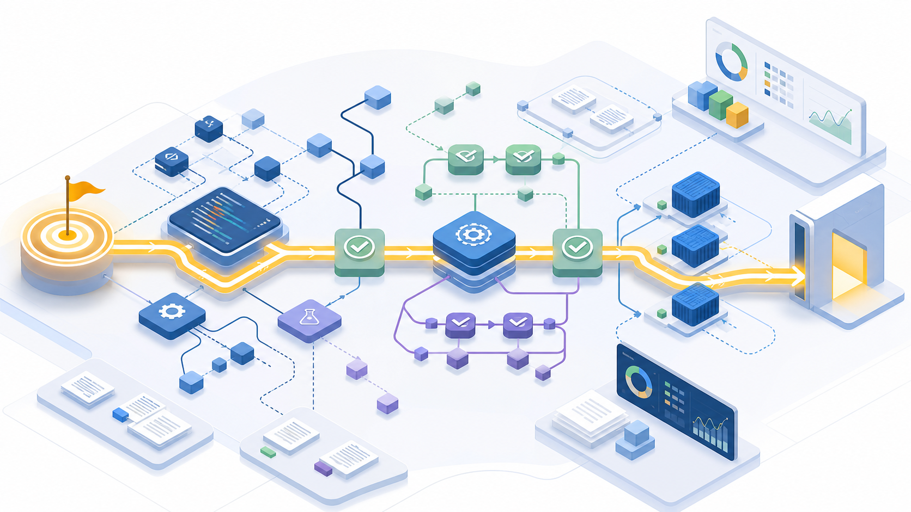

一个 goal 能执行很久，通常不是因为模型特别能熬。更像是项目本身已经把路铺好了：目标怎么理解，任务怎么拆，问题怎么查，结果怎么验，现场怎么恢复，都有东西可以依靠。

这次会话就是典型例子。goal 一开始不是一个小问题，而是一串连续动作：清理历史兼容路径、复核残留、重新拉起环境、跑 scanner、强制重扫、提交独立扫描任务，最后还要确认功能真的正常。如果没有足够的工程支撑，这类任务跑到一半就会散掉。

先放几个现场数字，方便感受这个"长"到底是什么概念。按 goal 记录口径，这轮任务从 6 月 5 日晚上启动，到 6 月 6 日中午的收尾统计点，前后约 16 小时。父会话加 subagent 一共 129 个会话，其中直接 subagent 有 128 个。累计 token 约 7.99 亿，去掉缓存输入后粗算也还有 4,220 多万。工具调用侧累计了将近 7 小时，等待 subagent、执行命令、持续读取运行输出占了大头。

第一次看到这些数字的时候我愣了一下——这不像是一个"会话"，更像一个工程团队的日吞吐量。

所以这篇文章不讲 AI 有多强，而是讲项目做对了什么，才让 goal 有机会一路执行下去。

_图 1：goal 能持续推进，因为项目把规则、模块、验证、部署和状态观察串成了一条可执行路径。_

## 规矩先写在门口

长程任务最怕方向没问题、跑着跑着开始变形。我把很多关键约束写进了 `AGENTS.md`。执行者进来以后不用靠猜：

- 哪些项目上下文必须先看
- 项目管理单据怎么处理
- 状态最多能自动推进到哪里
- 哪些节点必须等人确认
- 前端组件优先复用哪一套
- 部署验证默认走哪条路
- 清理历史数据前要做哪些保护
- 提交、需求和验收之间怎么对齐

这些内容看起来很"项目说明"，实际作用更像护栏。goal 启动以后不是随便往前冲，而是在这些规则里推进。能做的就做，不能自动做的就停下来，结果该怎么记录也有规矩。

长任务能跑下去，第一步就是执行者不用每次都从零理解项目。这件事说起来平平无奇，但真的做和不做，差很多。

## 目标能拆开，才跑得动

这次的 goal 不是一个单点修复。它同时碰到历史兼容路径、后端查询、平台适配、前端页面、部署脚本、验证环境和真实运行链路。

我比较庆幸的是项目的工作面本来就能拆出来：

- scanner 核心逻辑在扫描模块
- 平台适配逻辑在适配模块
- 前端页面在前端模块
- 部署和运行环境在部署与脚本模块
- 接口说明和行为约定在文档模块

有了这些边界，goal 就能被拆成几条线：查后端、查适配层、查前端、查部署、查文档、查测试，再跑真实验证。

这件事很朴素。长程任务不是靠一个执行者把所有东西一次性装进脑子里，而是靠项目边界把问题切成能处理的小块。我的经验是，一个项目能不能撑住长程任务，看这一点就够了。

## subagent 要有活可干

清理历史兼容逻辑时，最容易出问题的不是"某个文件不会改"，而是"角落里还藏着一条旧路径"。一个函数删干净了，接口、测试、部署模板、文档却没跟上。

这次统计里直接 subagent 有 128 个。能把这个数量跑起来，前提不是"多开线程"，而是每条线都有明确问题可以查。

_图 2：父会话负责统筹，多个 subagent 分别检查后端、前端、部署、测试、文档和运行验证，再把证据汇总回来。_

这些检查面包括：

- scanner 后端是否还有旧查询
- 平台适配层是否还有旧 fallback
- 前端是否还依赖旧字段或旧页面语义
- Helm、Docker、E2E、perf 脚本是否还保留旧迁移入口
- 文档和契约是否还在描述旧行为
- 真实环境下扫描、强制重扫、独立扫描任务是否正常

父会话负责统筹、修改和判断，subagent 负责只读检查、补证据、找遗漏。这里不是为了"多开几个代理显得热闹"，是因为项目真的能按范围被审计。

一个项目如果只能靠熟悉全局的人凭经验判断，就很难支撑这种长程任务。能被拆开检查，才有机会反复收敛。反过来想，如果每个 subagent 拿到的都是"全仓扫一遍"这种任务，那开 128 个也没用——项目边界这关没过。

## 反复跑验证，反复修正

长程任务不是靠一句"应该好了"结束的。它靠的是一轮一轮验证。

这个项目有多层验证入口：代码验证、本地 E2E、运行时验证、浏览器验收、环境准备、环境回收、部署验证。执行过程变成了一个比较稳定的循环：发现问题→改代码→跑验证→看失败结果→继续修→再复核→回到真实环境验收。

如果没有这些入口，长任务很快就会卡在"现在该怎么确认"这一步。项目把验证做成可重复动作以后，goal 才能用结果不断校正方向。

这里面真正值钱的是验证覆盖了不同层面：代码、接口、前端、环境、部署。长任务经常跨很多层，只靠单元测试根本不够。我见过不少项目单测全绿但 E2E 环境死掉的场景，都是因为缺了这一层。

## 运行状态要看得见

长程任务里，难点经常不是"代码有没有改"，而是"系统现在到底怎么样"。

我这个项目提供了任务列表、任务详情、结果页、overview、children、requeue、队列摘要、扫描状态等观察出口。执行者可以反复确认：扫描任务有没有创建、有没有完成、结果有没有写入、页面有没有展示、详情页能不能打开、强制重扫有没有生效、独立扫描任务的链路是否正常。

这些出口让执行者不用靠猜。能看见状态才知道下一步该修哪里。看不见状态，长任务很容易变成在日志、数据库和代码之间来回碰运气——我吃过这个亏。

适合长程任务的系统，应该主动把关键状态暴露出来，不然就是在黑暗中丢飞镖。

## 证据要留下来，现场才接得住

goal 执行越久，越不能只靠记忆。

这次任务能统计父会话、subagent、工具调用、token、耗时和会话文件，是因为执行过程留下了足够多的记录。最后一轮统计能看见父会话和 128 个 subagent 的 token 分布，也能看见工具时间里 `multi_agent.wait_agent`、`exec_command`、`write_stdin` 分别占了多少。会话日志、工具输出、测试结果、工作区文件、规则文件和运行记录一起保存了现场。

这些记录让任务中途也能接回来：之前做过什么、哪个验证失败过、哪个路径还没清理、哪个 subagent 发现了残留、最后一次统计到哪里、还有哪些动作没闭环。

长程任务不是靠"我还记得"撑住的，是靠证据撑住的。证据越完整，任务越容易恢复。做到这一点不需要什么高级技术，就是每步都留痕——但大多数项目这一步就做得不行。

## 环境要能真跑起来

这类 goal 最后一定要回到运行场景。只读代码和跑单元测试，只能说明一部分问题。

这个项目有本地 E2E、mock 服务、网关、平台服务、scanner、Ingress、容器环境、Helm 等运行和验收能力。代码改完以后可以放进接近真实的环境里走一遍。这也是这次任务能推进到"重新跑扫描、强制重扫、提交独立扫描任务"的原因。

有同事问过长程任务为什么经常断在环境问题上。我的观察是：环境能复现，问题才查得到底；环境靠人临时拼，每次都要重新搭一次。临时拼的环境和代码一样脆弱。

## 交付规则也要接住

很多项目能支持"把代码写完"，但不一定能支持"把事情交付完"。长程任务最后一定会碰到这些问题：对应哪个需求、谁来验收、状态怎么推进、哪些动作必须人工确认。

我把项目管理单据、迭代、处理人、状态流转、单据记录和人工确认边界写进了 `AGENTS.md`。goal 的执行不只停在技术修改，还能接到交付闭环上。

这件事做和不做的区别很直接：复杂任务做完以后如果不知道怎么登记、怎么验收、怎么同步，事情其实还没结束——只是看起来结束了。

---

回头看，这个项目能支撑 goal 长时间执行，是因为提前做好了这些事：

- 规则写在项目入口
- 代码边界能拆分
- 验证命令能重复跑
- 运行状态能看见
- 本地环境能复现
- 复核范围能分出去
- 组件和契约有统一做法
- 执行证据能留下
- 交付流程能接上

goal 能跑这么久，不是因为它变成了一个无限续航的聊天窗口，而是因为项目本身具备"能看懂、能拆开、能验证、能接回来、能交付"的基础。

如果希望 AI 或团队承担复杂长任务，不要只建设代码本身。更重要的是建设围绕代码的执行系统：让项目能说明自己、验证自己、暴露状态、保存证据。项目越做到这些，长程任务越有机会跑到真正完成。
