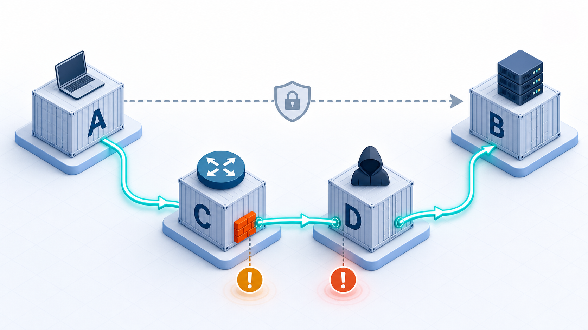

> 说明：本文只讨论授权环境下的安全实验和防护验证。实验里的 MITM 代理、路由改写和密码转发都只应在自己的测试环境中使用。

SSH 很容易给人一种直觉：只要连接是加密的，就安全了。

这个直觉只对了一半。SSH 确实会加密传输，但它还要先回答另一个问题：我现在加密通信的对象，真的是我要连的那台服务器吗？

这个问题靠 hostkey 校验来守住。hostkey 是 SSH 服务端的长期身份标识。客户端第一次连接服务器时，会看到服务端公钥指纹。确认后，这个公钥会写入 `known_hosts`。以后再连接同一个主机名或 IP，客户端会拿服务端这次给出的 hostkey 和本地记录对一下。

如果对不上，OpenSSH 会给出那条很多人都见过的警告：

```text
WARNING: REMOTE HOST IDENTIFICATION HAS CHANGED!
```

这条警告想说的是：你现在连到的，可能不是原来的那台服务器。

说实话，我以前也经常跳过这个警告。生产环境的机器轮换了、测试环境的虚拟机重建了、同事说"没事的删掉 known_hosts 就行"——久而久之，这个警告在我眼里跟"是否信任此证书"一样，变成了一个随手确认的对话框。

直到我搭了这个实验，才真正理解它挡住的到底是什么。


_图 1：hostkey 校验做的是身份确认。只有服务端给出的公钥和 `known_hosts` 里的记录一致，客户端才应该继续认证和登录。_

## 搭一个看得见的现场

实验目录是 `lab/hostkey-demo`，里面有 4 个容器：

- A 是 SSH 客户端，它只知道目标是 `lab@10.88.0.20`
- B 是真实 SSH 服务端，用户 `lab`，密码 `labpass`
- C 是软路由，用 iptables 把 A 发往 B:22 的 TCP 流量改到本机端口 `10022`，再用 GOST 转发到 D
- D 是 SSH MITM 服务：先伪装成 SSH 服务端接住 A，再作为 SSH 客户端连接真实的 B

A 不使用容器服务名访问 B，而是像真实用户一样执行：

```sh
ssh lab@10.88.0.20
```

从 A 的视角看，目标一直是 `10.88.0.20:22`。但 C 已经把真实路径改成了：

```text
A -> C -> D -> B
```



_图 2：虚线代表 A 以为自己在直连 B；亮色路径代表实验中被 C 改写后的真实流量路径：A 先到 C，再到 D，最后才到 B。_

GOST 在这里只做一件事——把 C 上的本地端口转发到 D：

```sh
gost -L tcp://:10022/mitm:2022
```

C 上的 iptables 规则把原本去 B:22 的连接重定向到本机 `10022`：

```sh
iptables -t nat -A PREROUTING \
  -p tcp -d 10.88.0.20 --dport 22 \
  -j REDIRECT --to-ports 10022
```

A 没有改命令，也没有改目标地址，但连接路径已经被放到了 D 面前。

## 先让客户端认识真正的服务器

在项目根目录执行：

```sh
cd lab/hostkey-demo
./scripts/run-demo.sh
```

脚本先生成两套测试 hostkey：`server_ed25519_key` 是 B 的真实 hostkey，`mitm_ed25519_key` 是 D 的伪造 hostkey。然后把 B 的公钥写入 A 使用的 `known_hosts`：

```text
10.88.0.20 ssh-ed25519 ...
```

这一步表示 A 已经"认识"真实的 B。之后只要有人拿另一个 hostkey 来冒充 `10.88.0.20`，A 就应该拦下来。

## 开启校验时，攻击卡在密码之前

第一轮连接开启严格 hostkey 校验：

```sh
sshpass -p labpass ssh \
  -o StrictHostKeyChecking=yes \
  -o UserKnownHostsFile=/lab-keys/known_hosts \
  lab@10.88.0.20 'hostname; whoami'
```

从网络路径看，这个连接已经被 C 导向 D。A 实际收到的不是 B 的 hostkey，而是 D 的 hostkey。

OpenSSH 不会继续问密码，也不会把密码交给 D。它会在认证前终止连接——`known_hosts` 里记录的是 B 的身份，眼前这个"服务端"拿不出同一把 hostkey。

阻断发生得很早。密码还没有送出去，命令还没有执行，MITM 代理还没有机会进入真正的登录流程。我第一次看到这个结果时其实有一点意外：原来 SSH 客户端在认证之前就先把对方的身份验完了，而不是先认证再验身份。这个顺序很关键。

## 关闭校验时，一切看起来都很正常

第二轮连接故意关闭校验：

```sh
sshpass -p labpass ssh \
  -o StrictHostKeyChecking=no \
  -o UserKnownHostsFile=/dev/null \
  lab@10.88.0.20 'hostname; whoami'
```

这次 A 不再关心服务端 hostkey 是否可信。D 拿出自己的伪造 hostkey，A 接受了，然后继续发送密码。

D 拿到密码后，再去连接真实的 B，把命令转过去，把输出转回来。最终用户看到的结果仍然像一次普通 SSH：

```text
server
lab
```

这也是这个实验最值得警惕的地方——成功输出不等于安全。命令确实执行了，SSH 连接也确实加密了，但加密对象已经变成了两段：A 和 D 加密，D 和 B 再加密。中间的 D 不需要破解 SSH，它只需要让客户端相信自己就是目标服务器，然后把两边都接起来。

说实话，我第一次跑通这个场景时心里有点发毛。不是因为 MITM 技术多复杂——恰恰相反，它简单到只需要一个 GOST 和一条 iptables，而且用户完全感知不到任何异常。

## 脚本比人更容易吃这个亏

人在终端里看到 hostkey changed 警告时，至少还有机会停下来判断。脚本更危险，因为很多脚本为了"不要卡住"会直接写：

```sh
-o StrictHostKeyChecking=no
```

或者更进一步，把 known_hosts 丢掉：

```sh
-o UserKnownHostsFile=/dev/null
```

这两个选项一起出现时，等于告诉 SSH：不用确认服务端是谁，只要能连上就继续。

在 CI、部署脚本、运维批处理和跳板机链路里，这种写法很常见。它省掉了第一次连接时的交互确认，但也顺手拿掉了 SSH 抵抗 MITM 的第一道门。我以前写部署脚本时也加过这两行——当时想的是"自动化环境没人守在终端前点确认"，没想过这两行意味着什么。

更稳妥的做法是预置可信 `known_hosts`：自动化环境可以不弹交互确认，但不能跳过身份校验。提前通过可信渠道拿到目标服务器 hostkey，把它写进运行环境，再让 SSH 按记录校验。多做一步而已，差别很大。

## 真遇到警告，先别急着删 known_hosts

hostkey 变化不一定代表攻击。服务器重装、换机、轮换 hostkey、IP 被重新分配，都可能让指纹变化。

但这也正是它值得停下来的原因。遇到 WARNING: REMOTE HOST IDENTIFICATION HAS CHANGED! 的时候，我的处理顺序现在是：

1. 先确认这台机器最近是否重装、换机或轮换 hostkey
2. 通过云控制台、资产系统、带外管理通道或负责人确认新指纹
3. 确认无误后再更新 `known_hosts`
4. 如果链路中间有跳板机、代理、软路由或透明代理，更要谨慎

这不是形式主义——做这个实验之前我也觉得有点过于谨慎，但看到 D 容器里记录的密码和命令之后，我改了看法。hostkey changed 警告保护的是"我连接的是不是那台服务器"，不是"连接有没有加密"。对不上就停下来问清楚，最多多花两分钟。

---

回到这个 Docker 实验，结果很直接：

- 开启 hostkey 校验时，MITM 被挡在密码认证前
- 关闭 hostkey 校验时，命令执行成功，但中间代理已经能观察和转发会话

所以不要把 `StrictHostKeyChecking=no` 当成无害的便利选项，也不要长期把 `UserKnownHostsFile=/dev/null` 写进脚本。

SSH 的加密只能保证你和"对面那一端"的通信不被旁路读取。hostkey 校验负责确认"对面那一端"到底是谁。少了这一步，加密还在，但你在跟谁加密就不一定了。
