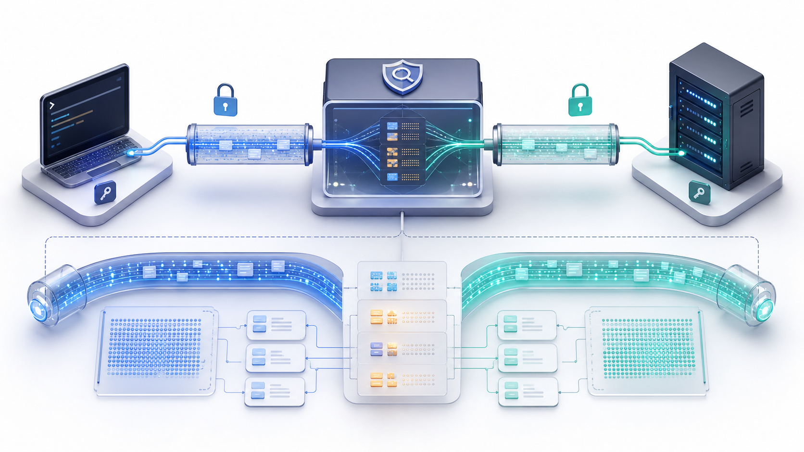
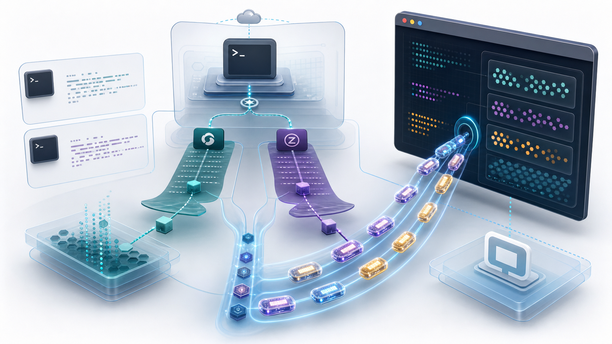

> 说明：本文只讨论授权环境下的调试、审计和协议分析。SSH MITM 会让代理侧看到认证、命令和终端字节流，不应被用于未授权系统。

这篇文章的背景，是 Warp 相关实现开源之前，对它的 `ssh warpify` 特性做的一次黑盒分析。所谓 `warpify`，可以理解为 Warp 把一条普通 SSH 会话“Warp 化”的过程：不要求远端预装 agent，却能让本地 Warp 终端识别远端命令块、提示符、目录、shell 状态和命令生命周期。由于当时没有官方源码可直接阅读，本文主要依据 SSH MITM 代理捕获到的协议行为、远端 bootstrap payload，以及当前项目中的代理实现来还原它的技术路径。

Warp 的远程 SSH 体验看起来像普通 `ssh user@host`：用户输入命令，远端返回输出。但从终端能力上看，它又不像普通 SSH。Warp 能识别命令块，知道当前目录、用户名、主机名、shell 类型，甚至能在嵌套 SSH 会话里继续接管提示符和命令生命周期。

这些能力不是 SSH 协议原生提供的。SSH 只负责加密传输、认证、打开 channel、申请 PTY、启动 shell 或执行一条远程命令。Warp 真正做的是两件事：


*图 1：题图里的透明节点代表授权调试环境中的观测代理；它终止一侧 SSH 会话，再向真实服务器建立另一侧 SSH 会话。*

1. 在本地把交互式 `ssh` 包装成一个可控的远程启动过程。
2. 在远端 shell 启动阶段注入一段初始化脚本，再通过终端控制序列把结构化事件发回本地 Warp。

这个项目 `ssh-mitm-proxy` 的价值，是把这条链路放在中间观察：它伪装成 SSH 服务端接住 Warp 的连接，再用真实凭据连到目标 SSH 服务端。于是我们能看到 Warp 发出的 `pty-req`、`exec`、`shell` 请求，也能在原始输入输出里捕获 Warp 的初始化 payload 和后续 hook 消息。

## 项目里的 MITM 观测点

项目启动后有两个入口：

- `cmd/server.go` 同时启动 SSH MITM 服务和 HTTP CONNECT 代理。SSH 服务监听 `2022`，HTTP 代理监听 `2080`。
- `pkg/proxy/sshserver.go` 的 SSH 入口支持把目标信息塞进 SSH 用户名：用户名是 base64 JSON，格式类似 `{"account":"root","ip":"1.2.3.4","port":"22"}`。代理在认证阶段解析出真实用户名和目标地址。

这一步很关键，因为 SSH 握手前拿不到用户名。项目把“目标解析”放进服务端配置的 `BannerCallback` 中：一旦客户端元数据里出现 `conn.User()`，就调用 `parseAccountCallback` 得到 `targetHost` 和 `realUsername`，然后把真实用户名交给后端连接。

认证阶段是典型 MITM 转发：

- 面向 Warp，本项目是一个 SSH server，使用自己的 host key。
- 面向目标机器，本项目是一个 SSH client，调用 `ssh.Dial("tcp", targetHost, clientConfig)`。
- 密码认证时，`PasswordCallback` 从 Warp 收到密码，通过 channel 交给后端 SSH client。
- keyboard-interactive 时，后端服务端的问题被转发给 Warp，Warp 的回答再转回后端。

连接建立后，`ConnectionWithParser.Start()` 调用 `ssh.NewServerConn()` 接受 Warp 的 SSH 连接，然后等待后端 `ssh.Client`。日志里能同时记录两段 session id：一段属于 Warp 到 MITM，一段属于 MITM 到真实服务器。这也是 MITM 和普通代理的区别：它不是简单转发 TCP，而是终止并重建了两条 SSH 会话。



*图 2：MITM 代理不是原样转发 TCP，而是在两侧分别建立 SSH 会话，因此能看到 session channel、pty、exec、shell 和原始终端字节流。*

真正好玩的部分在 `handleChannel()`。项目只接受 `session` channel，然后为后端创建一个 `ssh.Session`，把三条流接起来：

```go
clientSession.Stdout = &TestWrite{target: serverChannel, log: chanCtx.Logger}
clientSession.Stderr = &TestWrite{target: serverChannel, log: chanCtx.Logger}
clientSession.Stdin = &TestRead{t: serverChannel, log: chanCtx.Logger}
```

`TestRead` 记录 `【input-raw】`，也就是 Warp 发往远端的数据；`TestWrite` 记录 `【output-raw】`，也就是远端返回给 Warp 的数据。因为 Warp 的私有消息本质上也是终端字节流，所以它会自然出现在这些 raw log 里。

channel 请求处理则覆盖了 SSH 交互的几个核心动作：

- `pty-req`：解析终端类型、宽度和高度。
- `env`：记录并尝试转发环境变量。
- `exec`：解析远程命令字符串，调用 `clientSession.Start(execMsg.Command)`。
- `shell`：调用 `clientSession.Shell()` 启动普通交互式 shell。

这说明项目目前主要是“解析和观测器”，还不是一个完整的 Warp 注入器。它不会主动生成 Warp 初始化脚本，但能捕获 Warp 自己注入的脚本。

## Warp 注入从哪里进入 SSH

在捕获样本 `test.sh` 中，文件开头带有少量非文本字节，说明它更像从 SSH/终端原始流里截出来的 payload，而不是一份干净的 shell 文件。真正的 bootstrap 脚本从 `export TERM_PROGRAM='WarpTerminal'` 开始，主体大致是这样的结构：

```sh
export TERM_PROGRAM='WarpTerminal'
hook=$(printf '{"hook":"SSH", ...}' | command -p od -An -v -tx1 | command -p tr -d " \n")
printf '\e]9278;d;%s\a' $hook

case ${SHELL##*/} in
  bash)
    exec -a bash bash --rcfile <(echo '...')
    ;;
  zsh)
    WARP_TMP_DIR=$(command -p mktemp -d warptmp.XXXXXX)
    # 解码十六进制脚本到 $WARP_TMP_DIR/.zshenv
    ZDOTDIR=$WARP_TMP_DIR exec -l zsh -g
    ;;
esac
```

这回答了一个容易误解的问题：Warp 不是等普通 shell 完全启动后，再像用户一样敲入一堆初始化命令。它更早地介入了 SSH 会话启动方式。

对交互式 SSH，Warp 会把远端启动命令改造成一段 bootstrap command，通过 SSH `exec` 请求发过去。远端执行这段 command 后，它再 `exec` 成真正的 bash 或 zsh。由于最后使用的是 `exec`，bootstrap 进程会被目标 shell 替换掉，不会额外留一个父 shell 挂在那里。

## 第一条消息：SSH hook

payload 开头先声明：

```sh
export TERM_PROGRAM='WarpTerminal'
```

然后构造一个 JSON：

```json
{
  "hook": "SSH",
  "value": {
    "socket_path": "~/.ssh/175380264210224",
    "remote_shell": "bash"
  }
}
```

这段 JSON 不直接明文输出，而是先转成十六进制：

```sh
command -p od -An -v -tx1 | command -p tr -d " \n"
```

再包装成 OSC 控制序列：

```text
ESC ] 9278 ; d ; <hex-json> BEL
```

也就是样本中的：

```sh
printf '\e]9278;d;%s\a' $hook
```

终端显示层不会把这串内容当普通文本渲染。Warp 作为终端应用能识别 `9278;d` 这个私有通道，取出后面的十六进制 JSON，解码成结构化事件。对普通终端或不了解该协议的程序来说，它只是一个 OSC 序列。

这里的设计很聪明：SSH 不需要新增扩展，远端也不需要安装 agent。只要远端 shell 能执行 `printf`、`od`、`tr`，Warp 就能把元数据藏在终端输出流里送回本地。

## bash 分支：用 --rcfile 注入初始化

如果远端默认 shell 是 bash，样本使用：

```sh
exec -a bash bash --rcfile <(echo '...')
```

`--rcfile` 是关键。bash 启动交互式 shell 时会读取指定 rcfile。Warp 通过进程替换 `<(echo '...')` 临时生成 rcfile 内容，让新 bash 在启动阶段执行初始化代码。



*图 3：bash 和 zsh 的注入入口不同，但最终都会把结构化事件编码进终端输出流，交给本地 Warp 解析。*

样本里的 rcfile 做了几件事：

```sh
command -p stty raw
HISTCONTROL=ignorespace
HISTIGNORE=" *"
WARP_SESSION_ID="$(command -p date +%s)$RANDOM"
WARP_HONOR_PS1="0"
```

然后采集远端身份：

```sh
_hostname=$(command -pv hostname >/dev/null 2>&1 && command -p hostname 2>/dev/null || command -p uname -n)
_user=$(command -pv whoami >/dev/null 2>&1 && command -p whoami 2>/dev/null || echo $USER)
```

接着发送第二条结构化消息：

```json
{
  "hook": "InitShell",
  "value": {
    "session_id": 1736757988322805,
    "shell": "bash",
    "user": "root",
    "hostname": "server"
  }
}
```

它同样会被 hex 编码，并通过 `ESC ] 9278 ; d ; ... BEL` 发回 Warp。

这里有几个实现细节值得注意：

- `command -p` 绕过 shell function、alias 和用户 PATH，尽量调用系统基础命令。
- `HISTCONTROL=ignorespace` 和 `HISTIGNORE=" *"` 避免 Warp 内部命令污染用户历史。
- `WARP_HONOR_PS1=0` 表示默认由 Warp 接管提示符表现，而不是完全信任远端 PS1。
- `stty raw` 把终端切到 raw 模式，方便 Warp 自己处理输入编辑、控制字符和显示状态。

## zsh 分支：用临时 .zshenv 注入初始化

zsh 没有 bash 那样的 `--rcfile` 参数，所以 Warp 换了一个入口：`ZDOTDIR`。

样本流程是：

1. 创建临时目录：`mktemp -d warptmp.XXXXXX`。
2. 把一段十六进制脚本解码到 `$WARP_TMP_DIR/.zshenv`。
3. 设置 `ZDOTDIR=$WARP_TMP_DIR`。
4. 执行 `exec -l zsh -g`。

解码出来的 `.zshenv` 内容是：

```sh
unsetopt ZLE
unset RCS
unset GLOBAL_RCS
WARP_SESSION_ID="$(command -p date +%s)$RANDOM"
WARP_USING_WINDOWS_CON_PTY=false
_hostname=$(...)
_user=$(...)
_msg=$(printf '{"hook":"InitShell",...}' | command -p od -An -v -tx1 | command -p tr -d ' \n')
printf '\e]9278;d;%s\x07' $_msg
unset _hostname _user _msg
```

这和 bash 分支的目标一致：在 zsh 启动最早期发送 `InitShell`。不同点是 zsh 的启动文件加载顺序给了 Warp 一个更稳定的注入点。通过把 `ZDOTDIR` 指向临时目录，Warp 能让 zsh 读取自己生成的 `.zshenv`，同时用 `WARP_SSH_RCFILES=${ZDOTDIR:-$HOME}` 记住用户原始 rcfile 位置，后续再决定如何加载或模拟用户配置。

## 不支持的 shell 怎么办

样本里如果远端 shell 既不是 bash 也不是 zsh，Warp 会走降级路径：

```sh
if test "${SHELL##*/}" != "bash" -a "${SHELL##*/}" != "zsh"; then
  # 尝试输出 motd、加载 /etc/profile
  exec $SHELL
fi
```

也就是说，Warp 仍会尽量保持普通 SSH 可用，但不会强行安装完整的 shell hook。这个选择很务实：fish、tcsh 或其他 shell 的启动语义不同，强行注入更容易破坏用户环境。

## 后续 hook：命令块能力从这里来

`SSH` 和 `InitShell` 只是 bootstrap。已有文档里提到的更完整初始化脚本还会继续注入 bash-preexec 或等价 hook，从而追踪命令生命周期：

- `Precmd`：提示符显示前上报当前目录、PS1、git 分支、虚拟环境等。
- `Preexec`：命令真正执行前上报命令文本。
- `CommandFinished`：命令结束后上报退出码。
- `InputBuffer`：同步当前输入缓冲区。
- `Bootstrapped`：初始化完成后上报环境变量名、alias、function、shell 版本等信息。

这些事件的承载方式仍然是终端控制序列里的 JSON。远端 shell hook 负责发送，Warp 本地终端负责解析。SSH 只看到普通 stdout/stderr 字节流。

这也是为什么 MITM 日志会出现看似奇怪的输出：

```text
"\x1b]9278;d;7b22686f6f6b223a...07"
```

`\x1b]` 是 OSC 开始，`9278;d;` 是 Warp 私有消息标识，后面是 hex JSON，`\x07` 是 BEL 结束符。

## 为什么这种注入方式稳定

Warp 的方案有几个工程上的优点：

1. **不依赖远端安装组件**  
   只借助 shell、`printf`、`od`、`tr`、`hostname`、`whoami` 这类基础命令。

2. **不修改 SSH 协议**  
   初始化脚本通过标准 `exec` 请求进入远端；结构化消息通过标准终端控制序列返回本地。

3. **尽早接管 shell 初始化**  
   bash 走 `--rcfile`，zsh 走 `ZDOTDIR/.zshenv`，都发生在用户正式交互前。

4. **尽量减少环境污染**  
   使用 `exec` 替换进程，清理临时变量，用历史规则隐藏内部命令。

5. **跨平台留有分支**  
   初始化里设置了 `WARP_USING_WINDOWS_CON_PTY`、`WARP_IN_MSYS2` 等变量，为 Windows/MSYS2/ConPTY 场景留出口。

## 如果要在本项目里继续做解析

当前项目已经能看到关键字节流，但还缺少专门的 Warp 协议解析层。可以沿着这个方向扩展：

1. **按协议边界解析 exec payload**  
   `test.sh` 这样的样本可能混有 SSH request framing 或终端原始流残留。解析时应优先从 `exec` 请求的 command 字段取出命令体，再分析 shell，而不是假设日志文件本身就是一份干净脚本。

2. **实现 OSC 9278 解码器**  
   从 `TestWrite.Write()` 的 output raw 中识别 `ESC ] 9278 ; d ; ... BEL`，提取 hex，解码 JSON，得到 `hook/value`。

3. **处理分片和多条消息**  
   SSH channel 的读写不保证一次 `Read` 就是一条完整 OSC。需要状态机处理跨 chunk 的 ESC 序列。

4. **区分 bootstrap exec 和普通 exec**  
   在 `exec` 请求里，如果命令包含 `TERM_PROGRAM='WarpTerminal'`、`9278;d`、`InitShell` 等特征，可标记为 Warp bootstrap。

5. **给日志加结构化字段**  
   例如 `warp_hook=InitShell`、`warp_session_id=...`、`remote_shell=bash`，而不是只保留 `%q` 后的原始字符串。

6. **谨慎处理敏感数据**  
   项目的 `audit` 包已经有脱敏思路，但 raw log 仍可能包含密码、token、命令参数和输出内容。真正落地时必须默认关闭敏感输出，或只在明确授权的调试窗口开启。

## 总结

Warp 的 SSH 初始化注入可以概括成一句话：

> 它把交互式 SSH 改造成一次携带 bootstrap command 的远程 `exec`，再用 bash/zsh 的启动文件机制接管新 shell，最后通过 OSC 私有序列把 shell 状态以 JSON 形式传回本地终端。

本项目的 SSH MITM 代理正好站在这条路径中间：入口层解析目标，认证层转发凭据，session 层记录 `pty-req/exec/shell/env` 和原始字节流。借助这些观测点，我们可以把 Warp 的“远程智能终端”拆开看清楚：它并不神秘，也没有突破 SSH 协议；它只是非常熟练地利用了 SSH `exec`、shell rcfile 和终端控制序列这三个老工具。
