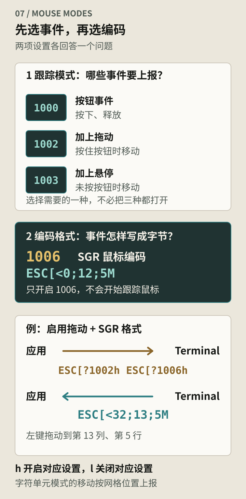
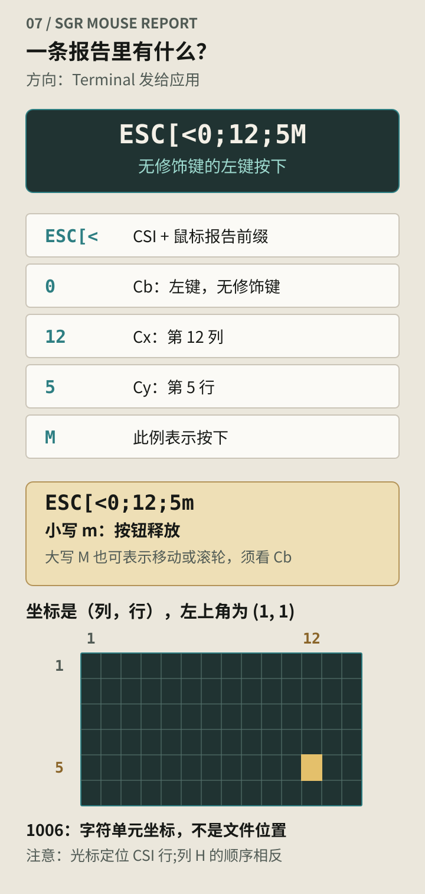

在普通 Shell 提示符下拖动鼠标，通常会选中终端里的文字。打开启用了鼠标支持的 Vim 后，同样的动作可能开始选择编辑器里的文本；在 tmux 的分隔线上拖动，还可能改变 pane 的大小。

鼠标没有换，处理这次操作的程序却变了。第一种选择由 Terminal Emulator 完成，Shell 通常不会收到鼠标坐标。后两种需要终端里的应用参与：Terminal 把鼠标事件编码成字节，应用读到后再决定如何处理。

例如，在启用鼠标跟踪和 SGR 编码后，点击屏幕第 12 列、第 5 行，左键按下的一条报告可以写成：

```text
ESC[<0;12;5M
```

释放左键时则是：

```text
ESC[<0;12;5m
```

这里的 `ESC` 代表一个 `0x1b` 字节。两条序列只差最后字母的大小写，却描述了不同的动作。它们和方向键一样，通过终端输入字节流到达应用。

## 应用先请求，Terminal 才上报

应用向终端输出模式设置序列，要求开始上报；Terminal 随后把符合条件的鼠标操作编码成输入。应用退出时，再请求关闭自己启用的模式。

这里要分别设置两件事：

| 设置         | 回答的问题               | 常用选择               |
| ------------ | ------------------------ | ---------------------- |
| 事件跟踪模式 | 哪些操作需要上报？       | `1000`、`1002`、`1003` |
| 事件编码格式 | 按钮、坐标怎样写成字节？ | `1006`，SGR 鼠标编码   |

例如，应用可以先输出下面两条序列：

```text
ESC[?1002h
ESC[?1006h
```

第一条请求上报按钮按下、释放，以及按住按钮时的移动；第二条选择 SGR 格式。只启用 `1006`，并不等于已经请求跟踪鼠标。退出时，把对应序列末尾的 `h` 换成 `l`，关闭这两项设置。



_图 1：跟踪模式选择要报告的操作，编码模式选择报告的写法。`1002 + 1006` 的组合把点击、释放和按住按钮时的移动编码为 SGR 报告。_

这些是沿用 DEC 私有模式语法的 xterm 扩展。`?` 出现在设置序列里，并不表示这次在查询状态；这里的 `h` 是设置模式，`l` 是重置模式。[xterm.js 的支持列表](https://xtermjs.org/docs/api/vtfeatures/#set-mode-private)也按不同模式分别列出了鼠标跟踪与编码能力。

## 点击、拖动和悬停需要不同的事件

一个只允许点击菜单的程序，不需要用户每移动一下鼠标就处理一条输入。支持拖动选择的编辑器需要更多信息；有悬停效果的界面，还需要鼠标没有按下时的位置。

常见的三种模式对应这些差别：

| 模式                          | 按下与释放 | 按住按钮移动 | 未按按钮移动 |
| ----------------------------- | ---------- | ------------ | ------------ |
| `1000`，Normal Tracking       | 上报       | 不上报       | 不上报       |
| `1002`，Button-event Tracking | 上报       | 上报         | 不上报       |
| `1003`，Any-event Tracking    | 上报       | 上报         | 上报         |

字符坐标模式通常只在鼠标跨入另一个单元格时上报移动；格子里的小幅移动不会逐像素记录。只做点击菜单，用 `1000` 就够了。

表中的模式是几种跟踪策略，不需要把它们全部打开来逐层增加功能。应用应选择需要的一种，再配置编码格式。终端不支持某项扩展时，还要允许键盘操作继续完成同样的任务。

## 拆开一条鼠标报告

SGR 鼠标报告的一般形式是：

```text
CSI < Cb ; Cx ; Cy M
CSI < Cb ; Cx ; Cy m
```

这些空格用于说明结构，实际发送时没有空格。`CSI` 在这里使用 `ESC [` 两个字节。以 `ESC[<0;12;5M` 为例：

| 部分    | 作用                                 |
| ------- | ------------------------------------ |
| `ESC [` | CSI 开头                             |
| `<`     | 标识这类鼠标报告的参数形式           |
| `0`     | 事件编码：无修饰键的左键按下         |
| `12`    | 横坐标，第 12 列                     |
| `5`     | 纵坐标，第 5 行                      |
| `M`     | 最终字节；此例表示按下，结束这条报告 |



_图 2：`ESC[<0;12;5M` 报告左键在第 12 列、第 5 行按下；同一位置释放时，末尾变成小写 `m`。大写 `M` 也用于移动和滚轮，须结合按钮字段判断。_

坐标按“列、行”排列，左上角是 `(1, 1)`。这与光标定位 `CSI 行;列 H` 的参数顺序不同，写解析器时容易放反。

这里的 `m` 别和颜色序列 `CSI 31 m` 混在一起：`CSI <0;12;5m` 从终端发给应用，报告左键释放。`<` 前缀和传输方向都不同。[XTerm 控制序列文档](https://invisible-island.net/xterm/ctlseqs/ctlseqs.html#h2-Mouse-Tracking)给出了报告的完整定义。

按钮字段也包含事件标志。下面是在无修饰键、SGR 编码下的一组具体例子：

| 操作                              | 示例报告        |
| --------------------------------- | --------------- |
| 左键在第 12 列、第 5 行按下       | `ESC[<0;12;5M`  |
| 左键在同一位置释放                | `ESC[<0;12;5m`  |
| 按住左键移动到第 13 列、第 5 行   | `ESC[<32;13;5M` |
| 没有按键，移动到第 13 列、第 5 行 | `ESC[<35;13;5M` |
| 在该位置向上滚动一格              | `ESC[<64;13;5M` |
| 在该位置向下滚动一格              | `ESC[<65;13;5M` |

第三行需要移动跟踪，第四行需要 `1003`。滚轮编码为一类按钮事件，通常没有配套的释放报告；触控板连续滚动怎样折算成这些报告，则取决于终端实现。修饰键还会改变按钮字段，应用不能把上表的几个数字当作全部可能的值。

## 为什么不用更早的鼠标格式

早期 xterm 鼠标格式使用 `CSI M`，后面紧跟三个编码字节，分别表示按钮、横坐标和纵坐标。按钮或坐标数值加上偏移量后直接放进字节，而不是写成十进制数字。

这种格式很短，但坐标范围受单字节限制。坐标字节还可能落在高位字节区域；如果中间的日志工具或文本解码器先把它当成 UTF-8 处理，就可能改变或丢失数据。

SGR 格式把字段改成分号分隔的十进制数字，并用大小写最终字节区分按下与释放。`12` 因而是字符 `1`、`2`，不再是一个加过偏移量的坐标字节。调试时更容易直接检查字段，也不受旧格式那样的单字节坐标上限约束。

应用需先请求 SGR 格式，再按这个格式解析。旧格式的三个编码字节与 SGR 的可变长十进制参数，不能混用同一个字段读取规则。

## 从屏幕坐标找到文档位置

在 `1006` 的字符单元模式里，`(12, 5)` 表示终端可见网格中的位置。它不是文件第 5 行的第 12 个字符，也不是某个控件的编号。

假设一个 TUI 顶部有两行工具栏，左侧有六列行号，正文又向下滚动了一百行。程序收到 `(12, 5)` 后，需要先判断这个位置是否落在正文区域，再减去工具栏和行号偏移，结合滚动位置换算到文件位置。中文宽字符、组合字符和横向滚动，还会影响屏幕列与文本索引之间的对应关系。

终端只报出了 `(12, 5)`。这个位置是正文、行号还是工具栏，要由应用用当前布局判断；判断完，才能决定这次点击做什么。

自动化发送点击前，也得核对应用当前使用的跟踪模式、编码格式和画面。窗口尺寸一变，界面可能重新排版；序列写对了，坐标仍可能点在另一个控件上。

另有使用像素坐标的 `1016` 扩展，它沿用类似的报告形式，但改变坐标单位。支持情况需要单独确认；解析器不能在没有确认模式的情况下，把所有鼠标坐标都当作字符列与行。

## 文本选择和滚轮由谁处理

没有启用鼠标跟踪时，Terminal 通常把拖动用于本地文本选择，把滚轮用于查看自己的滚动历史。启用跟踪后，这些操作可能改为发送给应用，因此用户会感觉“进了这个程序，就不能直接选字了”。

许多终端提供临时绕过鼠标上报的修饰键，常见做法是按住 Shift 再拖动。具体组合由终端及其配置决定，不能当作鼠标协议保证的行为。即使应用请求上报，终端快捷键也可能先处理某些操作。

滚轮还有一个容易混淆的情况：某些终端在 Alternate Screen 下，可以把滚轮转换成方向键。此时程序读到的是键盘序列，未必启用了鼠标跟踪。调试“滚轮为什么能控制程序”时，要检查收到的是鼠标报告、方向键，还是终端在本地滚动历史。

Alternate Screen、鼠标跟踪和滚轮转换是不同的设置。进入第二块屏幕不会自动要求应用处理鼠标；一个仍使用普通屏幕的程序也可以请求鼠标上报。

## tmux 还要判断事件属于哪个 pane

直接运行应用时，Terminal 报告的坐标对应整个终端网格。经过 tmux 后，外层终端首先把事件发给 tmux。

tmux 可以自己处理状态栏点击、pane 切换和边框拖动，也可以把事件交给 pane 内的应用。转发时需要考虑 pane 的位置和内层应用请求的鼠标模式：外层第 50 列，不一定是 pane 内的第 50 列。

所以，tmux 的 `mouse on` 与 Vim 自己的鼠标设置并不等价。前者让 tmux 参与鼠标处理，后者决定 Vim 是否请求并使用这些事件。[tmux 官方入门文档](https://github.com/tmux/tmux/wiki/Getting-Started#using-the-mouse)列出了外层鼠标操作能够完成的窗口与 pane 操作。

如果点击在直接运行时正常，进入 tmux 后却偏移或失效，应分别检查外层事件、tmux 的处理与坐标转换，以及内层应用的模式。SSH 通常负责传输这些字节；tmux 则会解析并处理输入，不能把两者看作同一种转发过程。

## 在本机观察一次点击

下面的实验适用于 macOS 或 Linux 上支持 xterm 鼠标协议的终端。先在普通 Shell 提示符下运行，暂时不经过 tmux，便于观察单层行为。

脚本通过 `/dev/tty` 读取控制终端，启用 `1002` 和 `1006`，收集八秒输入后退出。期间可以点击、拖动和滚动；按 `q` 或 `Ctrl-C` 也可以提前结束。数据暂存在内存里，关闭鼠标上报后才打印，避免输出不断滚屏而影响观察。

```bash
python3 - <<'PY'
import os
import select
import termios
import time
import tty

mode = 1002
enable = f'\x1b[?{mode}h\x1b[?1006h'.encode('ascii')
disable = f'\x1b[?{mode}l\x1b[?1006l'.encode('ascii')
data = bytearray()

with open('/dev/tty', 'rb+', buffering=0) as terminal:
    fd = terminal.fileno()
    old = termios.tcgetattr(fd)
    terminal.write(b'Click, drag, or scroll; q exits. Waiting 8 seconds.\r\n')
    try:
        tty.setraw(fd)
        terminal.write(enable)
        deadline = time.monotonic() + 8
        while len(data) < 16384:
            remaining = deadline - time.monotonic()
            if remaining <= 0 or not select.select([fd], [], [], remaining)[0]:
                break
            chunk = os.read(fd, min(1024, 16384 - len(data)))
            if not chunk:
                break
            data.extend(chunk)
            if b'q' in chunk or b'\x03' in chunk:
                break
    finally:
        try:
            terminal.write(disable)
        finally:
            termios.tcsetattr(fd, termios.TCSANOW, old)

print(repr(bytes(data)))
PY
```

如果在第 12 列、第 5 行按下并释放左键，再按 `q`，可能得到：

```text
b'\x1b[<0;12;5M\x1b[<0;12;5mq'
```

`repr()` 把 ESC 显示成 `\x1b`，不会把收集到的数据直接作为终端控制序列输出。结果末尾的 `q` 是退出按键，不属于鼠标报告。一次 `read()` 可能收到半条报告，也可能收到多条；这里把数据连接起来展示，没有尝试用读取边界划分事件。

再把脚本中的 `mode` 改成 `1000`，重复拖动，会少掉移动报告。换成 `1003` 后，不按按钮移动到其他字符单元，也会产生报告。用同一段读取代码比较，能直接观察跟踪模式的差别。

这个实验假定启动前鼠标上报处于关闭状态，退出时把自己启用的模式关闭；它没有查询并恢复任意外层程序预先设置的终端模式。TTY 的 termios 设置则单独保存并恢复。`finally` 能处理正常结束和 Python 异常；未处理的 `SIGTERM`、`SIGHUP` 或 `SIGKILL` 可能跳过清理。

如果实验被强制中断，回到 Shell 后点击还出现序列，可以关闭本实验涉及的模式：

```bash
printf '\033[?1000l\033[?1002l\033[?1003l\033[?1006l'
```

TTY 回显或按行输入仍不正常时，再运行 `stty sane`。前一条修改 Terminal 的鼠标模式，后一条修改内核 TTY 设置，两者处理的是不同位置的状态。

## 从字节报告到应用事件

正式应用通常把模式切换和序列解析交给终端库。例如，ncurses 用 `mousemask()` 选择希望接收的事件，输入接口报告 `KEY_MOUSE` 后，再通过 `getmouse()` 取出坐标和按钮状态。点击、双击等较高层事件，还涉及按下与释放的组合及时间间隔。[ncurses 鼠标接口文档](https://invisible-island.net/ncurses/man/curs_mouse.3x.html)说明了这些转换；它们与终端发来的单条字节报告并不一一对应。

录制时还要留意方向：程序的输出里通常没有鼠标输入。要重放这些报告，应把它们送入应用的终端输入路径；把报告作为输出打印到 Terminal，不能模拟点击。

## 资料参考

- [XTerm Control Sequences：Mouse Tracking](https://invisible-island.net/xterm/ctlseqs/ctlseqs.html#h2-Mouse-Tracking)：跟踪模式、SGR 编码及坐标扩展。
- [xterm.js Supported Terminal Sequences](https://xtermjs.org/docs/api/vtfeatures/)：终端实现支持的私有模式。
- [ncurses curs_mouse(3x)](https://invisible-island.net/ncurses/man/curs_mouse.3x.html)：字节协议之上的鼠标事件接口。
- [tmux Getting Started：Using the mouse](https://github.com/tmux/tmux/wiki/Getting-Started#using-the-mouse)：tmux 对鼠标操作的处理。
