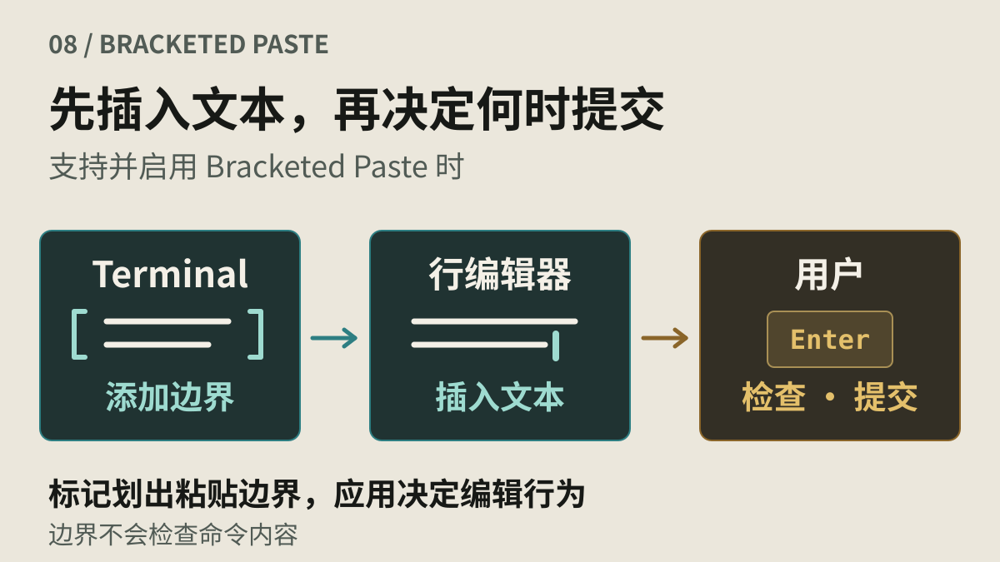
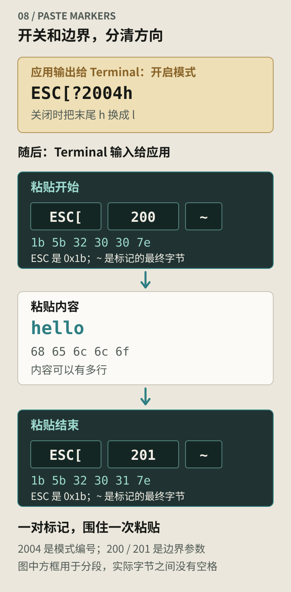
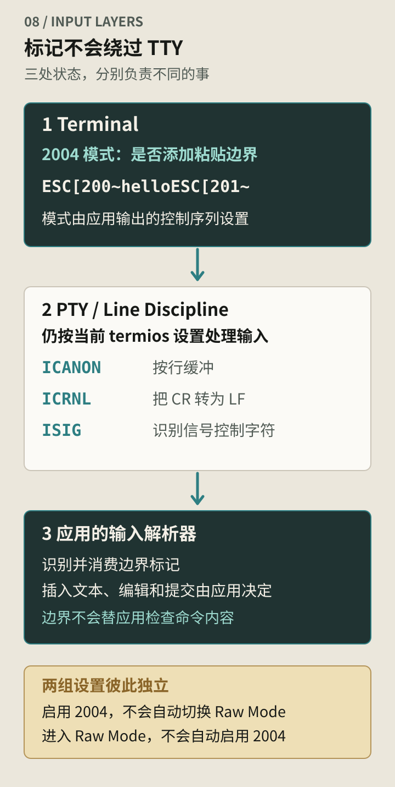
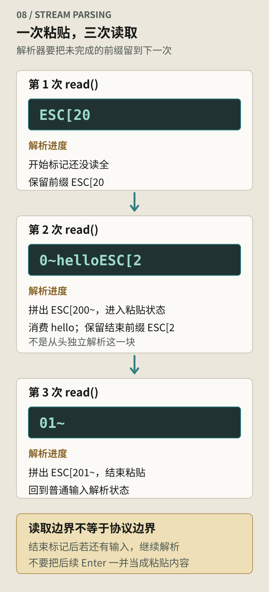

_题图：先把多行文本放进输入区，再决定何时提交。_

把两行命令粘贴到终端里，有时它们会先完整地停在提示符后面，等待确认；有时第一行刚出现，就已经开始执行。

例如，剪贴板里有这段内容：

```bash
printf 'one\n'
printf 'two\n'
```

如果行编辑器把两行之间的换行当作一次提交操作，第一条命令就可能立即执行。最后一条是否也执行，还取决于粘贴内容末尾有没有换行，以及当前输入处理方式。

你只粘贴了一次，程序却可能把中间的换行当成 Enter。它需要先知道：接下来这段文字是一起贴进来的。

## 字节相同，编辑操作却可能不同

行编辑器收到 Tab，可能去补全；收到 Enter，通常会提交当前命令。编辑器还会帮你缩进、补括号。手敲时这些是便利，粘贴一段排好的文本时，它们却可能把内容改乱，甚至提前执行命令。

Terminal 在用户调用粘贴操作时，可以知道这是一次剪贴板输入。但如果它只把文本编码后写入 PTY，接收端就失去了这个来源信息。

靠速度判断也不可靠。远程连接会把几个按键攒在一起送来，长粘贴也可能分批到达。

## 2004 是开关，200~ 和 201~ 是边界

Bracketed Paste 为粘贴增加了开始和结束标记。它最初作为 xterm 面向 Readline 的扩展加入，后来被更多终端和编辑器采用；[XTerm 的历史记录](https://invisible-island.net/xterm/xterm-paste64.html)保留了这段演变。

支持它的应用先向 Terminal 输出：

```text
ESC[?2004h
```

此后，Terminal 处理粘贴操作时，会在文本前后加上标记再发送给应用。关闭模式的序列是 `ESC[?2004l`。四条相关序列分别用于：

| 序列         | 方向            | 含义                 |
| ------------ | --------------- | -------------------- |
| `ESC[?2004h` | 应用 → Terminal | 开启 Bracketed Paste |
| `ESC[?2004l` | 应用 → Terminal | 关闭 Bracketed Paste |
| `ESC[200~`   | Terminal → 应用 | 一次粘贴开始         |
| `ESC[201~`   | Terminal → 应用 | 一次粘贴结束         |

表里的 `ESC` 都代表一个 `0x1b` 字节。`2004` 是模式编号，`200` 和 `201` 是输入标记里的参数，不能互换。[XTerm 控制序列文档](https://invisible-island.net/xterm/ctlseqs/ctlseqs.html#h2-Bracketed-Paste-Mode)定义了这组行为。

假设粘贴内容只有 `hello`，发送到应用的输入就是：

```text
ESC[200~helloESC[201~
```

对应十六进制字节：

```text
1b 5b 32 30 30 7e  68 65 6c 6c 6f  1b 5b 32 30 31 7e
```

`~` 是每条标记的最终字节。开头的 `ESC[200~` 完成后，接下来是粘贴文本；直到完整的 `ESC[201~` 出现，接收端才结束这段粘贴处理。



_图 1：一对开始、结束标记围住整次粘贴；即使文本有多行，也无需逐行添加标记。_

## Terminal 加标记，行编辑器决定怎样使用

Bash 的交互式命令行通常使用 Readline。支持并启用 Bracketed Paste 后，Readline 把标记之间的文本整体插入编辑缓冲区，避免按普通键绑定执行其中的编辑动作。多行内容可以先留在输入区，让用户修改，再提交给 Shell。[Readline 文档](https://tiswww.case.edu/php/chet/readline/readline.html)分别说明了 `enable-bracketed-paste` 设置和 `bracketed-paste-begin` 编辑命令。

Readline 消费边界标记后，Shell 语法解析器得到的是编辑后的命令文本。标记本身不属于 Shell 命令，也不应该出现在命令参数中。

zsh 使用自己的 ZLE 行编辑器，提供 `bracketed-paste` widget。它可以把粘贴内容插入编辑缓冲区，也支持供其他 widget 调用的处理方式。因此，即使 Terminal 发送相同序列，插件和应用配置也可能改变粘贴后的表现。[ZLE 文档](https://zsh.sourceforge.io/Doc/Release/Zsh-Line-Editor.html)描述了这个接口。

对于文本编辑器，这段边界还可以用于临时调整自动缩进、集中更新界面，或把一次粘贴作为一个撤销单元。这些是编辑器可以采用的策略，协议本身没有规定每个应用都必须这样做。

## 标记经过 TTY 时会发生什么

TTY 仍按当前 termios 设置处理字节：`ICANON` 控制按行输入，`ICRNL` 控制 CR 到 LF 的转换，`ISIG` 等设置决定中断字符是否触发信号。Bracketed Paste 没有改变这些开关。[termios 文档](https://man7.org/linux/man-pages/man3/termios.3.html)列出了各项规则。

启用 Raw Mode 不会自动打开 Bracketed Paste；输出 `CSI ? 2004 h` 也不会自动切换 Raw Mode。应用要分别准备 TTY 输入设置和粘贴解析器。



_图 2：Terminal 给粘贴加上边界，TTY 按 termios 配置处理输入，应用再解析标记并插入文本。_

如果字符在 TTY 这一层就被转换了，或触发信号而没有交给应用，后面的粘贴解析器便拿不到原始字节。

## 一次粘贴仍可能分成多次读取

即使终端发送了完整标记，应用也可能分三次才读完：

| 读取   | 收到的内容     |
| ------ | -------------- |
| 第一次 | `ESC[20`       |
| 第二次 | `0~helloESC[2` |
| 第三次 | `01~`          |



_图 3：`read()` 的分块可以落在标记中间。解析器保存未完成的前缀，直到后续字节补齐。_

第一批数据甚至没有包含完整的开始标记。解析器需要跨读取保存尚未匹配完的前缀，识别开始后进入粘贴状态，再持续寻找结束标记。若每次都对收到的字符串独立做一次替换，分段的标记就可能漏掉。

结束标记后还可能紧跟普通输入。例如，用户粘贴后立即按 Enter，这个按键可能与结束标记一起被读到。解析器必须在正确位置退出粘贴状态，再按普通输入规则处理剩余字节。

对长文本，也不能无限等待并积累数据。实现需要约束缓存大小，处理连接关闭、输入被截断等情况，并明确未完成的粘贴如何取消。这里没有一个适用于所有应用的固定等待时间：SSH 传输延迟不应该直接被解释为粘贴结束。

## 为什么会在命令行看到 200~

如果模式已经开启，但当前接收输入的程序没有正确处理标记，用户可能看到 `^[[200~`、`200~` 或残缺的类似内容。具体显示形式取决于哪些字节被回显、哪些被当作快捷键处理。

先查是谁打开了 `2004` 模式、现在又是谁在读输入。前一个程序退出时没关，或者当前程序不认识标记，都可能留下这些字符。经过 tmux 等终端复用器时，还要核对内外层的模式是否一致。删掉屏幕上的 `200~`，下一次粘贴仍会出现。

应用应在解析器就绪后启用模式，在交还终端前关闭；暂停后恢复运行，也要重新准备自己的输入设置。

如果已经回到普通 Shell，且确认粘贴标记是异常残留，可以尝试：

```bash
printf '\033[?2004l'
```

这条命令关闭 Terminal 的模式。行编辑器下一次启动输入时，可能又按自己的配置重新打开它，因此它适合恢复现场，不等于永久配置方法。

## 提交前仍要检查命令

粘贴标记帮应用把文本放进输入区，命令是否安全仍要自己检查。按下提交后，Shell 照样处理重定向、命令替换等语法。

和[键盘输入记录](/blog/posts/terminal-series/why-arrow-keys-send-escape-sequences/#录下字节以后能还原哪些操作)一样，标记不能证明操作来源。能向目标应用的终端输入路径注入字节的一方，例如能写入 PTY master 的程序，也能生成这对标记。普通应用向 slave 写入通常走的是输出方向，不能据此把它当作另一个应用的输入。

实现解析器时还需注意：基本格式没有长度字段或通用转义机制。如果文本包含与结束标记相同的控制字节，结果取决于终端的过滤和应用解析策略，不能把它当作任意二进制数据的透明容器。[XTerm 对粘贴限制的说明](https://invisible-island.net/xterm/xterm-paste64.html)也讨论了结束标记与正文冲突的问题。

## 自动化里，把粘贴和提交分开

“粘贴一段文本”和“按下 Enter”应当是两个动作。尤其是多行内容，直接向输入路径写入文本再追加一个换行，可能早在中间的换行处就触发了执行。

先确认目标程序是否启用了 Bracketed Paste，按它当前使用的格式送入文本，检查输入区里的内容，再决定是否提交。不能无条件添加 `ESC[200~` 和 `ESC[201~`：目标程序如果不认识它们，只会收到额外字节。

## 附：在本机比较键入和粘贴

在 macOS 或 Linux 的交互式终端里运行下面的脚本。它临时打开 Bracketed Paste，收集八秒输入后显示字节表示。先复制短文本 `hello`，再运行脚本并使用终端的粘贴快捷键。

脚本通过 `/dev/tty` 读取当前控制终端。这里不能直接从 Python 的标准输入读按键，因为标准输入已经被下面的 heredoc 用来提供脚本源码。

```bash
python3 - <<'PY'
import os
import select
import termios
import time
import tty

data = bytearray()
with open('/dev/tty', 'rb+', buffering=0) as terminal:
    fd = terminal.fileno()
    old = termios.tcgetattr(fd)
    terminal.write(b'Paste a short text. Waiting 8 seconds.\r\n')
    try:
        tty.setraw(fd)
        terminal.write(b'\x1b[?2004h')
        deadline = time.monotonic() + 8
        while len(data) < 65536:
            remaining = deadline - time.monotonic()
            if remaining <= 0 or not select.select([fd], [], [], remaining)[0]:
                break
            chunk = os.read(fd, min(4096, 65536 - len(data)))
            if not chunk:
                break
            data.extend(chunk)
    finally:
        try:
            terminal.write(b'\x1b[?2004l')
        finally:
            termios.tcsetattr(fd, termios.TCSANOW, old)

print(repr(bytes(data)))
PY
```

在支持该模式的终端里，粘贴 `hello` 的典型结果是：

```text
b'\x1b[200~hello\x1b[201~'
```

再运行一次，改为逐个键入 `hello`，通常只会得到：

```text
b'hello'
```

两次都不需要按 Enter。脚本把八秒内收到的字节合在一起显示；Raw Mode 下的 `Ctrl-C` 也会被记录为字节，等待八秒结束即可。`repr()` 会转义控制字符，避免把收集到的内容再次作为终端控制序列输出。

第三次可以粘贴两行普通文本 `one` 和 `two`，观察一对标记如何围住多行内容。行分隔可能显示为 `\r`、`\n` 或相应组合，要以当前终端实际发送的字节为准；边界标记不要求所有实现采用同一种换行转换方式。

脚本只用于短文本观察，最多收集 64 KiB。退出时，它关闭自己启用的模式并恢复先前的 termios 设置，但不查询或恢复运行前其他程序设置的终端模式。正常结束和 Python 异常会执行清理；未处理的 `SIGTERM`、`SIGHUP` 或 `SIGKILL` 可能跳过。先在普通 Shell 中直接运行，可以减少外层复用器对观察结果的影响。

## 资料参考

- [XTerm Control Sequences：Bracketed Paste Mode](https://invisible-island.net/xterm/ctlseqs/ctlseqs.html#h2-Bracketed-Paste-Mode)：模式开关与输入边界标记。
- [XTerm：Bracketed Paste 背景](https://invisible-island.net/xterm/xterm-paste64.html)：早期 Readline 扩展、采用过程与粘贴协议的限制。
- [GNU Readline Library](https://tiswww.case.edu/php/chet/readline/readline.html)：`enable-bracketed-paste` 与粘贴文本的插入行为。
- [Zsh Line Editor](https://zsh.sourceforge.io/Doc/Release/Zsh-Line-Editor.html)：`bracketed-paste` widget。
- [termios(3)](https://man7.org/linux/man-pages/man3/termios.3.html)：TTY 输入处理与 Raw Mode。
