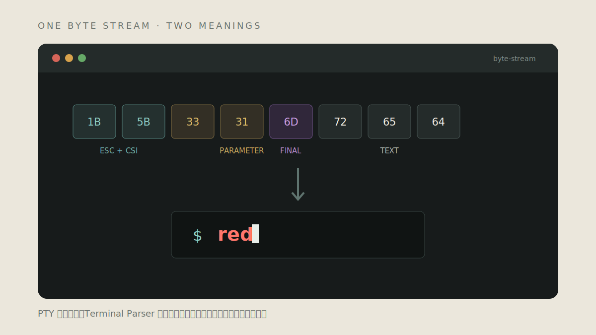
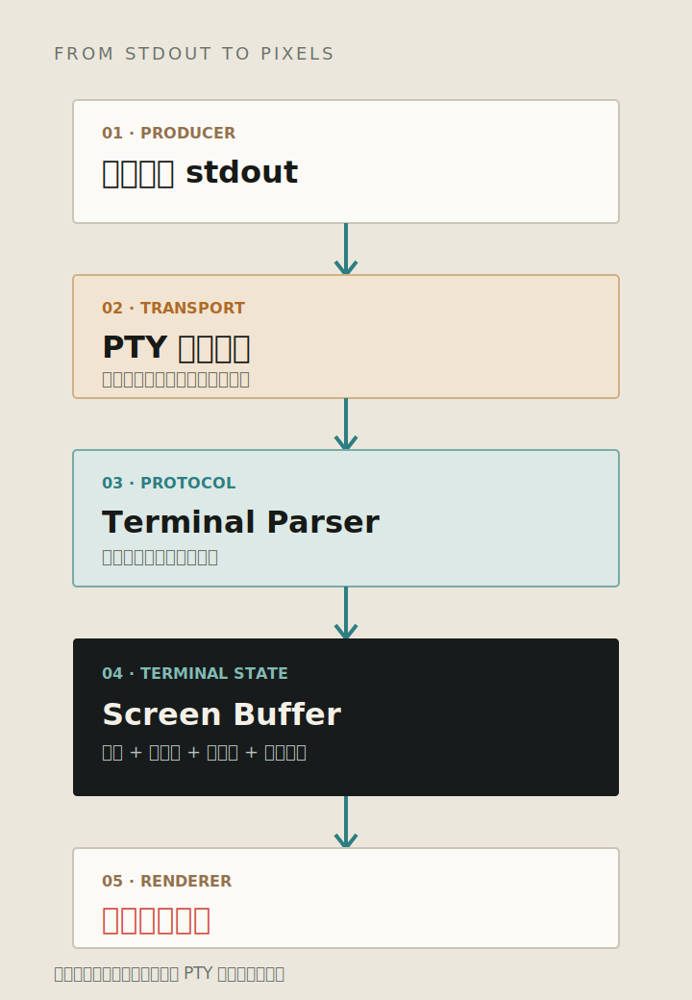
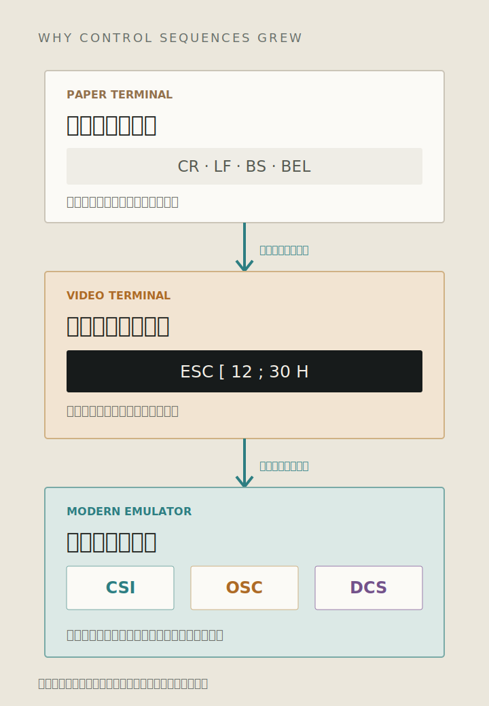
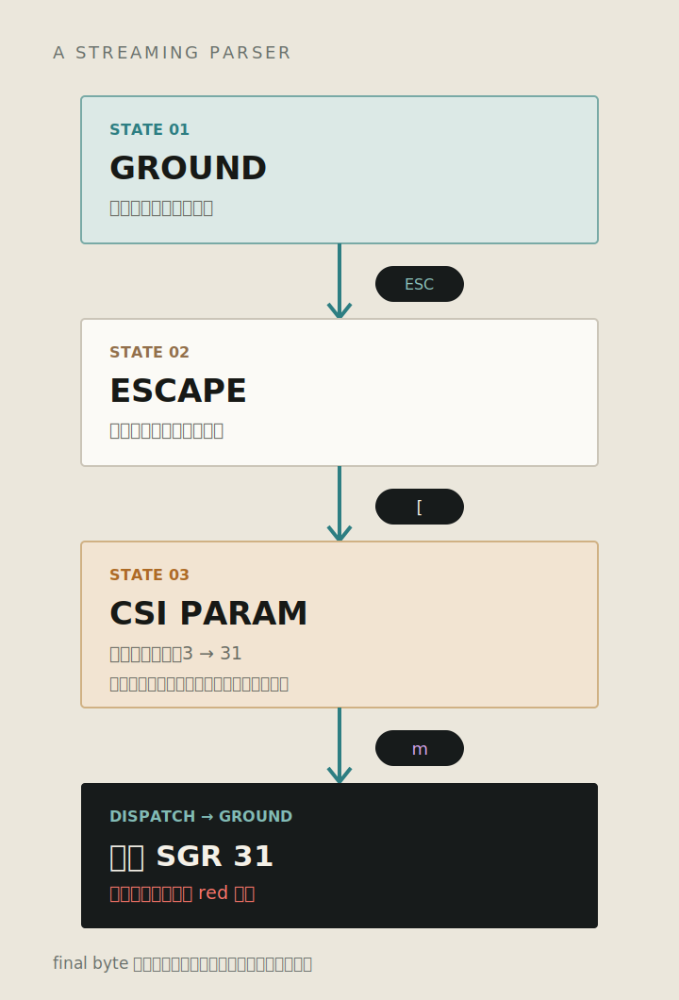
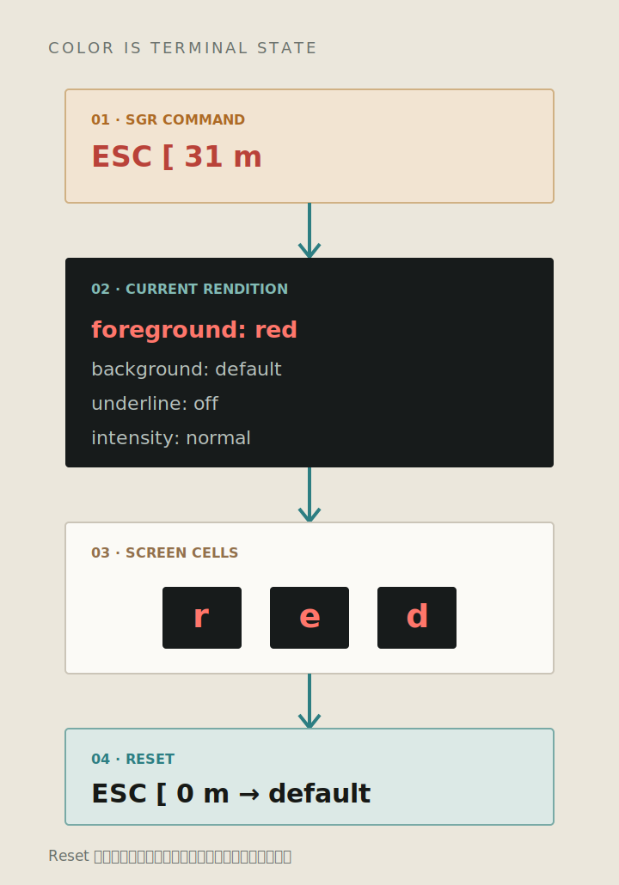
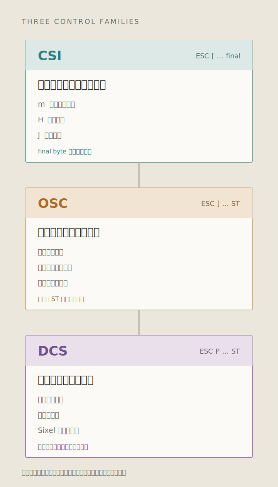

_题图：同一条字节流里既有要显示的文字，也有改变终端状态的控制序列。_

> 本文是《五彩斑斓的黑》系列第三篇。上一篇解释了 [TTY 与 PTY 为什么还存在](/blog/posts/terminal-series/why-tty-still-exists/)；这一篇继续处理 PTY Master 读到的字节：Terminal 怎样判断哪些应该显示，哪些应该执行。

在终端里运行：

```bash
printf '\033[31mred\033[0m\n'
```

屏幕上会出现红色的 `red`。如果把同一段输出交给十六进制工具，看到的是：

```text
1b 5b 33 31 6d 72 65 64 1b 5b 30 6d 0a
```

这串数据没有图片、CSS，也没有单独的“颜色通道”。其中的 `72 65 64` 是字母 `red`，前后的字节负责修改终端状态。PTY 不解释这些内容，Shell 也不会替文字上色。真正完成解析和显示的是 Terminal Emulator。

## PTY 传来的只有字节

程序把内容写入 stdout。stdout 连接 PTY Slave 时，数据经过内核到达 Master，再被终端模拟器读取。到这里为止，数据仍然只是一串字节。



_图 1：PTY 负责连接程序和终端模拟器，颜色从解析器修改屏幕状态之后才出现。_

因此，“命令有颜色”和“命令运行在 PTY 中”不是同一件事。程序通常先用 `isatty()` 判断 stdout 是否连接终端，再决定是否输出颜色序列。PTY 提供终端身份，颜色仍由程序请求、终端渲染。

## 视频终端需要在文字之外控制屏幕

电传打字机把字符打印到纸上，输出基本沿着一个方向前进。回车、换行、退格和响铃可以分别使用 `CR`、`LF`、`BS`、`BEL` 这样的单字节控制字符表示。

视频终端带来了可以反复更新的屏幕。主机不仅要发送文字，还要告诉终端把光标移动到第几行第几列、擦除哪一块区域、是否反色、滚动范围在哪里。操作数量增多以后，给每个动作分配一个单独字节不再现实，参数也没有地方表达。

最终采用的办法，是把可变长度的控制指令直接嵌入字符数据中。[ECMA-48](https://ecma-international.org/publications-and-standards/standards/ecma-48/) 对这类控制功能的定义，就是让它们嵌入字符编码数据中交换。传输层仍然只有一条，接收端根据特定字节切换解释方式。



_图 2：控制能力从少量单字节动作，扩展成可以携带参数和字符串的序列。_

这是一种带内控制协议：文字和命令走同一条链路。它不需要额外连接，也能穿过串口、PTY、SSH 和日志管道；代价是接收端必须持续解析，不能把输出简单当作普通字符串。

## ESC 让后续字节暂时换一种解释方式

`ESC` 的字节值是十六进制 `1B`。终端在普通状态看到它，不会绘制一个字符，而是进入 Escape 状态，等待后面的字节说明这是什么类型的控制序列。

以设置红色前景为例：

```text
ESC  [  31  m
 │   │   │  └─ 执行 SGR
 │   │   └──── 参数：前景色槽位 1
 │   └──────── 进入 CSI
 └──────────── 控制序列开始
```

`ESC [` 是 CSI（Control Sequence Introducer）的常用 7-bit 写法。`31` 是参数，最后的 `m` 决定要执行 SGR（Select Graphic Rendition）。只有读到 final byte，解析器才知道这条 CSI 完整了。



_图 3：简化后的状态转换。真实解析器还要处理取消、忽略、字符串和错误恢复等分支。_

控制序列不保证一次读取完整到达。PTY 的两次读取可能把 `ESC [` 和 `31m` 分开，SSH 包和 WebSocket 消息也可能在任意位置切段。Parser 必须跨数据块保存状态。用正则表达式逐块删除 ANSI 序列，很容易在序列被截断时漏掉一半。

[XTerm Control Sequences](https://invisible-island.net/xterm/ctlseqs/ctlseqs.html) 对这个边界有更严格的描述：每个字节根据当前状态落入控制、参数、结束或普通字符等类别；序列完成或者遇到错误后，解析器再回到 Ground 状态。

## 颜色是终端状态，不是字符的一部分

SGR 不会修改后面的字符编码。它更新的是“当前显示属性”：前景色、背景色、粗体、下划线等。解析器随后遇到普通字符时，把字符和当前属性一起写入 Screen Buffer。



_图 4：SGR 先修改当前状态，之后写入的字符单元继承这些显示属性。_

常见的 `31` 更接近一个语义颜色或调色板槽位，而不是固定的 RGB。深色主题可以把它显示成偏亮的红色，浅色主题可以使用更深的红色。256 色通常使用 `38;5;n`，True Color 常见写法是 `38;2;r;g;b`，但最终仍要由终端实现解释。

这也解释了颜色“串到下一行”的现象。程序输出 `ESC[31m` 后如果没有再输出 `ESC[0m`，终端状态仍然是红色，后续文字自然继续使用它。Reset 不是删除已经写出的颜色，而是把当前属性恢复为默认值。

## CSI、OSC 与 DCS 解决不同类型的控制

终端控制并不都适合“若干数字参数加一个结束字节”。ECMA-48 和后续终端实现使用了不同形式的控制字符串。



_图 5：CSI 偏向有限参数的控制，OSC 与 DCS 可以继续读取字符串，直到 ST 等终止符出现。_

### CSI：参数化的屏幕控制

CSI 常用于光标、屏幕区域和终端模式：

- `m` 设置显示属性；
- `H` 移动光标；
- `J` 擦除屏幕；
- `h`、`l` 设置或重置模式。

参数范围有限，并由 final byte 确定具体操作，适合表示“移动到第几行”或“启用哪个模式”。

### OSC：把字符串交给终端宿主

OSC（Operating System Command）通常携带命令编号和一段字符串，用于修改窗口标题、声明超链接或请求剪贴板操作。它已经越过字符网格，开始影响承载终端的窗口和桌面环境。

OSC 经常以 ST（String Terminator）结束。很多终端也为历史兼容接受 `BEL`，所以一条 OSC 的边界不能只靠固定长度判断。

### DCS：承载设备控制数据

DCS（Device Control String）可以承载设备状态查询、用户定义键和 Sixel 等图形数据。解析器识别 DCS 的头部后，会持续消费数据，直到收到字符串终止符。

CSI、OSC 和 DCS 不是三个协议版本，也不是由低到高的能力等级。它们解决的是不同的封装问题。

## 标准统一了结构，没有统一所有终端

日常所说的“ANSI 转义码”混合了多层来源。ECMA-48 定义了控制功能和编码结构；DEC 终端实现了一组标准能力，也增加了私有模式；xterm、aixterm 和现代终端模拟器又继续加入颜色、鼠标、超链接、图片和宿主集成。

VT100 推动了 ANSI 兼容序列的普及，但它不是今天这套 256 色或 True Color 能力的完整来源。它主要使用单色屏幕，SGR 可以改变反色、强调等显示属性；更多颜色能力来自后续终端和扩展。[VT100 Programmer Information](https://vt100.net/docs/vt100-ug/chapter3.html) 可以看到 ANSI 模式与 DEC Private Mode 同时存在。

ECMA-48 本身也明确允许设备只实现适合自己的子集。因此，“语法正确”不等于“当前终端支持”。应用可以通过 `$TERM` 和 terminfo 查询能力，也可以针对明确的终端协议协商扩展。把所有序列硬编码成一张永远正确的表，最终会碰到兼容性边界。

> **一个实用判断**
>
> PTY 解决“程序是否面对终端”，控制序列解决“程序怎样要求终端改变状态”，`$TERM` 与 terminfo 解决“这个终端声称支持哪些能力”。三者不要混在一起。

## 控制序列也是输入边界

Terminal 接收的并不是纯文本，而是一种会改变显示和宿主状态的协议。可信程序用它绘制 TUI；未经处理的文件、日志和远端输出同样可以携带控制序列。

影响可能只是清屏或修改标题，也可能涉及超链接、剪贴板和终端特有扩展。终端实现通常会限制敏感能力，日志系统和 Web Terminal 也需要决定哪些序列允许执行、哪些只记录、哪些必须过滤。

对 Terminal Agent 来说，只保存屏幕上最后留下的文字并不完整。控制序列可能覆盖旧内容、移动光标，或者让显示结果与原始输出不同。需要审计时，原始字节流、解析后的事件和最终屏幕状态承担不同用途，不能相互替代。

## 在本机看见这些字节

### 实验一：比较渲染结果和原始内容

```bash
printf '\033[31mred\033[0m\n' > /tmp/color.txt
od -An -tx1 /tmp/color.txt
cat -v /tmp/color.txt
cat /tmp/color.txt
```

`od` 显示十六进制字节，`cat -v` 尝试把不可见控制字符表示出来，最后一条命令则把同一文件重新交给当前终端解析。文件没有“红色格式”，其中保存的仍是控制序列和普通字符。

### 实验二：观察没有 Reset 的结果

```bash
printf '\033[31mred'
printf ' still red?\n'
printf '\033[0m'
```

第二次 `printf` 没有设置颜色，却可能继续显示为红色，因为终端的当前属性还没有恢复。第三条命令负责 Reset。

### 实验三：把序列拆成两次写入

```bash
printf '\033['
printf '31mred\033[0m\n'
```

两次写入仍能组成一条完整 CSI。解析器保存的是协议状态，不要求控制序列与某一次系统调用、PTY 读取或网络消息对齐。

## 结尾：颜色只是终端协议最容易看到的一部分

程序输出 `ESC[31m`，PTY 原样传输，Terminal Parser 把它识别为 CSI SGR 并修改当前显示属性。接下来的字符进入 Screen Buffer 时继承这项属性，Renderer 再把它画成主题对应的红色。

同一套机制也负责移动光标、擦除区域、切换模式、设置标题和承载图形。Terminal 能在一条字节流上构建完整交互界面，关键不在颜色数量，而在这套可以持续解析、可以扩展、同时保留历史兼容的控制协议。

> **下一篇：《Terminal 为什么可以原地更新屏幕？》**
>
> 继续拆开 CSI、光标移动、擦除区域与滚动范围，看看 TUI 如何维护一块持续变化的字符屏幕。

## 资料参考

- [ECMA-48：Control Functions for Coded Character Sets](https://ecma-international.org/publications-and-standards/standards/ecma-48/)：控制功能、7-bit/8-bit 表示与开放式结构。
- [Digital VT100 User Guide：Programmer Information](https://vt100.net/docs/vt100-ug/chapter3.html)：VT100 的 ANSI 模式、光标、屏幕和私有模式。
- [VT510 Programmer Information：SGR](https://vt100.net/docs/vt510-rm/SGR.html)：显示属性及参数定义。
- [XTerm Control Sequences](https://invisible-island.net/xterm/ctlseqs/ctlseqs.html)：现代 xterm 支持的 CSI、OSC、DCS 与扩展行为。
- [xterm.js](https://github.com/xtermjs/xterm.js)：浏览器终端中 PTY、解析、屏幕状态与渲染的工程实现入口。
