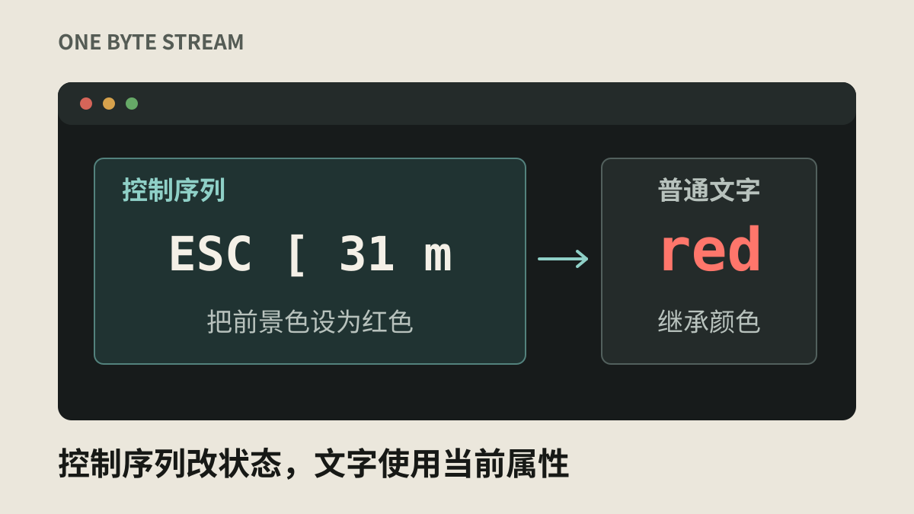
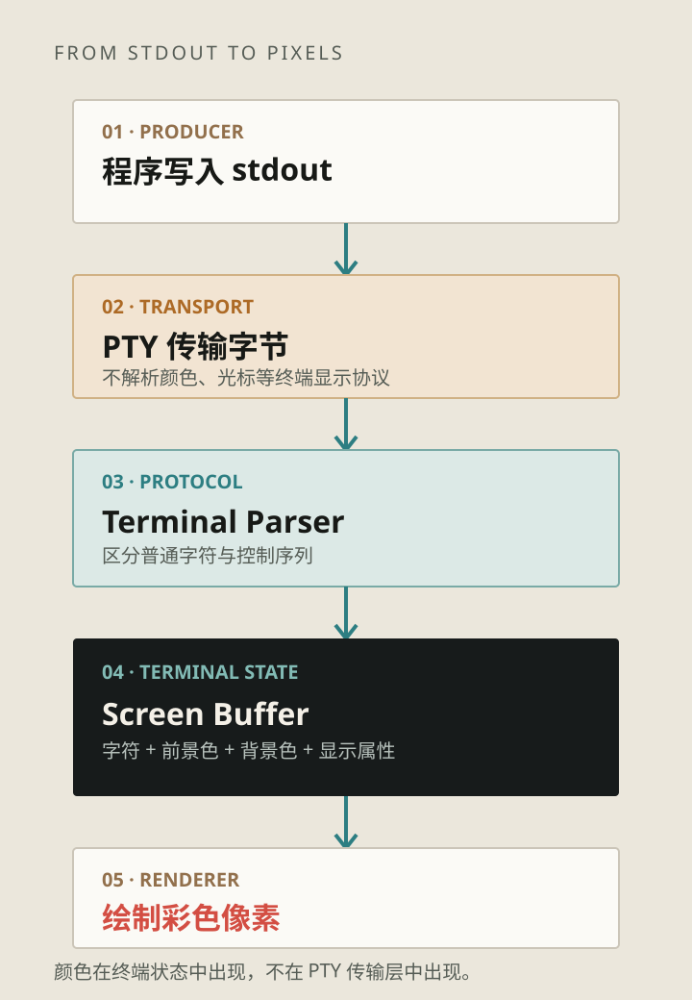
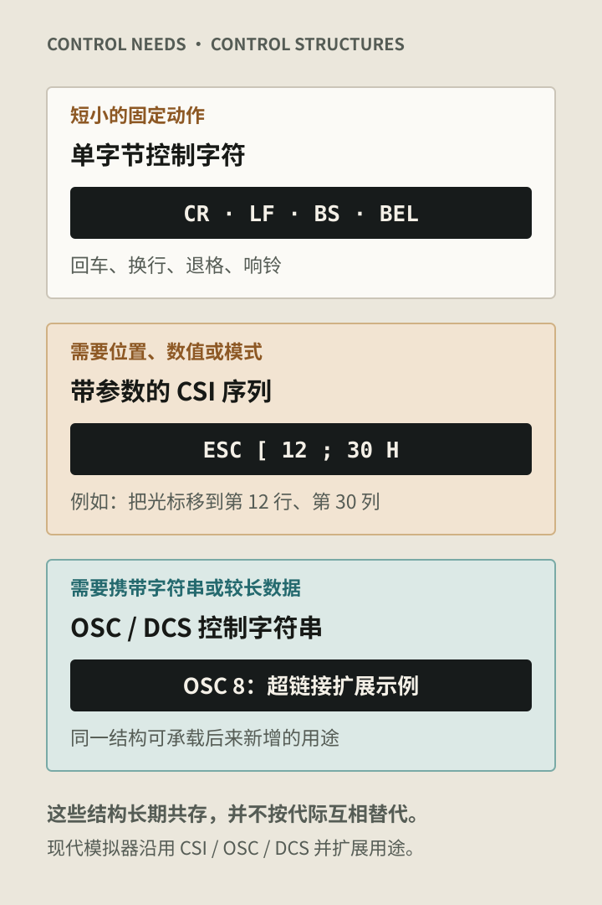
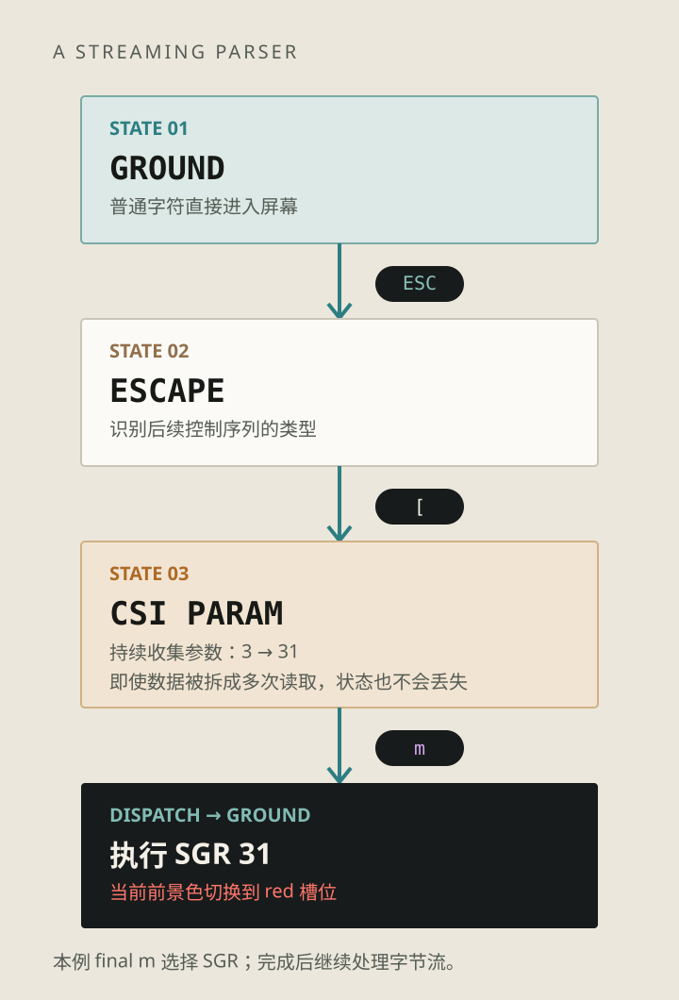
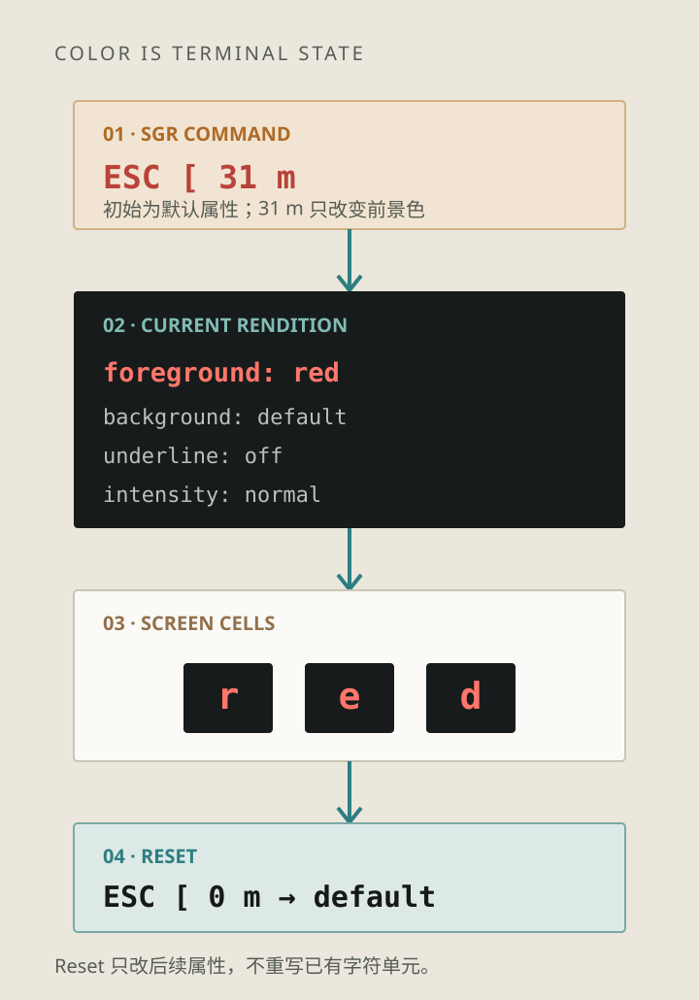
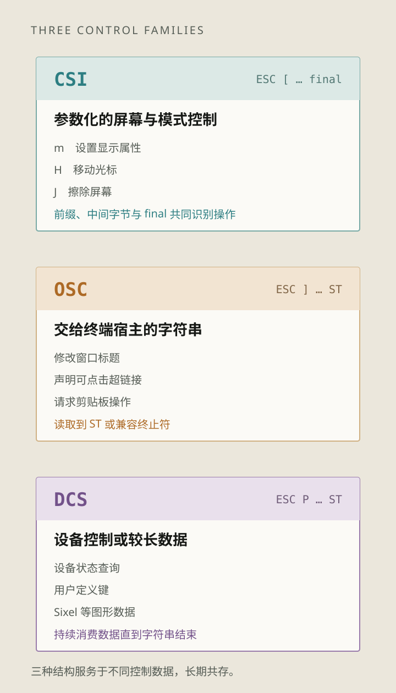

_题图：同一条字节流里既有要显示的文字，也有改变终端状态的控制序列。_

> 本文是《五彩斑斓的黑》系列第三篇。上一篇解释了 [TTY 与 PTY 为什么还存在](/blog/posts/terminal-series/why-tty-still-exists/)；这一篇接着看 PTY master 读到的字节，Terminal 怎样区分需要显示的文字和需要执行的控制序列。

在终端里运行：

```bash
printf '\033[31mred\033[0m\n'
```

在支持相应 SGR 序列的终端中，屏幕上会出现红色的 `red`。把 `printf` 的原始输出重定向到文件，再用十六进制工具查看，可以看到：

```text
1b 5b 33 31 6d 72 65 64 1b 5b 30 6d 0a
```

这串数据里没有图片、CSS，也没有单独的“颜色通道”。其中的 `72 65 64` 对应字母 `red`，前后的控制字节用来修改终端状态。PTY 不解释这些字节的颜色语义，Shell 也不负责上色；Terminal Emulator 解析控制序列，再把结果绘制到屏幕上。

## 从 stdout 到屏幕，中间发生了什么

stdout 连接 PTY slave 时，程序输出经内核终端层到达 master，再被终端模拟器读取。TTY 可能按配置转换字节：例如启用 `OPOST` 和 `ONLCR` 时，末尾的 `LF` 会变成 `CR-LF`。上面的十六进制清单是重定向文件中的原始输出，不能据此认定 PTY master 读到的字节完全相同。



_图 1：TTY 可能做换行等字节处理，但不解释颜色；Terminal Parser 修改显示状态后，Renderer 才绘制出颜色。_

许多程序会用 `isatty()` 判断 stdout 是否连接终端，再决定是否输出颜色序列；也有程序允许通过参数强制开启或关闭颜色。文件和管道同样可以保存这些序列，只有交给支持它们的终端解析后，才会产生对应的显示效果。

## 视频终端需要在文字之外控制屏幕

电传打字机把字符打印到纸上，打印过程基本只向前推进。回车、换行、退格和响铃可以分别使用 `CR`、`LF`、`BS`、`BEL` 这样的单字节控制字符表示。

到了视频终端，屏幕内容可以反复改写。主机除了发送文字，还要告诉终端把光标移动到第几行第几列、擦除哪一块区域、是否反色、滚动范围在哪里。操作数量增多以后，无法再为每个动作分配一个单独字节，还要解决参数的表示问题。

终端协议把可变长度的控制指令直接嵌入字符数据。[ECMA-48](https://ecma-international.org/publications-and-standards/standards/ecma-48/) 规定了这类控制功能在字符编码数据中的表示方式。数据仍通过同一条通道传输，接收端读到特定字节后切换解析状态。



_图 2：控制需求与结构。单字节控制字符、CSI 参数序列、OSC/DCS 控制字符串长期共存，各自承载不同类型的操作。_

这是一种带内控制协议：文字和命令走同一条链路。它不需要额外连接，可以和普通文本一起通过串口、PTY、SSH 或日志管道传输；代价是接收端必须持续解析，不能把输出简单地当作普通字符串。

## ESC 改变后续字节的解析方式

`ESC` 的字节值是十六进制 `1B`。解析器在 Ground 状态读到它时，不会将它写入屏幕，而是切换到 Escape 状态，继续读取后续字节，以确定控制序列的类型。

以设置红色前景为例：

```text
ESC  [  31  m
 │   │   │  └─ 执行 SGR
 │   │   └──── 参数：红色前景色
 │   └──────── 进入 CSI
 └──────────── 控制序列开始
```

`ESC [` 是 CSI（Control Sequence Introducer）的常用 7-bit 写法。`31` 是颜色参数，最后的 `m` 是最终字节（final byte），用来选择 SGR（Select Graphic Rendition）操作并结束这条 CSI。只有 `m` 到达后，`31` 才会被按 SGR 参数解释，解析器随后把前景色切换为红色。



_图 3：以 `ESC[31m` 为例的简化状态转换：收到 `m` 才执行 SGR。真实解析器还要处理私有前缀、中间字节、取消、字符串和错误恢复等分支。_

一次读取不一定能拿到完整的控制序列。PTY 的两次读取可能分别得到 `ESC [` 和 `31m`，SSH 数据包或 WebSocket 消息的边界也可能落在序列中间。Parser 必须跨数据块保存状态。逐块使用正则表达式删除 ANSI 序列，可能漏掉被拆开的部分。

[XTerm Control Sequences](https://invisible-island.net/xterm/ctlseqs/ctlseqs.html) 还说明了其解析器的错误恢复方式：遇到不合法的字节时回到 Ground。语法正确但功能未实现的序列，则需要与解析错误区别处理。

## 颜色是终端状态，不是字符的一部分

SGR 不会修改后面的字符编码。它更新的是“当前显示属性”：前景色、背景色、粗体、下划线等。解析器随后遇到普通字符时，把字符和当前属性一起写入 Screen Buffer。



_图 4：`SGR 31` 只把当前前景色改为红色。图中其余属性假设原本处于默认值；后续字符单元继承当前属性，收到 Reset 后才恢复默认。_

`31` 选择基础调色板中的红色前景，并不对应固定的 RGB 值；终端主题可以为这个位置指定不同的红色。256 色写法 `38;5;n` 同样选择调色板索引。

True Color 的 `38;2;r;g;b` 则直接给出 RGB 分量，语义上不经过索引色的主题映射。终端不支持直接色时可能降级显示，对比度设置和色彩管理也可能影响最终像素，但这与“由主题决定索引对应什么颜色”是两回事。[XTerm 的 SGR 说明](https://invisible-island.net/xterm/ctlseqs/ctlseqs.html)分别列出了索引色与直接色。

换行本身不会恢复颜色。程序输出 `ESC[31m` 后，只要没有其他序列改变前景色，后续文字就会继续显示为红色。`ESC[0m`（Reset）把当前显示属性恢复为默认值，不会回头修改已经写入的字符单元。

## CSI、OSC 与 DCS 解决不同类型的控制

有些控制操作可以使用“若干数字参数加一个结束字节”，有些则需要携带字符串或设备数据。因此，ECMA-48 和后续终端实现采用了多种控制序列结构。



_图 5：CSI 适合参数有限的控制操作；OSC 与 DCS 可以继续读取字符串，直到遇到 ST 等终止符。_

### CSI：参数化的屏幕控制

CSI 常用于光标、屏幕区域和终端模式：

- `m` 设置显示属性；
- `H` 移动光标；
- `J` 擦除屏幕；
- `h`、`l` 设置或重置模式。

这些简单 CSI 用最终字节选择操作，再用参数给出位置或模式。完整的 CSI 识别还要看私有前缀和中间字节，不能只按最后一个字符分派。例如 `CSI Ps q` 与带空格中间字节的 `CSI Ps SP q`，在 xterm 中就是不同操作。

### OSC：面向终端宿主的字符串指令

OSC（Operating System Command）通常携带命令编号和一段字符串，用于修改窗口标题、声明超链接或请求剪贴板操作。这些操作不再局限于字符网格，还会影响终端窗口和桌面环境。

OSC 经常以 ST（String Terminator）结束。出于兼容性，很多终端也接受 `BEL`，所以不能只靠固定长度判断一条 OSC 的边界。

### DCS：承载设备控制数据

DCS（Device Control String）可以承载设备状态查询、用户定义键和 Sixel 等图形数据。解析器识别 DCS 的头部后，会继续读取数据，直到收到字符串终止符。

CSI、OSC 和 DCS 不是三个协议版本，也不是由低到高的能力等级。它们解决的是不同的封装问题。

## 标准统一了结构，没有统一所有终端

日常所说的“ANSI 转义码”包含多种来源。ECMA-48 定义了控制功能和编码结构；DEC 终端实现了一组标准能力，也增加了私有模式；xterm、aixterm 和现代终端模拟器又加入了颜色、鼠标、超链接、图片和宿主集成。

VT100 推动了 ANSI 兼容序列的普及，但它不是今天这套 256 色或 True Color 能力的完整来源。VT100 主要使用单色屏幕，SGR 可以改变反色、强调等显示属性；后来的终端和扩展补充了更多颜色能力。[VT100 Programmer Information](https://vt100.net/docs/vt100-ug/chapter3.html) 同时列出了 ANSI 模式与 DEC Private Mode。

ECMA-48 本身也明确允许设备只实现适合自己的子集。因此，“语法正确”不等于“当前终端支持”。应用通常根据 `$TERM` 指定的类型名称查询 [terminfo 数据库](https://invisible-island.net/ncurses/man/terminfo.5.html)。这是查表，不是现场验证；名称、数据库和实际终端配置仍可能不匹配。部分扩展另有查询或协商方式，不能只靠一张硬编码序列表。

## 控制序列也需要安全边界

Terminal 接收的是一套会改变显示和宿主状态的协议，不是纯文本。可信程序用它绘制 TUI；未经处理的文件、日志和远端输出同样可以携带控制序列。

这些序列可以清屏或修改标题，也可能涉及超链接、剪贴板和终端特有扩展。终端实现通常会限制敏感能力，日志系统和 Web Terminal 也需要明确哪些序列允许执行、哪些只记录、哪些必须过滤。

记录终端会话时，只抄下最后一屏文字，会丢掉之前被覆盖的输出。要追查程序输出过什么，可以保留原始字节；要知道这些字节怎样改变了画面，还需要解析事件或屏幕状态。准确回放还涉及时间、窗口尺寸变化和终端配置。记录可能含敏感内容，也应限制访问和留存范围。

## 在本机看见这些字节

### 实验一：比较渲染结果和原始内容

```bash
printf '\033[31mred\033[0m\n' > /tmp/color.txt
od -An -tx1 /tmp/color.txt
cat -v /tmp/color.txt
cat /tmp/color.txt
```

`od` 显示十六进制字节，`cat -v` 尝试把不可见控制字符表示出来，最后一条命令让当前终端解析同一个文件。文件没有“红色格式”，其中保存的仍是控制序列和普通字符。

### 实验二：观察没有 Reset 的结果

在 Bash 或兼容 Shell 中，把下面的命令组完整执行。花括号内的输出会连续发生，避免两条命令之间插入交互提示符：

```bash
{
  printf '\033[31mred'
  printf ' still red?\n'
  printf '\033[0m'
}
```

第二次 `printf` 没有设置颜色，却仍显示为红色，第三次才执行 Reset。若把三条命令分开交给交互式 Shell，彩色提示符可能在中间恢复颜色，就观察不到相同结果。

### 实验三：把序列分给两次输出

同样完整执行这组命令，让两段输出之间没有提示符或其他输出插入：

```bash
{
  printf '\033['
  printf '31mred\033[0m\n'
}
```

两次 `printf` 的输出可以组成完整 CSI。这个例子不保证对应两次系统调用或两次 PTY 读取；它说明控制序列可以跨越应用的输出操作。模拟器无论一次读完还是分批读到，都需要按连续字节流解析。

颜色设置好以后，后面的字符会沿用它。光标位置也可以由控制序列改变：程序先移动光标，再输出文字，就能覆盖屏幕上已有的内容。

> **下一篇：《Terminal 为什么可以原地更新屏幕？》**
>
> 下一篇继续介绍 CSI、光标移动、擦除区域与滚动范围，以及 TUI 如何维护一块持续变化的字符屏幕。

## 资料参考

- [ECMA-48：Control Functions for Coded Character Sets](https://ecma-international.org/publications-and-standards/standards/ecma-48/)：控制功能、7-bit/8-bit 表示与开放式结构。
- [Digital VT100 User Guide：Programmer Information](https://vt100.net/docs/vt100-ug/chapter3.html)：VT100 的 ANSI 模式、光标、屏幕和私有模式。
- [VT510 Programmer Information：SGR](https://vt100.net/docs/vt510-rm/SGR.html)：显示属性及参数定义。
- [XTerm Control Sequences](https://invisible-island.net/xterm/ctlseqs/ctlseqs.html)：现代 xterm 支持的 CSI、OSC、DCS 与扩展行为。
- [xterm.js](https://github.com/xtermjs/xterm.js)：浏览器终端模拟器中的解析、屏幕状态与渲染实现；操作系统 PTY 通常由 node-pty 等后端接入，可参看 [Flowcontrol 文档](https://xtermjs.org/docs/guides/flowcontrol/)。
- [Linux man-pages：termios(3)](https://man7.org/linux/man-pages/man3/termios.3.html)：`OPOST`、`ONLCR` 等终端输出处理选项。
