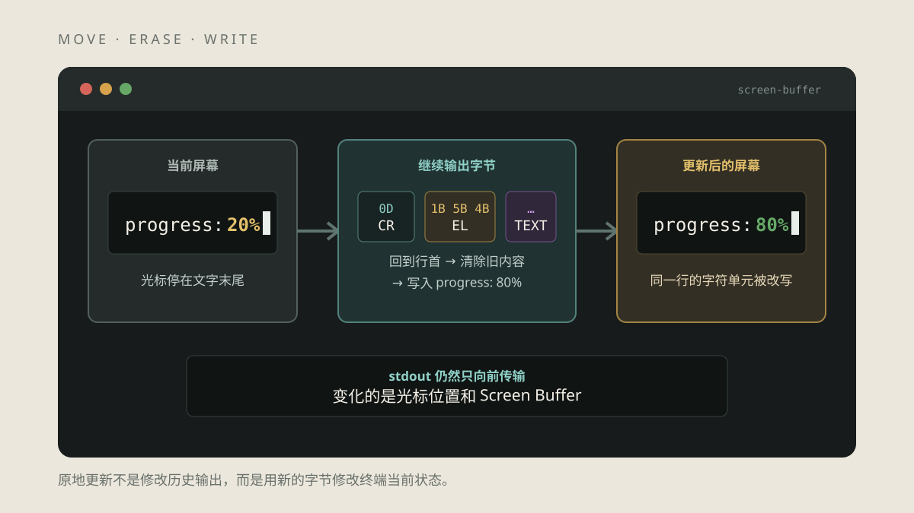
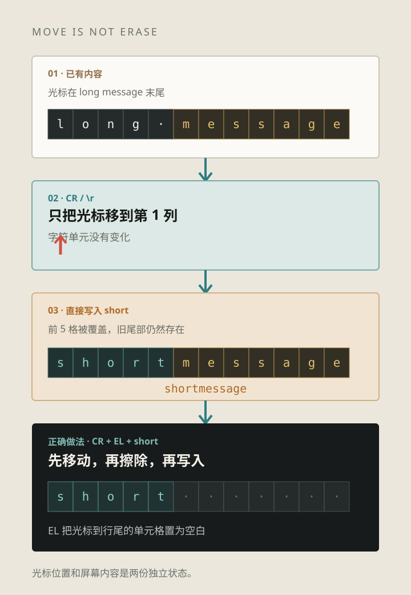
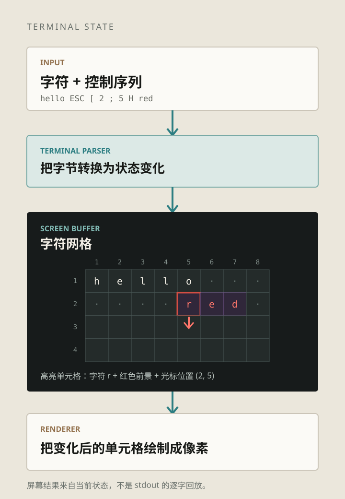
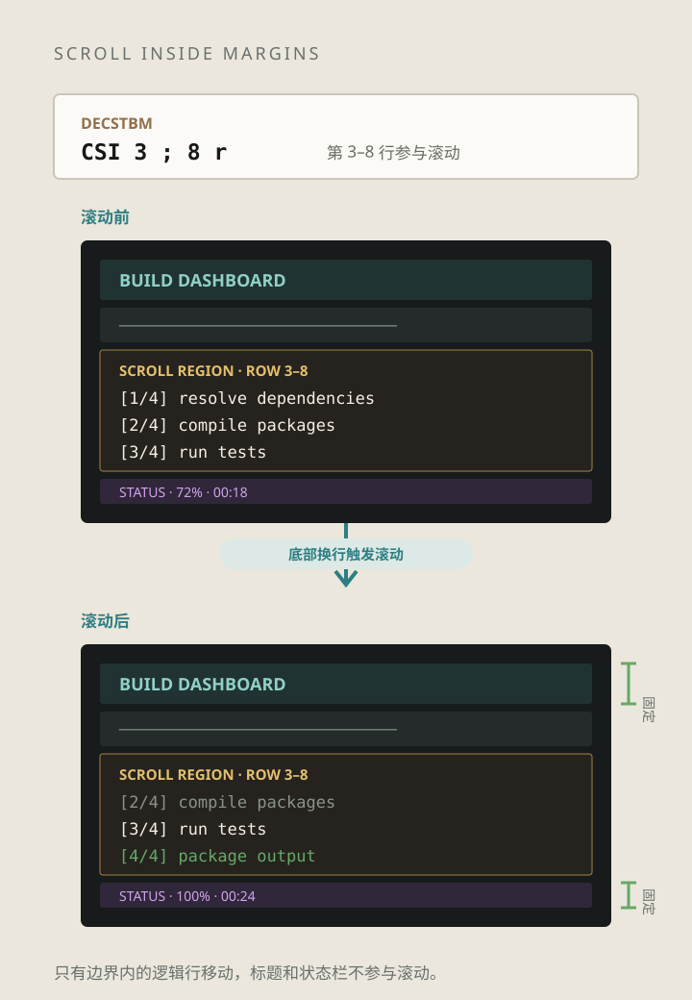
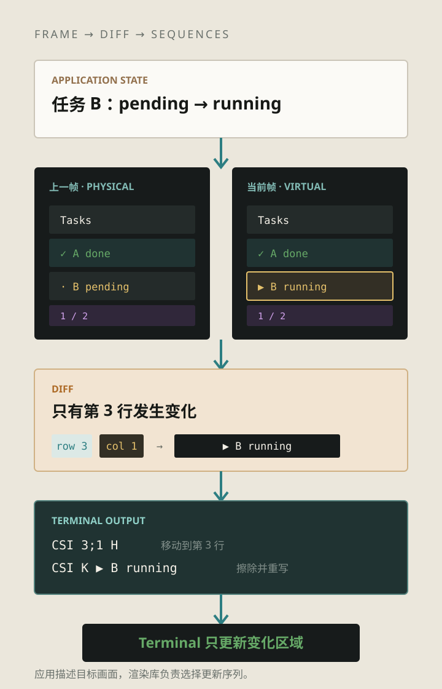

_题图：程序没有修改已经输出的字节，而是移动光标、清理旧单元格，再写入新的内容。_

> 本文是《五彩斑斓的黑》系列第四篇。上一篇解释了 [Terminal 为什么能显示彩色文字](/blog/posts/terminal-series/why-terminal-can-display-colors/)；这一篇继续看同一条字节流，Terminal 怎样用光标和 Screen Buffer 改写已经显示出来的内容。

下载进度、构建状态和命令行里的 Spinner 经常停在同一行变化：

```bash
printf 'progress: 20%%'; sleep 1; printf '\r\033[Kprogress: 80%%\n'
```

如果 stdout 只能不断向后追加，进度每变化一次就应该多出一行。这里没有发生这种情况，因为 Terminal 维护的不是一张打印完就不能修改的纸，而是一块带光标的字符网格。

上面的第二次 `printf` 做了三件事：

```text
\r         光标回到当前行最左侧
ESC [ K    从光标位置擦除到行尾
progress…  从当前位置写入新内容
```

这里的“原地更新”，就是改变下一次写入的位置，再修改那里的字符单元。

## 从纸上的回车到屏幕上的光标

`CR`（Carriage Return）来自打字机的机械动作：让字车回到左边界。到了视频终端，它变成了一个光标操作，字节值是 `0D`。

[VT100 系列的控制字符说明](https://vt100.net/docs/tp83/appendixb.html) 对 `CR` 的定义很直接：把光标移动到当前行的左边界。它不换行，也不清除这一行已有的内容。

这两条命令的差别很容易看到：

```bash
{
  printf 'downloading 100%%\rDone\n'
  printf 'downloading 100%%\r\033[KDone\n'
}
```

第一条会留下类似 `Doneloading 100%` 的结果。`Done` 只覆盖了开头四个字符，后面的旧字符仍在。第二条在写入 `Done` 前执行 `EL`（Erase in Line），旧内容才会被清掉。



_图 1：移动光标与擦除内容是两个操作。新文本比旧文本短时，只有 `CR` 不够。_

`LF` 与 `CR` 也不是同一个动作。`LF` 把活动位置移到下一行，`CR` 回到当前行左侧。常见的 Unix TTY 输出处理会把 `\n` 转换成 `CR + LF`，但终端协议仍保留了这两个独立概念。

## Screen Buffer 是一块有状态的字符网格

终端模拟器收到普通字符后，不会直接把像素永久画在窗口上。它先把字符写入 Screen Buffer 中光标指向的单元格，再移动光标。Renderer 根据缓冲区内容绘制当前画面。

一个字符单元通常不只有字符本身，还包含前景色、背景色、粗体、下划线、宽度等显示信息。整个终端状态还包括：

- 当前光标的行列位置；
- 可见区域和历史回滚位置；
- 当前显示属性；
- 自动换行、插入模式等终端模式；
- 滚动区域的上下边界。



_图 2：输出字符时，Parser 修改的是光标位置和字符单元；Renderer 再把缓冲区绘制成像素。_

[xterm.js 的 Buffer API](https://xtermjs.org/docs/api/terminal/interfaces/ibuffer/) 也公开了这套模型中的关键状态：`cursorX`、`cursorY`、`viewportY`、Buffer 类型以及逐行读取接口。不同终端内部实现并不相同，但对应用呈现出的抽象接近：一个可以定位和改写的字符网格。

“改写屏幕”并不是修改 stdout。已经传输的字节不会倒流，程序只是继续输出新的控制序列和字符；Terminal Parser 按顺序修改 Screen Buffer，后来的状态覆盖了先前的显示结果。

## CSI 把光标移动和擦除扩展到整块屏幕

`CR` 只能回到当前行左侧。全屏程序还需要上下移动、跳到指定坐标、清除一段区域。CSI 为这些操作提供了带参数的形式。

| 操作               | 常见写法        | 作用                       |
| ------------------ | --------------- | -------------------------- |
| 回到当前行左侧     | `CR` / `\r`     | 移动列位置，不擦除         |
| 上、下、右、左移动 | `CSI n A/B/C/D` | 相对当前位置移动光标       |
| 跳到指定坐标       | `CSI row;col H` | 把光标放到指定行列         |
| 擦除行内区域       | `CSI Ps K`      | 擦除光标前、后或整行       |
| 擦除屏幕区域       | `CSI Ps J`      | 擦除光标前、后或整个显示区 |

[VT220 Programmer Reference](https://vt100.net/docs/vt220-rm/chapter4.html) 把“编辑”和“擦除”分成了不同操作。擦除只把目标单元格变为空白，不移动光标，也不让右侧内容自动向左补位；插入和删除字符则会移动同一行里的其他单元格。

这个区别在实现 TUI 时很重要。清空一块区域、删除一个字符、用空格覆盖，屏幕看起来可能相似，但它们对光标位置、字符属性和后续内容的影响并不相同。

## 滚动不是整屏重画

日志不断增加时，终端通常会向上滚动。全屏 TUI 还可能要求顶部标题和底部状态栏保持不动，只让中间区域滚动。

`DECSTBM`（Set Top and Bottom Margins）使用 `CSI top;bottom r` 设置上下边界。光标位于滚动区域底部时，继续换行会让区域内的行向上移动，边界外的内容保持原位。



_图 3：滚动是 Screen Buffer 的区域操作，不需要应用重新发送整块屏幕。_

VT100 的文档已经定义了这项能力。更早的 [VT52 维护手册](https://www.vt100.net/docs/vt52-mm/chapter4.html) 还能看到硬件实现思路：滚动时不必复制并重写每一行显存，只需改变哪一行被映射为屏幕顶部。现代终端的内部结构已经不同，但“移动逻辑行或改变映射，而不是重画所有像素”的思路仍然成立。

设置滚动区域后，还要处理边界条件。光标是否受上下边界限制，会受到 Origin Mode 等模式影响；不同序列在区域内外的行为并不完全相同。应用可以通过 terminfo 或成熟的 TUI 库使用这些能力，不应假设所有终端都实现同一组细节。

## TUI 更新的是差异，不是重复打印整页文本

Terminal Emulator 只执行移动、擦除、写字符等操作。它并不知道屏幕上哪里是列表、按钮或对话框。把业务状态变成终端更新序列，是 TUI 应用或渲染库的工作。

经典的 curses 维护两份屏幕状态：

- physical screen：程序认为终端当前显示的内容；
- virtual screen：程序希望下一帧显示的内容。

`doupdate()` 比较两者，再把必要的更新发送给终端。[ncurses 的 `curs_refresh` 文档](https://invisible-island.net/ncurses/man/curs_refresh.3x.html) 说明了这一过程，也解释了为什么先合并多个窗口的变化，再统一刷新，可以减少输出次数和传输字符。

[Ratatui 的 `Terminal` 渲染流程](https://docs.rs/ratatui/latest/ratatui/struct.Terminal.html) 采用类似思路。应用每一帧仍然描述完整 UI，库比较当前 Buffer 和上一帧 Buffer，只把变化的字符单元交给后端。界面代码可以按“重画整帧”来写，发往 Terminal 的通常只是差异。



_图 4：应用描述目标画面，TUI 库计算差异，Terminal Parser 执行光标与字符更新。_

“只发送变化”也不等于逐单元格机械比较。移动光标本身有成本，连续写一段字符有时比频繁跳转更便宜，整屏变化时直接清屏重画也可能更合适。成熟库会结合终端能力和输出成本选择更新方式。

## 原地更新最容易在哪些地方出错

原地更新要求应用与终端对屏幕状态保持一致。两边一旦不同步，界面就会出现残影、错位或闪烁。

### 字符不一定只占一个单元格

ASCII 字符通常占一格，但 CJK 字符、Emoji、组合字符和零宽字符更复杂。应用计算出的显示宽度如果与终端不同，后面的光标定位会整体偏移。这里需要处理的是 grapheme 和 cell width，而不是字符串字节数。

### 窗口大小会变化

终端列数或行数变化后，旧的换行位置、布局和 Buffer 尺寸可能全部失效。Unix 环境通常通过 `SIGWINCH` 通知前台进程，TUI 重新计算布局，并在必要时做一次完整重画。

### TUI 运行期间不能随意混入其他输出

渲染库根据上一帧推算终端当前状态。如果其他线程、日志库或子进程绕过渲染器直接写 stdout，physical screen 的假设就会失效。下一次 diff 可能从错误的位置继续更新。

### 退出时要恢复终端状态

全屏 TUI 往往还会隐藏光标、启用 Raw Mode，或者切换到 Alternate Screen。程序异常退出而没有恢复这些状态，就会留下不可见光标、错乱的输入模式或停留在备用屏幕。成熟框架通常用清理守卫和 panic/signal handler 处理退出路径。

## 在本机观察原地更新

### 实验一：比较 CR 与 CR + EL

```bash
{
  printf 'long message\rshort\n'
  printf 'long message\r\033[Kshort\n'
}
```

第一行会留下旧文本的尾部，第二行不会。`CR` 只移动光标，`EL` 才负责清理旧单元格。

### 实验二：返回上一行修改内容

```bash
{
  printf 'task A: pending\ntask B: pending\n'
  printf '\033[2A\r\033[Ktask A: done'
  printf '\033[2B\r'
}
```

`CSI 2 A` 把光标上移两行，随后重新写入第一项。最后再把光标移回下方，避免 Shell Prompt 出现在列表中间。

### 实验三：观察一次简单的进度更新

```bash
{
  for n in 0 20 40 60 80 100; do
    printf '\r\033[Kprogress: %3s%%' "$n"
    sleep 0.2
  done
  printf '\n'
}
```

循环每次都发送新的字节，但 Screen Buffer 中被反复修改的是同一行。

## 屏幕结果不等于输出过程

Terminal 的原地更新由几项能力共同完成：光标决定写入位置，擦除和编辑序列修改目标区域，Screen Buffer 保存当前画面，Renderer 绘制变化后的字符单元。TUI 在这些基础能力之上维护前后两帧，计算需要发送的差异。

屏幕最终留下的内容不等于程序完整输出。进度条可能更新一百次，最后只剩一行；TUI 可能覆盖旧状态，滚动区域还会移走一部分内容。终端录制、审计和 Agent 上下文如果只读取最终屏幕，就会丢失变化过程；如果只保存原始字节，又需要重新执行终端状态机才能还原用户看到的画面。

> **下一篇：《Terminal 为什么会有第二块屏幕？》**
>
> 下一篇继续介绍 Normal Buffer、Alternate Screen、`DECSET 1049` 和退出恢复，解释 Vim、less 与全屏 TUI 为什么运行时不覆盖原来的 Shell 内容。

## 资料参考

- [ECMA-48：Control Functions for Coded Character Sets](https://ecma-international.org/publications-and-standards/standards/ecma-48/)：光标、擦除、编辑和滚动等控制功能的标准定义。
- [VT100 User Guide：Programmer Information](https://vt100.net/docs/vt100-ug/chapter3.html)：VT100 的光标移动、擦除和滚动区域。
- [VT220 Programmer Reference Manual](https://vt100.net/docs/vt220-rm/chapter4.html)：编辑、擦除、Origin Mode 与自动换行的行为。
- [XTerm Control Sequences](https://invisible-island.net/xterm/ctlseqs/ctlseqs.html)：xterm 支持的现代控制序列及兼容行为。
- [xterm.js Buffer API](https://xtermjs.org/docs/api/terminal/interfaces/ibuffer/)：浏览器终端中的光标、视口和 Buffer 接口。
- [ncurses `curs_refresh`](https://invisible-island.net/ncurses/man/curs_refresh.3x.html)：virtual screen、physical screen 与差异更新。
- [Ratatui `Terminal`](https://docs.rs/ratatui/latest/ratatui/struct.Terminal.html)：当前 Buffer、上一帧 Buffer 和 diff 渲染流程。
