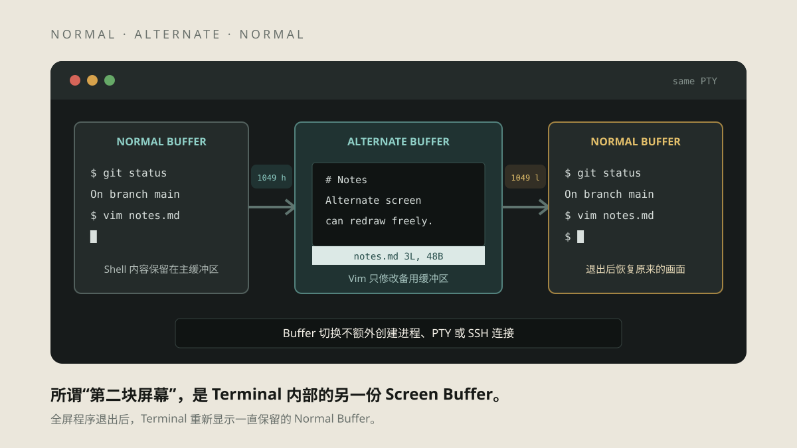
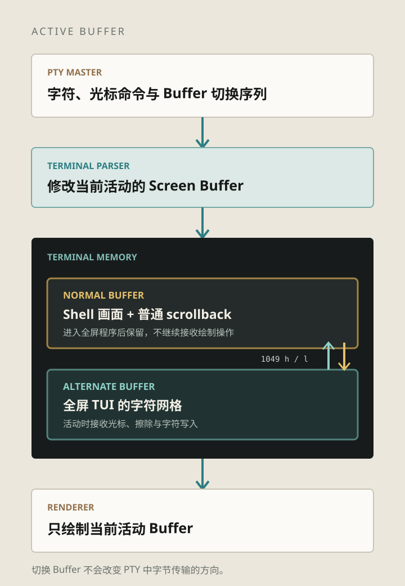
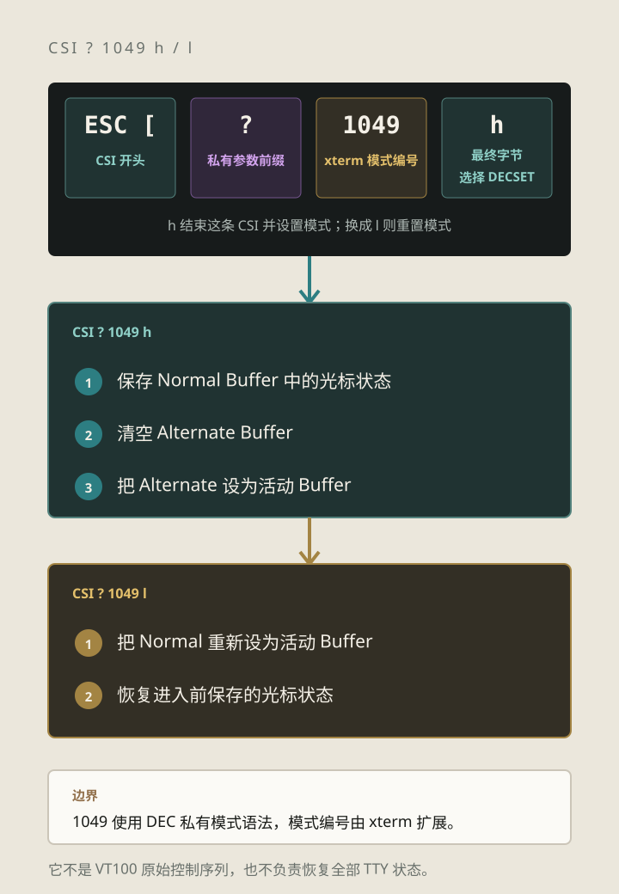
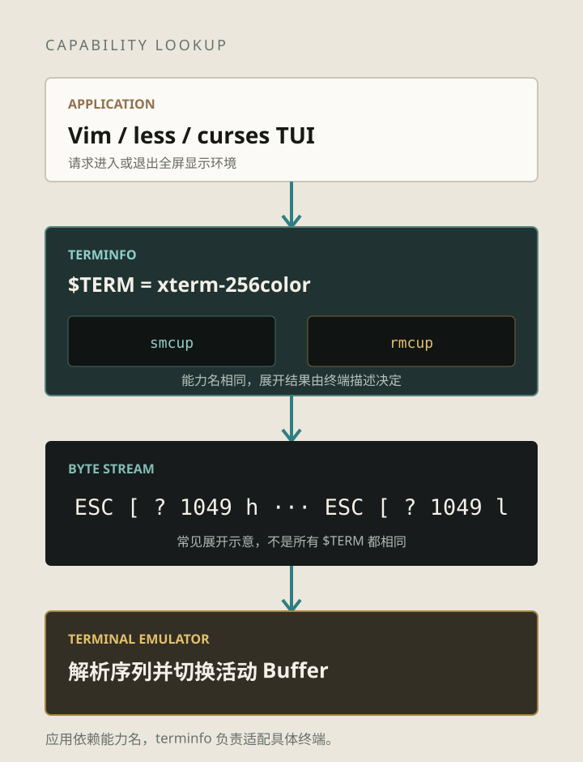
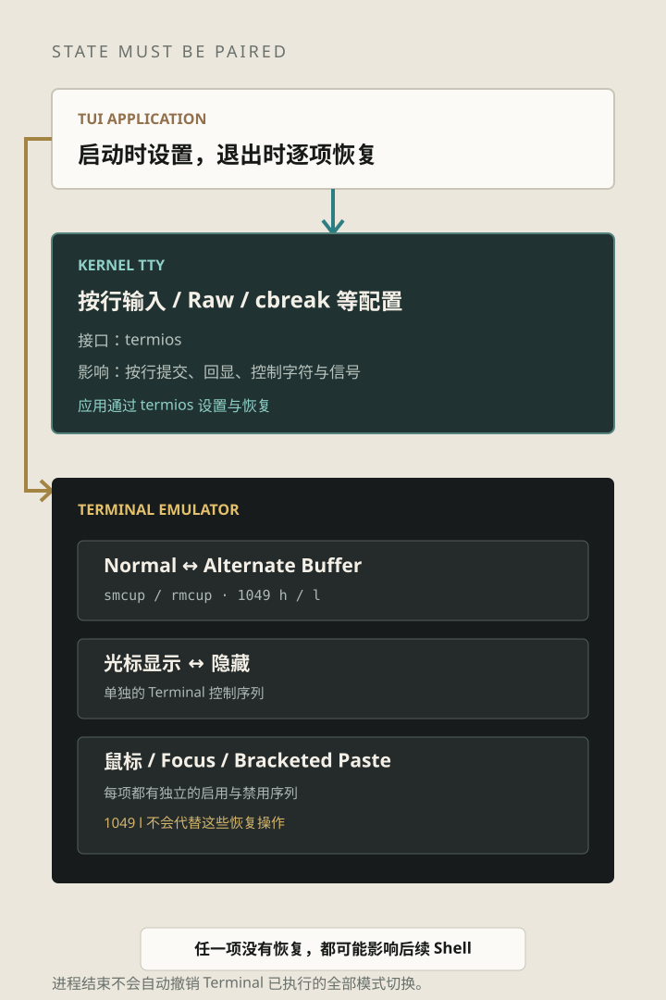

*题图：Vim 与 Shell 使用同一个 PTY。变化发生在 Terminal
内部：全屏程序运行时，当前显示的 Buffer 从 Normal 切换为 Alternate。*

> 本文是《五彩斑斓的黑》系列第五篇。上一篇解释了 [Terminal
> 如何在同一块字符网格上原地更新](/blog/posts/terminal-series/why-terminal-can-update-screen-in-place/)；这一篇继续看全屏程序如何使用这块网格，又不覆盖退出前的
> Shell 内容。

Vim 运行时占满窗口，退出后却恢复了之前的命令输出。这些内容保存在哪里？

Terminal Emulator 通常维护 Normal Buffer 和 Alternate Buffer。Vim
启动时请求使用备用缓冲区，退出时切回主缓冲区，原来的 Shell
画面便重新显示出来。

## Shell 内容保存在 Normal Buffer 中

上一篇介绍的 Screen Buffer 并不一定只有一份。现代终端通常至少提供两份：

- **Normal Buffer**：Shell 平时使用的主缓冲区，通常还连接着 scrollback；
- **Alternate Buffer**：供 Vim、less、top、k9s
  等全屏程序临时使用，通常只有当前窗口大小，不把滚出顶部的内容加入普通
  scrollback。

进入 Alternate Screen 后，普通字符写入、光标移动和擦除作用于 Alternate
Buffer，主屏内容不会被这些操作覆盖。不过，窗口 resize
仍可能影响主缓冲区的尺寸与布局，“保留内容”不代表全部状态冻结。



*图 1：切换的是 Terminal 当前显示和修改的 Buffer。Shell、Vim 与 Terminal
仍通过原来的 PTY 交换字节。*

[xterm.js 的 Buffer
API](https://xtermjs.org/docs/api/terminal/interfaces/ibuffernamespace/)
直接暴露了 `normal`、`alternate` 和 `active` 三个入口。`active`
只是指向当前使用的那一份，收到切换序列时会发生变化。

常见的 `1049`
进入方式会清空备用缓冲区。应用可以在其中自由重画，不必读取或保存 Shell
屏幕；退出时，备用缓冲区内容也不会自动合并到主屏。

## `ESC[?1049h` 如何切换屏幕

xterm 兼容终端中常见的进入序列是：

```text
ESC [ ? 1049 h
```

退出时把最后的 `h` 换成 `l`：

```text
ESC [ ? 1049 l
```



*图 2：`h` 设置模式，`l` 重置模式。`1049` 不只是选择另一份
Buffer，还组合了光标保存与恢复。*

这条 CSI 可以拆成四部分：

```text
ESC [       CSI 的 7-bit 开头
?           DEC Private Mode 参数前缀
1049        xterm 定义的私有模式编号
h / l       最终字节：选择设置 / 重置模式，并结束这条 CSI
```

执行 `CSI ? 1049 h` 时，xterm 保存当前光标状态，清空 Alternate
Buffer，再切换过去；执行 `CSI ? 1049 l` 时，xterm 切回 Normal
Buffer，并恢复此前保存的光标状态。[XTerm Control
Sequences](https://invisible-island.net/xterm/ctlseqs/ctlseqs.html)
将它描述为 `1047` 与 `1048` 两项能力的组合。

`?` 使用了 DEC Private Mode 的语法，但 `1049` 这个模式编号来自 xterm
扩展，不是 VT100 原始能力。xterm 为兼容旧应用还保留了几种相关模式：

| 模式   | 设置与重置时的主要行为                                    |
|--------|-----------------------------------------------------------|
| `47`   | 在 Alternate 与 Normal 之间切换，较早的 xterm 兼容方式    |
| `1047` | 设置时切到 Alternate；重置时清空 Alternate，再返回 Normal |
| `1048` | 设置时保存光标状态，重置时恢复，不切换 Buffer             |
| `1049` | 保存光标并清空、进入 Alternate；返回 Normal 时恢复光标    |

对应的重置操作使用 `l`。其中 `1049`
把全屏程序常用的进入与退出步骤配成了一组，因此现代 xterm 类型的 terminfo
通常优先使用它。不同终端对旧模式和边界行为的兼容程度仍可能不同。

## 应用通常通过 terminfo 进入备用屏幕

应用可以直接写死 `ESC[?1049h`，但这样等于假设当前终端实现了 xterm
的这项扩展。Unix 早已存在另一层适配：termcap 中的 `ti/te`，以及 terminfo
中对应的 `smcup/rmcup`。

- `smcup`：进入终端使用光标寻址所需的模式；
- `rmcup`：退出该模式，本身不保证恢复原来的屏幕内容。

这些名字来自不同年代的硬件能力，不保证它们展开后只包含一条“切换
Buffer”的序列。[terminfo
文档](https://man7.org/linux/man-pages/man5/terminfo.5.html)
提到，有些早期终端拥有多页显示内存，有些终端则需要先固定一个与屏幕等大的窗口，才能正确使用光标寻址。

在今天常见的 `xterm-256color` 描述中，`smcup/rmcup` 往往会展开为 `1049`
的设置与重置。Vim 或 curses 应用查询 terminfo，再把当前 `$TERM`
对应的字节发送给 Terminal，而不是把某一种终端的序列当成统一标准。



*图 3：应用请求的是 `smcup/rmcup` 能力；terminfo 根据 `$TERM`
返回具体字节，Terminal 再执行切换。*

可以在本机查看当前配置：

```text
infocmp -1 "$TERM" | grep -E '^[[:space:]]*(smcup|rmcup)='
tput smcup | od -An -tx1
tput rmcup | od -An -tx1
```

这里把 `tput` 的输出交给
`od`，所以控制序列只会以十六进制显示，不会真的切换当前 Terminal。不同
`$TERM` 得到的结果可能不同；能力也可能不存在。

同一个程序在不同环境中可能表现得不完全一致。即使 Terminal 支持 Alternate
Screen，若 `$TERM` 指向不匹配的
terminfo，或者用户、终端配置禁用了切换，程序也可能直接在 Normal Buffer
上绘制。

`less -X`
跳过终端初始化与退出字符串，通常也就不切换备用屏幕，浏览到的内容可能留在主屏上。

## 为什么 Alternate Screen 通常没有普通 scrollback

Normal Buffer 保存 Shell 的连续输出，滚出窗口顶部的行可以进入
scrollback。全屏程序则不断在固定的行列范围内改写内容，屏幕上的上下关系并不等于时间顺序。

例如 Vim
向下滚动文件时，可能只是把若干行移出区域，再在底部写入新的文本；top
每次刷新也会覆盖上一帧。如果把这些中间画面逐行追加到 Normal Buffer 的
scrollback，很快会得到大量重复、错序且脱离界面结构的内容。

xterm
的备用缓冲区与可见区域同样大小，并在该模式下停止把滚出顶部的行保存到普通
scrollback。很多终端沿用了这种行为，也有终端提供自己的配置或查看方式，所以它不是所有实现都必须完全一致的界面规则。

Vim 退出后的主屏不包含编辑器运行期间的画面。终端录制或 Agent
若需要还原过程，应从已知初始状态记录带时间信息的输出与窗口尺寸变化，再用终端状态机重放；只读取退出后的主屏会漏掉这段交互。

## 嵌套全屏程序会有第三块屏幕吗

在同一个终端实例中，Normal/Alternate
是两种缓冲区，不是按进程分配的屏幕栈。已经处于 Alternate Screen
时，再启动一个全屏程序，不会自动获得第三份缓冲区。内层程序可能清空外层画面，退出时还可能切回主屏；外层程序需要协调暂停、恢复与重画。

通过 SSH 运行时，切换序列使用原来的输出通道传输。tmux 则为每个 pane
维护虚拟终端状态，再生成外层终端的显示更新；内外层的 Buffer
不应看成同一份。进入备用屏幕本身不会额外创建 PTY。

## 切换屏幕不等于接管全部终端状态

应用启动时通常连续设置多项状态：通过 termios 关闭按行输入，使用 Raw 或
cbreak
等模式；请求备用屏幕；隐藏光标；按需启用鼠标、粘贴或焦点报告。它们不是同一个开关，`1049l`
也不能一次恢复全部状态。



*图 4：Alternate Screen 只负责显示缓冲区。Raw Mode 属于内核
TTY，光标、鼠标和粘贴模式则由其他控制序列管理。*

`1049` 处理的是 Buffer 和保存的光标状态。Raw Mode 由 `termios`
管理；光标显示、鼠标跟踪等功能各有自己的控制序列。一个完整的退出过程要逐项撤销应用启用的状态。

因此，异常退出后的故障也有不同表现：

- 仍停在 Alternate Buffer：Shell 内容没有重新显示；
- TTY 仍处于 Raw Mode：按键立即到达程序，输入不回显，`Ctrl-C`
  也可能不再由 Line Discipline 转成 `SIGINT`；
- 光标仍被隐藏：Shell 可以正常输入，但看不到光标；
- 鼠标报告仍开启：点击或滚轮操作变成类似控制序列的字符输入。

应用应在正常返回、错误和可处理的信号路径上执行清理；使用 TUI
库也要遵循它的退出流程。`SIGKILL`
无法被捕获，程序没有机会发送恢复序列。交互式 Shell 可能恢复部分 TTY
设置，但不能指望它撤销应用启用的全部终端模式。

遇到这类问题，可以先尝试：

```text
reset
```

或者针对已知状态执行
`stty sane`、`tput cnorm`、`tput rmcup`。它们分别处理不同层次的问题，不是完全等价的修复命令。

## 在本机观察 Buffer 切换

在普通 Shell 中运行下面的实验，不要在已有全屏 TUI 中嵌套测试。先确认
Terminal 支持并允许备用屏幕：terminfo
能力存在只代表配置声明支持，不是终端执行成功的确认。

### 实验一：安全地进入和退出备用屏幕

```bash
(
  [ -t 1 ] || exit 1
  tput smcup >/dev/null && tput rmcup >/dev/null || {
    printf '当前 terminfo 缺少进入或退出能力。\n' >&2
    exit 1
  }
  tput smcup || exit 1
  cleanup() { tput rmcup; }
  trap cleanup EXIT
  trap 'exit 130' INT
  trap 'exit 143' TERM

  tput clear || exit 1
  printf 'This is the alternate screen.\n'
  printf 'The normal screen will return in 3 seconds.\n'
  sleep 3
)
```

进入后，当前窗口会显示两行文字；三秒后子 Shell 退出，`EXIT` trap 调用
`rmcup`，原来的 Shell 内容重新出现。

### 实验二：直接观察 `1049`

```bash
(
  cleanup() { printf '\033[?1049l'; }
  trap cleanup EXIT
  trap 'exit 130' INT

  printf '\033[?1049h'
  printf 'alternate buffer\n'
  sleep 2
)
```

这个实验绕过 terminfo，适合确认当前 xterm 兼容终端如何处理
`1049`。如果环境不支持该模式，序列可能被忽略；日常程序仍应通过 terminfo
或终端库使用能力。

### 实验三：比较 less 的初始化行为

```bash
man less | less
man less | less -X
```

在支持并配置了 Alternate Screen
的环境中，第一条命令退出后通常恢复进入前的屏幕；第二条命令会跳过初始化与退出字符串，最后浏览到的内容可能留在
Normal Buffer 中。终端、terminfo 和 less 配置不同，实际结果也可能不同。

> **下一篇：《方向键为什么会变成 `ESC[A`？》**
>
> 下一篇转向输入侧：方向键、功能键和组合键怎样编码成字节，传统 ESC
> 编码为什么存在歧义，以及现代键盘协议如何处理这些问题。

## 资料参考

- [XTerm Control
  Sequences](https://invisible-island.net/xterm/ctlseqs/ctlseqs.html)：`47`、`1047`、`1048`
  与 `1049` 的设置和重置行为。
- [XTerm FAQ：alternate
  screen](https://invisible-island.net/xterm/xterm.faq.html#xterm_tite)：`ti/te`、`smcup/rmcup`
  与 xterm Alternate Screen 扩展的历史和兼容关系。
- [terminfo(5)](https://man7.org/linux/man-pages/man5/terminfo.5.html)：`smcup/rmcup`
  的定义，以及多页显示内存和光标寻址模式的历史背景。
- [xterm.js
  `IBufferNamespace`](https://xtermjs.org/docs/api/terminal/interfaces/ibuffernamespace/)：`normal`、`alternate`、`active`
  Buffer 与切换事件。
- [less
  官方手册](https://github.com/gwsw/less/blob/master/less.man)：`-X`
  与终端初始化、退出字符串的定义。
