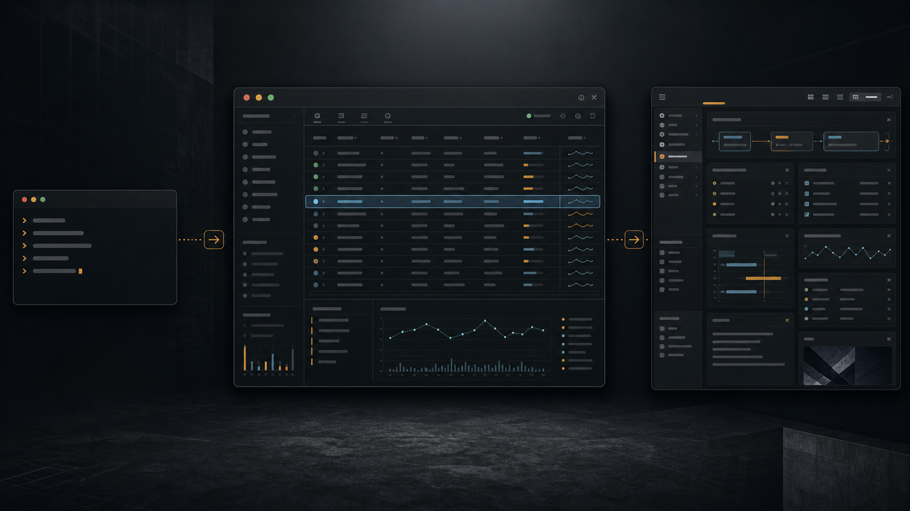

> 本文是《五彩斑斓的黑》系列的第一篇。这个系列不把 Terminal 当成一个理所当然存在的黑框，而是从它要解决的问题出发，逐步拆开 TTY、PTY、Shell、控制序列、屏幕模型和现代终端应用，理解一套诞生于大型机时代的交互约定为何一直延续到 Coding Agent 时代。

管理 Kubernetes 集群，最直接的入口是 `kubectl`。`kubectl get pods` 返回一张列表，接下来要看日志、事件还是资源定义，再输入下一条命令。浏览器里的控制台走另一条路：资源、状态和操作被整理成页面、表格、按钮与表单。

不少每天使用 Terminal 的人还会选择 k9s。它仍在 Terminal 中运行，却已经具备完整应用的交互：资源列表持续刷新，当前 namespace 和选中的对象留在屏幕上，查看日志、端口转发、扩缩容等操作都可以基于当前对象继续执行。

如果只是为了少敲几次键，alias 或脚本就够了。k9s 做得更多：它替用户保存上下文，把一组离散命令整理成可以浏览、可以连续操作的界面。

这也是今天仍有人做 TUI（Text-based User Interface，文本用户界面）的原因。对本来就在 Terminal 中工作的用户，运行环境和使用入口已经存在。Terminal 按行列显示字符单元，样式能力也相对有限，团队可以先处理信息布局、操作流程和状态反馈。核心交互验证稳定后，再决定是否需要扩展为 GUI。

## Terminal 不只承载命令

Terminal 最初甚至不是一个软件窗口。

在 1960 年代的分时系统里，它是摆在用户面前的实体设备。键盘把字符送往集中式计算机，主机再把结果传回打印机构或屏幕。[Dennis Ritchie 对早期 Unix 的回顾](https://www.nokia.com/bell-labs/about/dennis-m-ritchie/hist.html)描述了这种变化：人不再提交一叠穿孔卡等待结果，而是可以连续输入、观察响应，再决定下一步。

最早的交互接近一问一答。随着视频终端普及，界面开始需要在屏幕上移动光标、擦除一块区域、设置颜色和切换显示状态。1978 年的 [VT100 User Guide](https://bitsavers.org/pdf/dec/terminal/vt100/EK-VT100-UG-001_VT100_User_Guide_Aug78.pdf)已经包含光标控制、滚动区域和屏幕擦除等能力。程序不再只能把新文字追加到末尾，也可以回到屏幕已有位置更新内容。

当程序可以控制光标、局部刷新屏幕并读取即时按键后，Terminal 就不再只是命令和结果的传送带。编辑器、文件管理器、系统监视器和数据库客户端可以占据整个屏幕，维护持续状态，并根据用户操作更新局部区域。

物理设备后来退出主流，交互约定则由 Terminal Emulator 延续。Shell 和普通命令通过它收发文本，k9s、Vim、btop 这类程序则使用整个屏幕显示界面。硬件消失后，这套轻量界面环境仍广泛存在于开发者的计算机中。

## CLI、TUI 与 GUI 分别承担什么

`kubectl`、k9s 与 Web 控制台都面向 Kubernetes，但它们承担的交互职责不同。

> **同一个 Kubernetes API，三种交互入口**
>
> - `kubectl CLI`：命令与结果；
> - `k9s TUI`：持续状态与上下文操作；
> - `Web GUI`：图形导航与丰富呈现。

`kubectl` 把系统能力表达成命令、参数和结果。它便于精确调用，也容易进入脚本和自动化；代价是操作上下文主要由用户自己保存。执行完 `kubectl get pods` 后，程序已经退出。当前 namespace、刚才关注的 Pod、接下来想看日志还是事件，通常留在人的记忆、Shell 历史或下一条命令里。

k9s 没有创造新的 Kubernetes 资源操作能力。它做的是替用户保存交互上下文：当前在哪个 namespace，正在看哪类资源，焦点位于哪一行，对这个对象可以执行什么动作，刚才的操作有没有反馈。k9s 官方把产品描述为一个用于浏览、观察和管理 Kubernetes 集群的终端界面；它持续观察集群变化，并针对当前资源提供后续操作。[k9s 官方说明](https://k9scli.io/)

这让一些原本需要多条命令和短期记忆配合的工作，变成可以探索的界面。用户不必在每一步重新描述对象，而是先进入一个上下文，再围绕当前对象继续行动。

Web GUI 使用图形显示环境、窗口系统和浏览器，可以提供图表、图标、自由布局、鼠标悬停、拖放和更复杂的导航，同时显示更多信息。对于不熟悉命令和快捷键的用户，它也能提供更容易发现的入口、输入限制和安全确认。

同一个 Kubernetes API 可以同时服务三种入口：

| 产品形态 | 主要交互单位         | 谁保存上下文                 | 主要使用场景                     |
| -------- | -------------------- | ---------------------------- | -------------------------------- |
| CLI      | 一次命令及其结果     | 主要由用户、Shell 或脚本保存 | 精确调用、组合、自动化           |
| TUI      | 持续存在的视图与焦点 | 应用在当前会话中保存         | 高频浏览、观察、上下文操作       |
| GUI      | 页面、面板和图形对象 | 应用跨视图组织更多状态       | 视觉探索、丰富呈现、复杂任务组织 |

选择哪一种，取决于用户已经在哪里工作、界面需要保存多少状态，以及这项任务值得建立多大的视觉系统。

## Terminal 的显示约束如何影响设计

把 k9s 叫作“字符版 Kubernetes 控制台”并不准确。GUI 的显示区域可以自由使用字体、图标、阴影、动效和响应式布局。TUI 则基于按行列排列的字符单元、有限样式和键盘输入构建界面，可用的表现手段更少。

限制并没有消灭设计。列表里保留哪些列，焦点是否醒目，当前对象能做什么，失败状态放在哪里，窗口缩小时先隐藏什么，这些问题一个也躲不掉。只是团队很难靠大图和动画绕开它们，必须先把信息层级和操作路径理清楚。

k9s 的资源列表、状态颜色、快捷键提示和上下文操作，就是在这套限制里形成的。颜色负责传递状态，位置建立层级，焦点连接当前对象和下一步动作。视觉设计被压缩到了少数稳定手段中，交互设计自然占了更大比重。

## TUI 降低的是接入和视觉决策成本

对 Kubernetes 工程师来说，Terminal、键盘工作流、kubeconfig、集群权限和远程环境通常已经存在。安装一个可执行程序后，k9s 可以直接进入原有工作流。这降低了产品接入成本：团队不必先部署一套 Web 服务、建立独立登录入口，再把用户从编辑器和 Shell 引导到另一个环境。

Terminal 的显示约束也减少了视觉方案选择，可以更早验证资源如何组织、焦点如何移动、动作放在哪里、反馈是否清楚。对于目标用户本来就熟悉 Terminal 的工具，这能缩短从“系统已经有能力”到“用户拥有可用界面”之间的距离。

实现成本并不会因此消失，TUI 仍要处理一组特有的工程问题：

- 窗口缩小时，分栏和长字段如何降级；
- Unicode 字符、Emoji 和全角字符如何计算宽度；
- 快捷键如何避开 Shell、Terminal 与操作系统已有绑定；
- 程序异常退出后，备用屏幕、光标和输入模式如何恢复；
- 不同 Terminal 对颜色、键盘和控制序列的支持如何兼容；
- 只依赖颜色或复杂快捷键时，可访问性和学习成本如何处理。

像 k9s 这样成熟的 TUI，实现成本并不低。它的使用成本较低，是因为用户、运行环境和交互方式相互匹配。目标用户原本就在 Terminal 中，任务又以列表、状态、焦点和高频操作为主，TUI 的接入优势才会成立。对于复杂图形编辑、多媒体内容，或者从不接触 Terminal 的用户，上述优势不再成立。

## Terminal、Shell、CLI 与 TUI 的职责边界

Terminal Emulator 接收输入，解释字符和控制序列，再将内容渲染到屏幕。Shell 解释命令、启动程序，用管道和重定向组织它们。CLI 是程序提供的命令行调用界面；TUI 应用运行在 Terminal 中，并持续维护屏幕状态。

可组合和自动化主要来自 Shell、CLI 和进程接口，k9s 的集群管理能力来自 Kubernetes。Terminal 给它们提供了共同的交互环境：`kubectl` 在里面输出一次结果，k9s 在里面维护全屏界面，两者退出以后，Shell 继续等待下一条命令。

CI、批处理和 Agent 也不必为了调用 CLI 而真的打开一个可见的黑框。只有当程序需要维持交互会话、操作全屏应用，或者把执行现场交给人观察和接管时，Terminal 才成为人机界面的一部分。

Terminal、Shell、Console、TTY 与 PTY 的严格区别先不展开。这里只需要这条边界：Terminal 承载交互，能力来自运行在另一端的 Shell 和程序。

## Coding Agent 为什么先从 Terminal 起步

Coding Agent 进入开发工作流时，可以直接利用 Terminal 中已有的开发环境。代码仓库、编译器、测试、Git 和项目脚本本来就能从 Terminal 访问。用户给出目标，Agent 读写文件、运行命令、展示结果；遇到权限或判断问题，再停下来让用户决定。对话、执行记录、确认和纠正都可以先通过终端界面呈现。

这个阶段需要优先验证双方如何协作：过程展示多少，什么动作必须确认，用户怎样打断，失败以后从哪里继续。项目导航、多任务布局和丰富产物预览不必在初期同时完成。k9s 把 Kubernetes 已有的能力整理成连续操作，早期 Agent TUI 做的也是类似的工作，只是它组织的是人和 Agent 之间的一轮轮协作。

这里的“先”只表示一种起步方式。目标用户已经在 Terminal 中，交互方式还没有定型，TUI 可以较快进入真实项目接受验证。它不是所有 Agent 产品都要经过的固定阶段。

## 单个 Terminal 窗口无法承载更多任务时

任务持续时间延长后，Terminal 的限制会更加明显。多个项目同时推进，不同 Agent 在 worktree 中并行修改，权限确认分散在不同任务中，还要审阅计划、diff、测试结果和截图。这些内容不再是一段从上到下滚动的对话，而是一批需要反复切换的工作状态。

OpenAI 在 [Codex App 发布文章](https://openai.com/index/introducing-the-codex-app/)中把 App 称为 Agent 的“command center”，列出的重点正是多 Agent 并行、项目线程、长时间任务、worktree、diff 审阅和自动任务。文章还提到，问题已经从 Agent 能做什么，转到人怎样在更大规模上指导和监督它们。

这时 GUI 增加的不只是视觉效果。项目可以放在侧边栏，任务各自保留线程，diff、计划和产物占用独立区域；用户不必把所有执行状态压缩到一条滚动记录中。Codex CLI 侧重在代码仓库中快速工作，App 则侧重组织长期状态。OpenAI 也把 Codex 定位为横跨 ChatGPT、编辑器和 Terminal 的同一个 Agent。[Codex 产品页](https://openai.com/codex/)

从 TUI 到 GUI 的重点变化，是本文基于公开产品形态作出的判断，不是 Codex 的官方演进路线。TUI 先以较低成本验证核心交互，GUI 再利用更大的显示空间处理并行任务、审阅和长期状态。两种入口解决的问题不同，也会继续共存。

## 结尾：Terminal 也是新交互发生的地方

GUI 已经承担了大量需要可发现、可约束和丰富呈现的任务。Terminal 保留的使用场景并不与它冲突：CLI 负责精确调用，TUI 在同一个环境里保存状态、组织操作。

k9s 说明按行列显示的终端界面足以承载成熟产品，Coding Agent 则说明 TUI 可以让新的交互方式较早进入真实工作流。有些工具会继续使用 TUI，有些会在交互稳定后扩展为更完整的 GUI。

Terminal 今天仍然存在，因为它既能运行成熟工具，也能为新的交互方式提供低成本的验证环境。核心交互稳定以后，产品可以继续使用 TUI，也可以根据任务规模、信息密度和用户需求扩展为 GUI。

这一篇先回答 Terminal 为什么没有消失。接下来，系列会回到它最容易混淆的基础边界：Terminal、Console、TTY 与 PTY 到底分别是什么，以及这些来自硬件时代的名字为什么仍然存在于今天的操作系统里。

## 源码与资料参考

### Terminal 与 TUI

- [Dennis Ritchie：The Evolution of the Unix Time-sharing System](https://www.nokia.com/bell-labs/about/dennis-m-ritchie/hist.html)：理解分时系统、交互式计算与早期 Unix 的关系。
- [VT100 User Guide, 1978](https://bitsavers.org/pdf/dec/terminal/vt100/EK-VT100-UG-001_VT100_User_Guide_Aug78.pdf)：观察视频终端已经提供的光标、滚动区域和屏幕控制能力。
- [XTerm Control Sequences](https://invisible-island.net/xterm/ctlseqs/)：查看现代终端模拟器继承和扩展的控制序列。
- [xterm.js](https://github.com/xtermjs/xterm.js)：查看浏览器终端模拟器如何划分输入、解析、屏幕状态与渲染。

### k9s 与 Kubernetes

- [k9s 官方网站](https://k9scli.io/)：核对持续观察集群、资源导航和上下文操作的产品定位。
- [k9s 源码](https://github.com/derailed/k9s)：观察终端界面、资源视图、快捷键与 Kubernetes 客户端之间的实现关系。
- [kubectl 官方文档](https://kubernetes.io/docs/reference/kubectl/)：对照 CLI 如何暴露 Kubernetes 资源操作。

### Codex

- [Codex 产品页](https://openai.com/codex/)：核对 Codex 在 ChatGPT、编辑器和 Terminal 中的多入口定位。
- [Introducing the Codex app](https://openai.com/index/introducing-the-codex-app/)：核对多 Agent、并行工作、长程任务、项目线程、worktree 和审阅等 App 侧重点。
