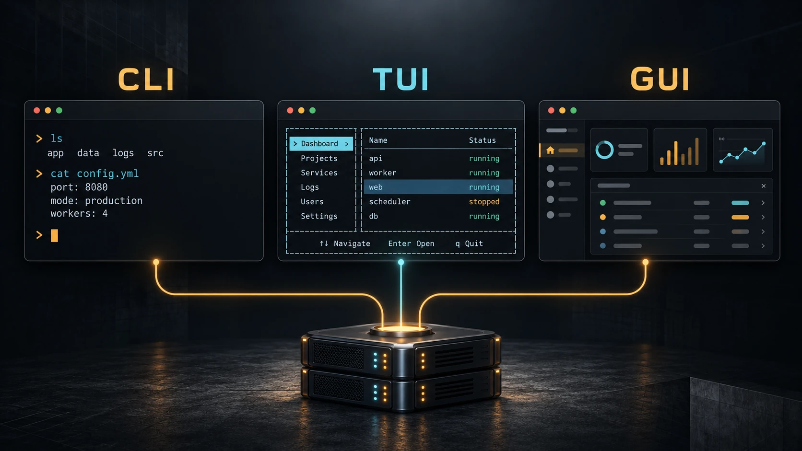

> 本文是《五彩斑斓的黑》系列的第一篇，先从产品设计的角度看：为什么今天仍有人选择在 Terminal 里做交互应用。后续再拆开 TTY、PTY、Shell、控制序列和屏幕模型，看看这些界面靠什么运行。

管理 Kubernetes 集群，最直接的入口是 `kubectl`。`kubectl get pods` 返回一张列表，接下来要看日志、事件还是资源定义，再输入下一条命令。浏览器里的控制台走另一条路：资源、状态和操作被整理成页面、表格、按钮与表单。

不少每天使用 Terminal 的人还会选择 k9s。它仍在 Terminal 中运行，却已经具备完整应用的交互：资源列表持续刷新，当前 namespace 和选中的对象留在屏幕上，查看日志、端口转发、扩缩容等操作都可以基于当前对象继续执行。

如果只是为了少敲几次键，alias 或脚本就够了。k9s 做得更多：它替用户保存上下文，把一组离散命令整理成可以浏览、可以连续操作的界面。

这种持续存在的文本界面叫作 TUI（Text-based User Interface，文本用户界面）。它与一次执行就退出的命令不同，但也不需要用户离开已经熟悉的 Terminal。

## Terminal 不只承载命令

Terminal 最初甚至不是一个软件窗口。

在 1960 年代的分时系统里，它是摆在用户面前的实体设备。键盘把字符送往集中式计算机，主机再把结果传回打印机构或屏幕。[Dennis Ritchie 对早期 Unix 的回顾](https://www.nokia.com/bell-labs/about/dennis-m-ritchie/hist.html)谈到了 CTSS、Multics 带来的交互体验。与提交一叠穿孔卡等待结果相比，终端让用户可以连续输入、观察响应，再决定下一步。

最早的交互接近一问一答。随着视频终端普及，界面开始需要在屏幕上移动光标、擦除一块区域、设置颜色和切换显示状态。1978 年的 [VT100 User Guide](https://bitsavers.org/pdf/dec/terminal/vt100/EK-VT100-UG-001_VT100_User_Guide_Aug78.pdf)已经包含光标控制、滚动区域和屏幕擦除等能力。程序不再只能把新文字追加到末尾，也可以回到屏幕已有位置更新内容。

当程序可以控制光标、局部刷新屏幕并读取即时按键后，Terminal 就不再只是命令和结果的传送带。编辑器、文件管理器、系统监视器和数据库客户端可以占据整个屏幕，维护持续状态，并根据用户操作更新局部区域。

物理设备后来退出主流，交互约定则由 Terminal Emulator 延续。Shell 和普通命令通过它收发文本，k9s、Vim、btop 这类程序则使用整个屏幕显示界面。硬件消失后，这套轻量界面环境仍广泛存在于开发者的计算机中。

## CLI、TUI 与 GUI 分别承担什么

`kubectl`、k9s 与 Web 控制台都面向 Kubernetes，但它们承担的交互职责不同。

`kubectl` 把系统能力表达成命令、参数和结果，便于精确调用，也容易进入脚本和自动化。执行完 `kubectl get pods` 后，程序就退出了。namespace 可以保存在 [kubeconfig 的当前 context](https://kubernetes.io/docs/concepts/configuration/organize-cluster-access-kubeconfig/#context) 中，但刚才关注哪个 Pod、接下来要看日志还是事件，仍要由用户衔接到下一条命令。

k9s 没有创造新的 Kubernetes 资源操作能力。它做的是替用户保存交互上下文：当前在哪个 namespace，正在看哪类资源，焦点位于哪一行，对这个对象可以执行什么动作，刚才的操作有没有反馈。k9s 官方把产品描述为一个用于浏览、观察和管理 Kubernetes 集群的终端界面；它持续观察集群变化，并针对当前资源提供后续操作。[k9s 官方说明](https://k9scli.io/)

Web GUI 使用图形显示环境、窗口系统和浏览器，可以提供图表、图标、自由布局、鼠标悬停、拖放和更复杂的导航，同时显示更多信息。对于不熟悉命令和快捷键的用户，它也能提供更容易发现的入口、输入限制和安全确认。

下表概括的是这三个例子的典型侧重，不是 CLI、TUI、GUI 的能力上限。TUI 同样可以保存配置、恢复会话或组织多个面板，GUI 也可以只完成一次输入。

| 入口        | 主要交互单位         | 上下文如何衔接                         | 典型使用场景                     |
| ----------- | -------------------- | -------------------------------------- | -------------------------------- |
| kubectl CLI | 一次命令及其结果     | 配置保存集群等信息，用户或脚本衔接命令 | 精确调用、组合、自动化           |
| k9s TUI     | 持续存在的视图与焦点 | 界面保留当前资源、选中对象和可用操作   | 高频浏览、观察、上下文操作       |
| Web GUI     | 页面、面板和图形对象 | 页面导航与面板组织对象和操作           | 视觉探索、丰富呈现、复杂任务组织 |

## Terminal 的显示约束如何影响设计

k9s 的设计要适应字符网格。GUI 可以自由使用字体、图标、阴影、动效和响应式布局；典型 TUI 主要依靠按行列排列的字符单元、颜色、有限样式和键盘输入，可用的表现手段更少。

列表里保留哪些列，焦点是否醒目，当前对象能做什么，失败状态放在哪里，都需要设计。窗口缩小时先隐藏哪一列，就得从用户当前要做什么开始判断。

k9s 用颜色标出资源状态，用快捷键提示当前可用的操作。用户先选中一个对象，再看它的日志或执行其他动作，不必每次重新输入对象名称。

## TUI 降低的是接入和视觉决策成本

对 Kubernetes 工程师来说，Terminal、键盘工作流、kubeconfig、集群权限和远程环境通常已经存在。安装一个可执行程序后，k9s 可以直接进入原有工作流。这降低了产品接入成本：团队不必先部署一套 Web 服务、建立独立登录入口，再把用户从编辑器和 Shell 引导到另一个环境。

Terminal 的显示约束也减少了视觉方案选择。团队可以先验证资源如何组织、焦点如何移动、动作放在哪里、反馈是否清楚，再决定是否需要图形界面。这个顺序适合目标用户本来就熟悉 Terminal、任务又以文本和列表为主的工具。

实现成本并不会因此消失，TUI 仍要处理一组特有的工程问题：

- 窗口缩小时，分栏和长字段如何降级；
- Unicode 字符、Emoji 和全角字符如何计算宽度；
- 快捷键如何避开 Shell、Terminal 与操作系统已有绑定；
- 程序异常退出后，备用屏幕、光标和输入模式如何恢复；
- 不同 Terminal 对颜色、键盘和控制序列的支持如何兼容；
- 只依赖颜色或复杂快捷键时，可访问性和学习成本如何处理。

像 k9s 这样成熟的 TUI，实现成本并不低。接入方便也有前提：用户熟悉键盘工作流，任务适合用列表和文本呈现。对于复杂图形编辑、多媒体内容，或者从不接触 Terminal 的用户，选择 TUI 反而可能增加使用门槛。

## Terminal、Shell、CLI 与 TUI 的职责边界

Terminal Emulator 接收输入，解释字符和控制序列，再将内容渲染到屏幕。Shell 解释命令、启动程序，用管道和重定向组织它们。CLI 是程序提供的命令行调用界面；TUI 应用运行在 Terminal 中，并持续维护屏幕状态。

可组合和自动化主要来自 Shell、CLI 和进程接口，k9s 的集群管理能力来自 Kubernetes。Terminal 给它们提供了共同的交互环境：`kubectl` 在里面输出一次结果，k9s 在里面维护全屏界面，两者退出以后，Shell 继续等待下一条命令。

CI、批处理和 Agent 也不必为了调用 CLI 而真的打开一个可见的黑框。只有当程序需要维持交互会话、操作全屏应用，或者把执行现场交给人观察和接管时，Terminal 才成为人机界面的一部分。

## Coding Agent 在 Terminal 中如何与人配合

Coding Agent 进入开发工作流时，可以直接利用 Terminal 中已有的开发环境。代码仓库、编译器、测试、Git 和项目脚本本来就能从 Terminal 访问。用户给出目标，Agent 读写文件、运行命令、展示结果；遇到权限或判断问题，再停下来让用户决定。对话、执行记录、确认和纠正都可以先通过终端界面呈现。

这里要解决的问题很具体：命令输出展示多少，修改文件前要不要确认，用户怎样打断，失败以后从哪里继续。TUI 可以把这些操作放在一起，不必同时做完项目导航、多任务布局和产物预览。这是一种产品起步方式，并非所有 Agent 都必须先经过终端阶段。

## 并行任务让单窗口工作流变得吃力时

多个项目同时推进时，用户要在不同 worktree 的修改之间切换，处理各个任务的权限确认，还要审阅计划、diff、测试结果和截图。把这些内容都放进一条滚动对话里，就很难快速找回某个任务上次停在哪里。

OpenAI 在 [Codex App 发布文章](https://openai.com/index/introducing-the-codex-app/)中把 App 称为 Agent 的“command center”，列出的重点正是多 Agent 并行、项目线程、长时间任务、worktree、diff 审阅和自动任务。文章还提到，问题已经从 Agent 能做什么，转到人怎样在更大规模上指导和监督它们。

GUI 可以把项目放在侧边栏，让任务各自保留线程，再给 diff、计划和产物留出独立区域，方便用户切回某项工作。Codex CLI 侧重在代码仓库中工作，App 则把并行任务和审阅集中到一个工作区。OpenAI 也提供跨 ChatGPT、编辑器和 Terminal 的 Codex 入口。[Codex 产品页](https://openai.com/codex/)

这是对公开产品侧重点的比较，不是 Codex 的官方演进路线，也不意味着 TUI 不能管理长期任务。这里 GUI 的优势是更容易把导航、审阅和丰富预览同时摆出来。

对已经在终端里工作的人，k9s 把查资源、看日志和执行操作放进同一个界面；Coding Agent 则把指令、执行过程和确认放在一起。它们接得上用户已有的工具和习惯，这是 TUI 今天仍有吸引力的一个原因。

终端窗口只是用户看见的一端。窗口里的 Shell 怎么和键盘、屏幕连在一起？下一篇从 `tty` 命令返回的设备名说起，区分 Terminal、Console、TTY 与 PTY。

## 源码与资料参考

### Terminal 与 TUI

- [Dennis Ritchie：The Evolution of the Unix Time-sharing System](https://www.nokia.com/bell-labs/about/dennis-m-ritchie/hist.html)：理解分时系统、交互式计算与早期 Unix 的关系。
- [VT100 User Guide, 1978](https://bitsavers.org/pdf/dec/terminal/vt100/EK-VT100-UG-001_VT100_User_Guide_Aug78.pdf)：观察视频终端已经提供的光标、滚动区域和屏幕控制能力。
- [XTerm Control Sequences](https://invisible-island.net/xterm/ctlseqs/)：查看现代终端模拟器继承和扩展的控制序列。
- [xterm.js](https://github.com/xtermjs/xterm.js)：查看浏览器终端模拟器如何划分输入、解析、屏幕状态与渲染。

### k9s 与 Kubernetes

- [k9s 官方网站](https://k9scli.io/)：核对持续观察集群、资源导航和上下文操作的产品定位。
- [k9s 源码](https://github.com/derailed/k9s)：观察终端界面、资源视图、快捷键与 Kubernetes 客户端之间的实现关系。
- [kubectl 官方文档](https://kubernetes.io/docs/reference/kubectl/)：对照 CLI 如何暴露 Kubernetes 资源操作。

### Codex

- [Codex 产品页](https://openai.com/codex/)：核对 Codex 在 ChatGPT、编辑器和 Terminal 中的多入口定位。
- [Introducing the Codex app](https://openai.com/index/introducing-the-codex-app/)：核对多 Agent、并行工作、长程任务、项目线程、worktree 和审阅等 App 侧重点。
