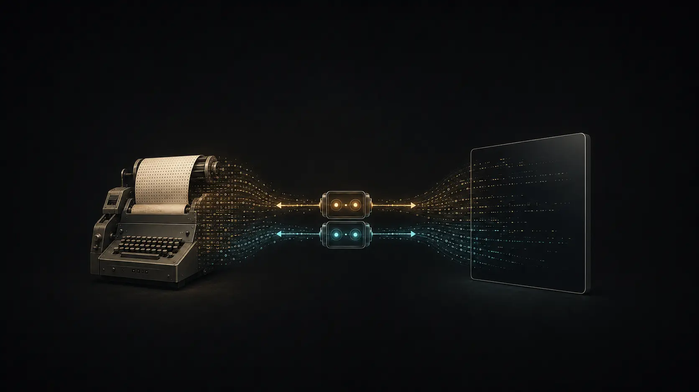
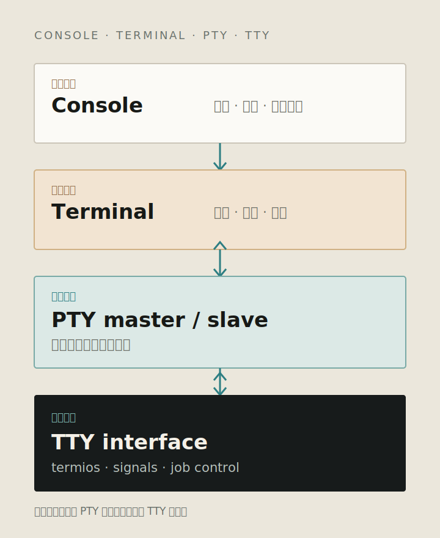
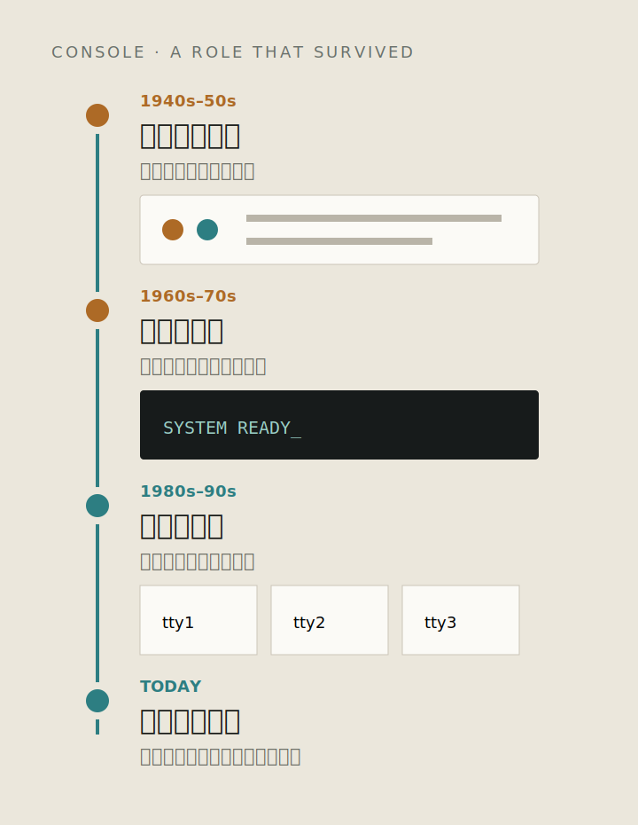
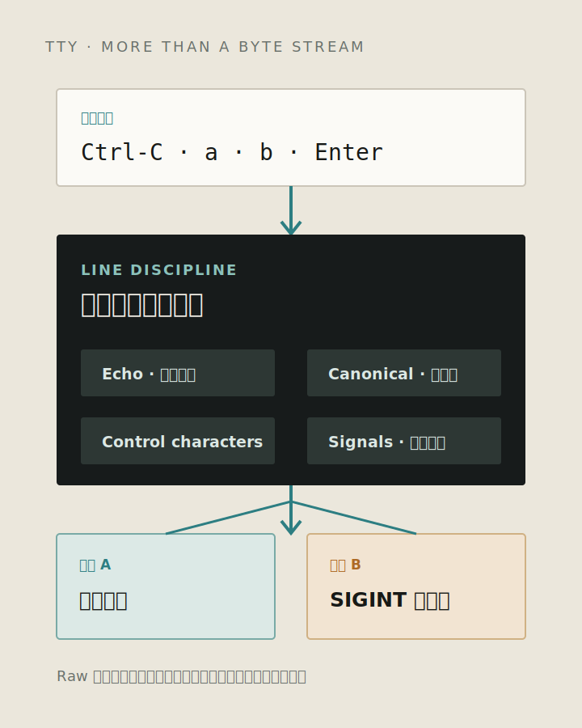
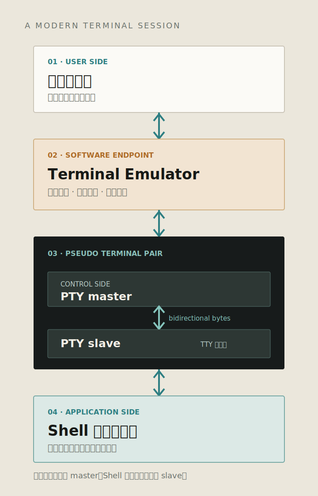
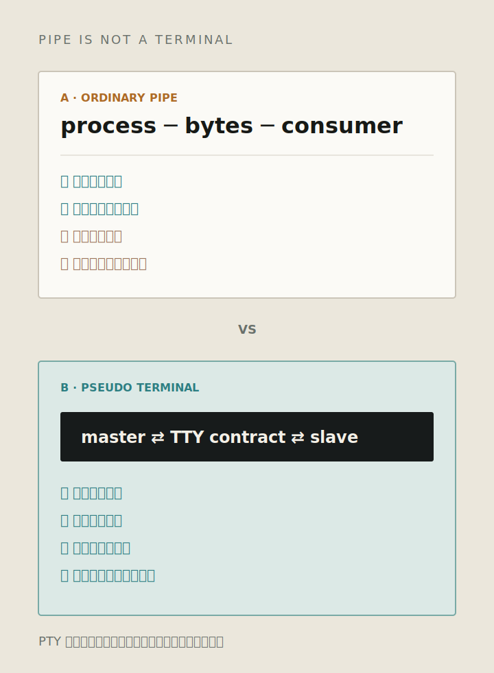

_题图：物理终端被软件窗口替代后，程序仍通过 TTY/PTY 接口处理输入、信号和作业控制。_

> 本文是《五彩斑斓的黑》系列的第二篇。上一篇回答 [Terminal 为什么没有消失](/blog/posts/terminal-series/why-terminal-still-exists/)；这一篇只处理四个容易混淆的名字：Console、Terminal、TTY 和 PTY。后面讨论控制序列、SSH 和 tmux 时，会直接用到这些概念。

打开一个终端窗口，输入：

```bash
tty
```

macOS 可能返回：

```text
/dev/ttys003
```

Linux 可能返回：

```text
/dev/pts/3
```

现在打开的是一个图形化终端窗口，但 `tty` 显示 Shell 仍连接着 TTY。TTY 原本指 Teletypewriter，也就是电传打字机。电脑里早已没有这种设备，这个名字为什么还留在操作系统里？

更容易混乱的是另外几个词。有人把 Terminal 当成 Shell，有人把 Console 当成 Terminal 的正式叫法，还有人以为 PTY 就是一种看不见的终端窗口。它们看起来都在描述同一件事，实际上分别属于不同层次。

今天的 Shell 通常连接 PTY slave。终端模拟器持有 master，把键盘输入写进去，再从中读取程序输出。TTY 这个名字留下来，是因为这套内核接口没有消失。

## 先分清四个词

为了后面的讨论，先给这四个词划出边界：

| 概念     | 所在层次 | 它回答的问题                     |
| -------- | -------- | -------------------------------- |
| Console  | 系统角色 | 谁负责启动、观察和抢救这台机器？ |
| Terminal | 交互端点 | 人在哪里输入，又在哪里看到结果？ |
| TTY      | 内核接口 | 程序怎样使用传统终端的行为？     |
| PTY      | 虚拟连接 | 软件怎样假装自己是一台终端？     |



_图 1：Console 表示系统控制入口，Terminal 处理用户交互，PTY 连接控制程序与 Shell，TTY 提供内核终端接口。_

Console 更接近一种系统角色；Terminal 是人与计算机交互的端点；TTY 是操作系统向程序提供的终端行为；PTY 则是把这种行为虚拟出来的连接机制。它们会出现在同一条链路里，却不是四个可以互换的名字。

## Console：最初是机器旁边的控制席

在计算机还占满房间的年代，Console 不是用户随手打开的应用，而是操作员控制机器的地方。开机、装载程序、查看系统状态和处理故障，都从这里完成。

它与机器的关系特殊：普通用户的终端可以断开，系统仍要有一个入口输出关键消息并接受控制。Console 描述的首先不是一种通信协议，而是一个系统级角色。

后来，灯和开关组成的控制面板被键盘与屏幕替代，操作系统又提供了虚拟控制台。图形界面普及后，启动信息、内核消息和故障恢复仍需要一个系统指定的入口，因此 Console 这个系统角色继续存在。



_图 2：Console 从物理控制面板演变为系统指定的启动、消息输出和故障恢复入口。_

所以，Console 不是 Terminal 的正式英文名。一台机器可以同时存在许多 Terminal 会话，但系统只会把特定入口视为 Console。我们平时打开的终端窗口通常不是系统控制台，它只是一个普通用户会话的交互端点。

## Terminal：为什么叫“终端”

Terminal 的名字来自它所在的位置：通信线路的末端。

早期分时系统把昂贵的计算能力放在中央主机，用户坐在远处，通过电传打字机输入字符，再把主机返回的字符打印到纸上。主机负责运行程序和管理多个用户，终端负责采集输入、呈现输出。

这种分工让主机不必知道用户面前的键盘长什么样、纸张有多宽，只需要面对相对稳定的字符接口。

视频终端后来用屏幕替代纸张。为了移动光标、擦除区域和改变显示属性，终端开始识别混在普通文字里的控制命令。再后来，物理终端被桌面软件模拟，但“程序运行在一端，交互设备位于另一端”的结构保留了下来。

桌面终端模拟器接管输入和显示后，Shell 仍然通过 TTY 接口读写。

## TTY：从设备名称到内核接口

TTY 来自 Teletypewriter。最开始它确实是一类具体设备。

Unix 面对的现实却是：终端型号很多，字符编码、波特率和控制方式各不相同。如果每个程序都直接适配硬件，编辑器、Shell 和交互式工具会被设备差异淹没。

操作系统于是把这些差异收进终端驱动，对应用暴露统一的字符设备。程序只管读写，内核负责提供一组大家默认存在的终端行为：

- 输入回显；
- 按行提交；
- Canonical 与 Raw 模式；
- 控制字符与信号；
- 窗口尺寸；
- 会话和控制终端；
- 前台进程组与作业控制。



_图 3：输入到达应用之前会经过 Line Discipline，回显、按行提交和控制字符都在这里处理。_

### Ctrl-C 为什么不是普通字符

默认模式下，用户按下 `Ctrl-C`，内核终端层可以识别这个控制字符，并向当前前台进程组发送 `SIGINT`。应用收到的往往不是两个按键组成的文本，而是一个中断信号。

Vim、游戏和全屏 TUI 会把终端切换到 Raw 模式，尽量关闭内核的行编辑与特殊字符处理，再自行解释每一次按键。程序异常退出后，如果没有恢复 TTY 配置，终端就可能出现“不回显”或“回车错位”。

`/dev/tty` 也不是某一台固定设备。对一个拥有控制终端的进程来说，它表示“我的控制终端”。同一个路径由不同会话里的进程打开，可能落到不同的实际终端上。

## PTY：用虚拟设备接上终端模拟器

物理终端退出主流以后，Shell、编辑器和交互式程序仍然使用 TTY 接口。Unix 用一对虚拟字符设备连接这些程序和新的软件控制端，这就是 Pseudo Terminal，伪终端。

PTY 不是单个设备，而是一对相连的虚拟字符设备：

- **Master** 交给终端模拟器、SSH、tmux 或其他控制程序；
- **Slave** 交给 Shell 或前台应用，对它们表现得像经典 TTY。



_图 4：终端模拟器连接 master，Shell 和前台进程连接 slave；输入与输出沿相反方向经过同一对设备。_

写入 Master 的数据，会像用户在终端上输入一样到达 Slave；程序写入 Slave 的输出，可以从 Master 读取。Slave 一侧继续提供经典 TTY 的行为，Master 一侧则允许另一个软件驱动和观察会话。

Shell 只看到 Slave 端，因此不需要区分 Master 另一侧是 Terminal.app、Ghostty、SSH 服务端、tmux、IDE，还是自动化工具。

## 一次按键和一段输出，到底经过了哪里

### 输入方向：按键不一定原样交给程序

用户按下一个键，终端模拟器先把它编码成字节并写入 PTY Master。字节从 Slave 一侧进入内核终端层，可能经过回显、Canonical 行编辑和控制字符处理，最后才被 Shell 或前台应用读取。

```text
键盘
  ↓
Terminal Emulator
  ↓
PTY Master
  ↓
Line Discipline
  ↓
PTY Slave
  ↓
Shell 或前台程序
```

如果输入触发终端控制字符，内核还可能直接生成信号。程序看到的结果，未必是用户按下的原始字节。

### 输出方向：PTY 不知道什么是红色

程序向 stdout 写入数据，数据经 PTY Slave 到达 Master，再由终端模拟器读取。

PTY 只传输字节，不知道字节代表普通文字、光标移动还是颜色变化。字符和控制序列由终端模拟器解析，最终再绘制成像素。

TTY/PTY 保持终端式交互，Terminal Emulator 解释输出并显示结果。

这个边界会直接引出系列的下一篇。

## 为什么普通管道不能完全替代 PTY

Pipe 和 PTY 都能搬运字节，所以自动化脚本经常先尝试用管道连接程序。但交互式程序依赖的不只是字节，还依赖 TTY 语义。

程序可以通过 `isatty()` 判断文件描述符是否连接终端，再选择颜色、缓冲、进度条和输入方式。



_图 5：Pipe 只连接输入输出；PTY 还提供终端身份、信号、窗口尺寸和作业控制。_

这解释了为什么一条命令直接运行时有颜色，接到 `| cat` 后颜色可能消失；也解释了为什么全屏 TUI 放进普通管道会失去正常交互。

`ssh -t` 和 `docker exec -t` 里的 `-t`，请求的正是一台伪终端，而不只是保持 stdin 打开。

## PTY 还被谁使用

终端模拟器不是 PTY 的唯一控制端。只要程序需要驱动一个按 TTY 方式工作的进程，就可能站到 Master 一侧。

### SSH：把远端 Shell 接回本地

SSH 服务端为远端进程分配 PTY，再把 Master 一侧的字节通过网络转发。远端程序仍以为自己面对传统终端，本地用户则通过 SSH 客户端看到并控制它。

### tmux 与 screen：把会话从当前窗口剥离

tmux 自己持有 PTY Master。用户离开以后，Shell 和前台任务仍连接着 Slave 继续运行；用户重新连接时，tmux 再把保存的会话呈现出来。

### 容器和 IDE：给真实进程分配终端

`docker run -it` 中的两个参数解决的不是同一个问题：

- `-i` 保持输入流开放；
- `-t` 分配 PTY。

有输入流，不代表程序拥有终端语义。

VS Code、JetBrains 等应用也持有 PTY Master，并把从中读到的输出显示在集成终端里。Shell 与命令行工具仍然运行在独立进程中，连接 PTY Slave。

### 自动化工具和 Agent：控制交互式程序

有些程序只有检测到 TTY 才显示提示、读取密码或启用交互模式。`expect`、`script` 等工具站到 PTY Master 一侧，像人一样读取输出并写回输入。

Agent 运行普通编译命令时，Pipe 往往更简单；但需要持续输出、中断、窗口尺寸或操作 TUI 时，也要决定是否分配 PTY。

## 在本机验证 TTY 与 PTY

### 实验一：找到当前 TTY 和前台进程组

```bash
tty
ps -o pid,ppid,pgid,sid,tpgid,tty,stat,command -p $$
```

观察当前 TTY 设备名、Session ID、Process Group ID，以及当前终端的前台进程组。

不同系统的 `ps` 参数略有差异。如果某一列不受支持，可以先删除该列继续观察。

### 实验二：比较终端与管道

先直接运行：

```bash
python3 -c 'import os; print(os.isatty(0), os.isatty(1))'
```

再把 stdout 接进管道：

```bash
python3 -c 'import os; print(os.isatty(0), os.isatty(1))' | cat
```

第二条命令中，`isatty(1)` 会从 `True` 变为 `False`。程序仍能写出字节，但 stdout 已经不再连接终端。

### 实验三：亲手创建一对 PTY

```python
import os
import pty

master, slave = pty.openpty()

print("master fd:", master)
print("slave fd:", slave)
print("slave name:", os.ttyname(slave))
```

这段代码还没有启动 Shell，也没有终端渲染器，但已经创建了控制端和带有终端设备名的 Slave。

PTY 首先是一对文件描述符。Shell、会话、控制终端和渲染能力，由其他组件建立在这对连接之上。

## 结尾：TTY 这个名字为什么还在

终端模拟器连接 Master，把键盘输入写进去，并读取程序输出；Shell 和前台进程连接 Slave，继续使用 termios、控制终端、前台进程组和窗口尺寸等接口。这些接口仍在被程序使用，TTY 这个历史名称也就保留了下来。

但 PTY 传输的终究只是一串字节。同一条字节流为什么既能显示普通文字，又能移动光标、改变颜色、清空屏幕，甚至修改窗口标题？

> **下一篇：《Terminal 为什么能显示彩色文字？》**
>
> 从 ESC 开始，继续认识 CSI、OSC、DCS，以及普通文字和终端命令如何共享同一条字节流。

## 资料参考

- [The Open Group：General Terminal Interface](https://pubs.opengroup.org/onlinepubs/9799919799/basedefs/V1_chap11.html)
- [Linux man-pages：pty(7)](https://man7.org/linux/man-pages/man7/pty.7.html)
- [Linux man-pages：tty(4)](https://man7.org/linux/man-pages/man4/tty.4.html)
- [Dennis Ritchie：The Evolution of the Unix Time-sharing System](https://www.nokia.com/bell-labs/about/dennis-m-ritchie/hist.html)

本文以 POSIX 通用终端模型为主。设备路径、`ps` 参数和部分实现细节在 Linux、macOS 与 BSD 上会有所不同。
