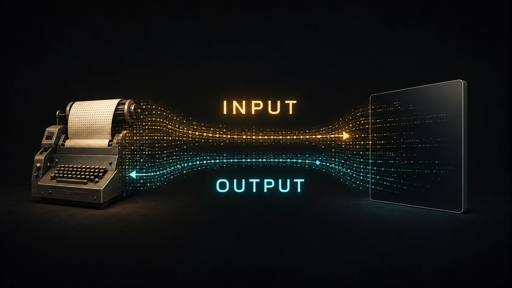
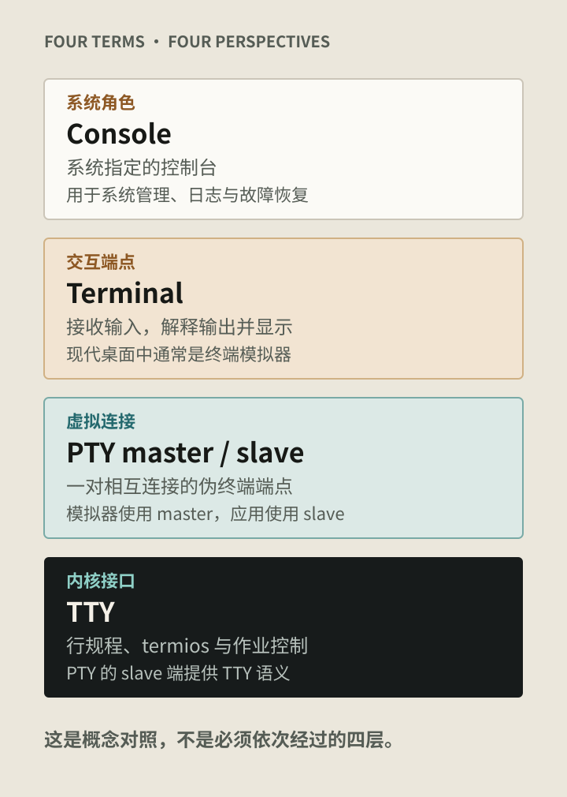
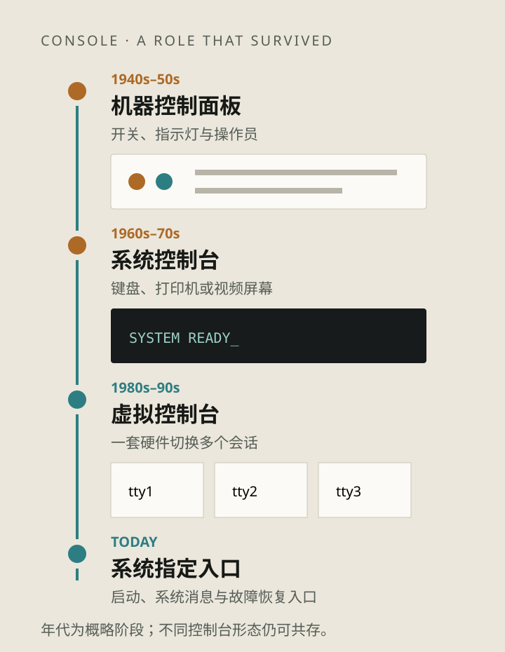
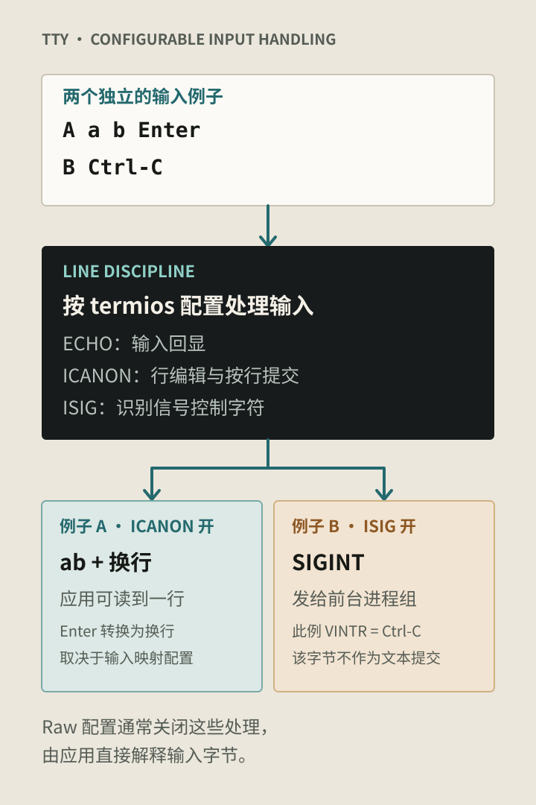
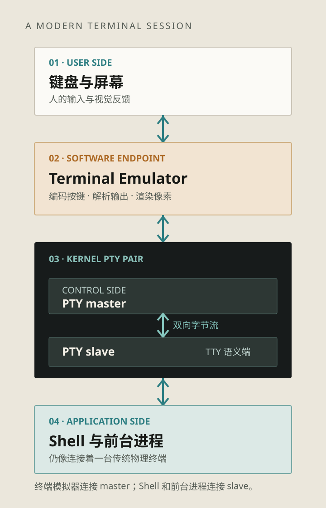
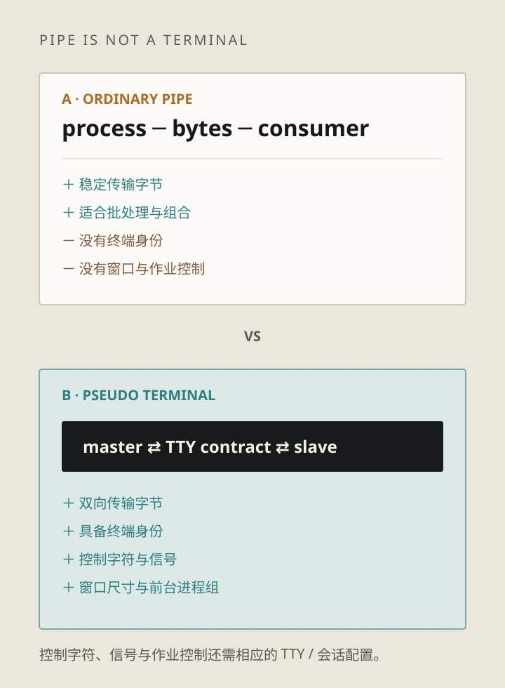

_题图：从物理设备到软件窗口，终端交互始终包含方向相反的输入与输出。图示表达这一关系，具体 PTY 连接见下文。_

> 本文是《五彩斑斓的黑》系列的第二篇。上一篇回答 [Terminal 为什么没有消失](/blog/posts/terminal-series/why-terminal-still-exists/)；这一篇只处理四个容易混淆的名字：Console、Terminal、TTY 和 PTY。后面讨论控制序列、SSH 和 tmux 时，会直接用到这些概念。

打开一个终端窗口，输入：

```bash
tty
```

macOS 可能返回：

```text
/dev/ttys003
```

Linux 可能返回：

```text
/dev/pts/3
```

`tty` 报告的是标准输入所连接的终端名。这里它继承了交互式 Shell 的 stdin：明明打开的是一个图形化窗口，命令却仍然返回一个 TTY 设备路径。TTY 原本指 Teletypewriter，也就是电传打字机。电脑里早已没有这种设备，这个名字为什么还留在操作系统里？

更容易混乱的是另外几个词。有人把 Terminal 当成 Shell，有人把 Console 当成 Terminal 的正式叫法，还有人以为 PTY 就是一种看不见的终端窗口。它们看起来都在描述同一件事，实际上分别属于不同层次。

今天终端窗口里的 Shell 通常连接 PTY slave。终端模拟器持有 master，把键盘输入写进去，再从中读取程序输出。TTY 这个名字留下来，是因为这套内核接口没有消失。

## 先分清四个词

本文以 POSIX 通用终端模型为主。设备路径、`ps` 参数和部分实现细节在 Linux、macOS 与 BSD 上会有所不同。Console 一词在不同产品中也有其他用法；这里讨论的是它作为系统控制入口的含义。

| 概念     | 所在层次 | 它回答的问题                     |
| -------- | -------- | -------------------------------- |
| Console  | 系统角色 | 谁负责启动、观察和抢救这台机器？ |
| Terminal | 交互端点 | 人在哪里输入，又在哪里看到结果？ |
| TTY      | 内核接口 | 程序怎样使用传统终端的行为？     |
| PTY      | 虚拟连接 | 软件怎样假装自己是一台终端？     |



_图 1：四个术语的概念分类，不是每次会话必经的调用栈。Console 是系统控制角色；普通终端窗口也可以通过 PTY 使用 TTY 接口。_

Console 更接近一种系统角色；Terminal 是人与计算机交互的端点；TTY 是操作系统向程序提供的终端行为；PTY 则是把这种行为虚拟出来的连接机制。这些概念可能出现在同一套系统中，但不能互换。

## Console：最初是机器旁边的控制席

在计算机还占满房间的年代，Console 不是用户随手打开的应用，而是操作员控制机器的地方。开机、装载程序、查看系统状态和处理故障，都从这里完成。

它与机器的关系特殊：普通用户的终端可以断开，系统仍要有一个入口输出关键消息并接受控制。Console 描述的首先不是一种通信协议，而是一个系统级角色。

后来，灯和开关组成的控制面板被键盘与屏幕替代，操作系统又提供了虚拟控制台。图形界面普及后，启动信息、内核消息和故障恢复仍需要一个系统指定的入口，因此 Console 这个系统角色继续存在。



_图 2：Console 从物理控制面板演变为系统指定的启动、消息输出和故障恢复入口。_

所以，Console 不是 Terminal 的正式英文名。一台机器可以同时存在许多 Terminal 会话，但系统只会把特定入口视为 Console。我们平时打开的终端窗口通常不是系统控制台，它只是一个普通用户会话的交互端点。

## Terminal：为什么叫“终端”

Terminal 的名字来自它所在的位置：通信线路的末端。

早期分时系统把昂贵的计算能力放在中央主机，用户坐在远处，通过电传打字机输入字符，再把主机返回的字符打印到纸上。主机负责运行程序和管理多个用户，终端负责采集输入、呈现输出。

这种分工让程序可以通过字符接口与用户交互，不必直接驱动远端键盘和打印机构。

视频终端后来用屏幕替代纸张。为了移动光标、擦除区域和改变显示属性，终端开始识别混在普通文字里的控制命令。再后来，物理终端被桌面软件模拟，但“程序运行在一端，交互设备位于另一端”的结构保留了下来。

桌面终端模拟器接管输入和显示后，Shell 仍然通过 TTY 接口读写。

## TTY：从设备名称到内核接口

TTY 来自 Teletypewriter。最开始它确实是一类具体设备。

终端型号很多，串行通信的波特率、字符位数和流控方式也可能不同。Unix 把这类设备接入和通用输入输出处理放进终端驱动，对应用暴露字符设备接口。

这并没有统一所有型号的屏幕控制序列和功能键编码；这些差异仍要由应用或终端库处理。内核终端接口提供的是另一组行为：

- 输入回显；
- Canonical（规范）模式下按行提交；
- 非规范模式下由 `VMIN`、`VTIME` 等配置控制读取时机；
- 控制字符与信号；
- 窗口尺寸；
- 会话和控制终端；
- 前台进程组与作业控制。



_图 3：Line Discipline 根据终端配置处理输入。回显、按行提交和控制字符处理受不同标志控制，并非所有输入都固定经过同一组处理。_

### Ctrl-C 为什么不是普通字符

默认模式下，用户按下 `Ctrl-C`，内核终端层可以识别这个控制字符，并向当前前台进程组发送 `SIGINT`。应用收到的往往不是两个按键组成的文本，而是一个中断信号。

全屏应用通常会关闭规范模式和默认回显，再按需选择其他配置。非规范模式不等于 raw：例如 curses 的 cbreak 模式让程序不必等到回车就能读取输入，但仍保留信号字符处理；raw 则会进一步关闭信号字符处理，以及部分输入转换和软件流控。它们最终都是对 `termios` 标志的不同组合。[ncurses 输入选项手册](https://invisible-island.net/ncurses/man/curs_inopts.3x.html)区分了这两种用法。

程序异常退出后，如果没有恢复 TTY 配置，终端就可能出现“不回显”或“回车错位”。

`/dev/tty` 也不是某一台固定设备。对一个拥有控制终端的进程来说，它表示“我的控制终端”。同一个路径由不同会话里的进程打开，可能落到不同的实际终端上。

## PTY：用虚拟设备接上终端模拟器

软件接管终端的输入和显示时，Shell、编辑器和交互式程序仍需要 TTY 接口。Pseudo Terminal（伪终端，PTY）用一对相连的端点，把这些程序接到软件控制端。

一对 PTY 包含两个端点：

- **master** 交给终端模拟器、SSH、tmux 或其他控制程序；
- **slave** 交给 Shell 或前台应用，对它们表现得像经典 TTY。



_图 4：终端模拟器连接 master，Shell 和前台进程连接 slave；输入与输出沿相反方向经过同一对设备。_

写入 master 的数据会进入终端输入处理；程序写入 slave 的输出经终端输出处理后，可以从 master 读取。slave 一侧提供经典 TTY 的行为，master 一侧允许另一个软件驱动和观察会话。

Shell 通过 slave 端使用同一套 TTY 接口，不必为 Terminal.app、Ghostty、SSH 服务端、tmux、IDE 或自动化工具各写一套输入输出逻辑。

## 一次按键和一段输出，到底经过了哪里

### 输入方向：按键不一定原样交给程序

用户按下一个键，终端模拟器先把它编码成字节并写入 PTY master。字节从 slave 一侧进入内核终端层，可能经过回显、Canonical 行编辑和控制字符处理，最后才被 Shell 或前台应用读取。

```text
键盘
  ↓
Terminal Emulator
  ↓
PTY master
  ↓
Line Discipline
  ↓
PTY slave
  ↓
Shell 或前台程序
```

如果输入触发终端控制字符，内核还可能直接生成信号。程序看到的结果，未必是用户按下的原始字节。

### 输出方向：PTY 不知道什么是红色

stdout 连接 PTY slave 时，程序写入的数据经过内核终端层到达 master，再由终端模拟器读取。

TTY 可能按配置处理这些字节。例如启用 `OPOST` 和 `ONLCR` 时，输出中的换行 `LF` 可以变成 `CR-LF`。所以 PTY 不能默认视为原样传输的透明管道。[termios(3)](https://man7.org/linux/man-pages/man3/termios.3.html) 列出了这些输出选项。

这类处理不包含解释 SGR 颜色或光标控制。显示协议仍由终端模拟器解析，最终绘制成像素。

## 为什么普通管道不能完全替代 PTY

Pipe 和 PTY 都能搬运字节，所以自动化脚本经常先尝试用管道连接程序。但交互式程序依赖的不只是字节，还依赖 TTY 语义。

程序可以通过 `isatty()` 判断文件描述符是否连接终端，再选择颜色、缓冲、进度条和输入方式。



_图 5：Pipe 连接输入输出；PTY 还提供终端身份、控制字符处理、前台进程组和窗口尺寸接口。管道作业同样可以由 Shell 管理，但 Pipe 本身不提供这些终端接口。_

这解释了为什么一条命令直接运行时有颜色，接到 `| cat` 后颜色可能消失；也解释了为什么全屏 TUI 放进普通管道会失去正常交互。

`ssh -t` 和 `docker exec -t` 里的 `-t`，请求的正是一台伪终端，而不只是保持 stdin 打开。

## PTY 还被谁使用

终端模拟器不是 PTY 的唯一控制端。只要程序需要驱动一个按 TTY 方式工作的进程，就可能站到 master 一侧。

### SSH：把远端 Shell 接回本地

当客户端请求且服务端允许分配 PTY 时，SSH 服务端为远端进程创建 PTY，并通过网络转发 master 一侧的字节。远端程序使用 TTY 接口，本地用户通过 SSH 客户端与它交互。执行普通远程命令不一定分配 PTY；`-t` 请求分配，`-T` 则禁止分配。[OpenSSH ssh(1)](https://man.openbsd.org/ssh.1)

### tmux 与 screen：把会话从当前窗口剥离

tmux 服务端为窗格持有 PTY。用户断开客户端后，只要 tmux 服务端和任务仍在运行，Shell 与前台任务就可以继续使用原来的终端；用户重新连接时，再看到保留的会话。

### 容器和 IDE：给真实进程分配终端

`docker run -it` 中的两个参数解决的不是同一个问题：

- `-i` 保持输入流开放；
- `-t` 分配 PTY。

有输入流，不代表程序拥有终端语义。

IDE 的集成终端也会通过后端连接 PTY，把输出显示在编辑器里。`expect`、`script` 等工具则用 PTY 驱动或记录交互式程序。

自动化工具或 Agent 只需要运行编译和测试、读取输出时，用 Pipe 通常就够了。Pipe 可以持续读取输出，进程也可以通过进程管理接口接收信号；要驱动 Vim 这类依赖终端身份、按键和窗口尺寸的程序，才需要考虑 PTY。

## 在本机验证 TTY 与 PTY

### 实验一：找到当前 TTY 和前台进程组

```bash
tty
ps -o pid,ppid,pgid,sid,tpgid,tty,stat,command -p $$
```

在交互式 Shell 中执行，观察 stdin 连接的 TTY 设备名、Shell 的 Session ID、Process Group ID，以及采样时终端的前台进程组。`tty` 本身只检查 stdin，不能单凭它确定进程的控制终端。

启用作业控制时，Shell 会把前台交给正在执行的作业。因此 `ps` 采样时，`tpgid` 可能属于 `ps` 作业，不必等于 Shell 的 `pgid`。

不同系统的 `ps` 参数略有差异。如果某一列不受支持，可以先删除该列继续观察。

### 实验二：比较终端与管道

在普通终端窗口的 Shell 中，先直接运行：

```bash
python3 -c 'import os; print(os.isatty(0), os.isatty(1))'
```

再把 stdout 接进管道：

```bash
python3 -c 'import os; print(os.isatty(0), os.isatty(1))' | cat
```

第二条命令中，`isatty(1)` 会从 `True` 变为 `False`。程序仍能写出字节，但 stdout 已经不再连接终端。

### 实验三：亲手创建一对 PTY

```python
import os
import pty

master, slave = pty.openpty()

print("master fd:", master)
print("slave fd:", slave)
print("slave name:", os.ttyname(slave))
```

这段代码还没有启动 Shell，也没有终端渲染器，但已经创建了控制端和带有终端设备名的 slave。

`openpty()` 返回指向 PTY 两端的两个文件描述符。Shell、会话、控制终端和渲染能力，需要由其他组件另外建立。

电传打字机已经退出日常使用，但程序仍依赖 termios、控制终端、前台进程组和窗口尺寸这些接口。PTY 让软件控制端继续使用它们，这也是 TTY 名称保留下来的原因。

终端模拟器从 master 读到的仍是字节流。它怎样区分普通文字、光标移动、颜色设置和窗口标题？

> **下一篇：《Terminal 为什么能显示彩色文字？》**
>
> 从 ESC 开始，继续认识 CSI、OSC、DCS，以及普通文字和终端命令如何共享同一条字节流。

## 资料参考

- [The Open Group：General Terminal Interface](https://pubs.opengroup.org/onlinepubs/9799919799/basedefs/V1_chap11.html)
- [Linux man-pages：pty(7)](https://man7.org/linux/man-pages/man7/pty.7.html)
- [Linux man-pages：tty(4)](https://man7.org/linux/man-pages/man4/tty.4.html)
- [Linux man-pages：termios(3)](https://man7.org/linux/man-pages/man3/termios.3.html)：规范模式、信号字符与输入输出处理标志。
- [ncurses：curs_inopts(3x)](https://invisible-island.net/ncurses/man/curs_inopts.3x.html)：cbreak 与 raw 的区别。
- [OpenSSH：ssh(1)](https://man.openbsd.org/ssh.1)：PTY 请求与 `-t`、`-T`。
- [Dennis Ritchie：The Evolution of the Unix Time-sharing System](https://www.nokia.com/bell-labs/about/dennis-m-ritchie/hist.html)
